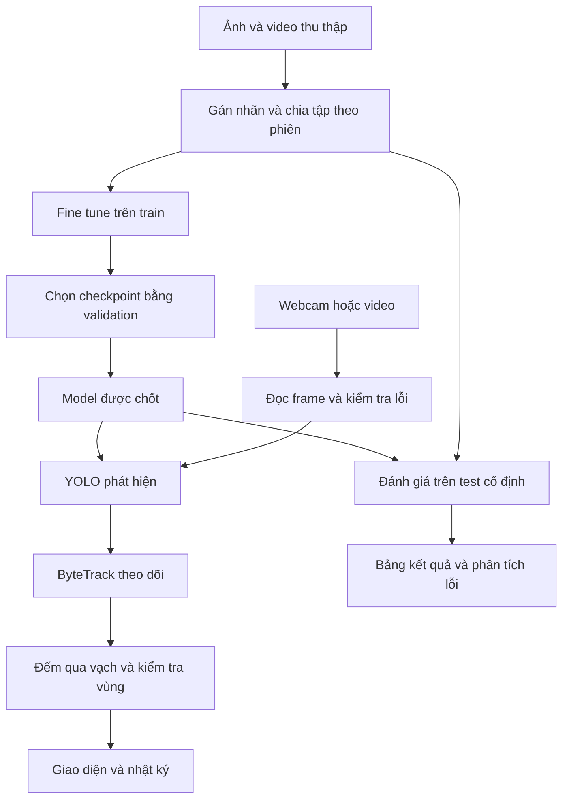

> **Đối soát 05/10/2026:** xem [trạng thái hiện hành](README.md#trạng-thái-theo-tuần). Dataset project8_v0.3 đã duyệt/khóa; R1 và R2 hoàn tất tổng 5 epoch. Những mô tả trước đó trong tài liệu là lịch sử hoặc đề xuất; G1/G2/G3 chưa đủ nghiệm thu toàn bộ.

# Kế hoạch đề tài 8 Nhận dạng đối tượng trong camera

> **Cập nhật 04/10/2026:** dataset chính draft `project8_v0.3` có **5.002 ảnh / 5.002 TXT / 26.566 box**: 3.883 train, 798 validation, 321 test. Đã nhập classroom với `table` và `with-student` cùng map về table; dọn bản sao, ảnh tham khảo và 107 ảnh pending theo yêu cầu. Giữ hai ZIP hành vi gốc phục vụ tuần 4–6. Có 4.681 file ảnh phát triển; chưa coi augmentation/frame video là cảnh độc lập. Nhãn/review, quyền/gần trùng/phiên, khóa release, video thật, baseline và fine-tune chưa hoàn tất. Xem [hồ sơ dataset chính](docs/PROJECT8_V0_3_DATA_PROFILE.md) và [báo cáo hiện hành](../README_DA_HOAN_THANH/reports/results/project_progress_20261004/REPORT.md).
**Cách đọc nhanh:** cả nhóm đọc mục 1–3 và 18 trước; dữ liệu/model đọc 6, 8, 9; tracking đọc 7, 9, 10; ứng dụng đọc 5, 10, 20; repo ở 11; phân công/tiến độ ở 12–13; bộ nộp/bảo vệ ở 15–17; đối soát Qwen ở 19; cấu hình ở 20; kiểm thử/bàn giao ở 21; nguồn ở 22.
## 1 Mọi thành viên cần hiểu gì trước tiên

Nhóm xây dựng một ứng dụng nhận hình từ webcam, phát hiện đối tượng, vẽ khung và tên, theo dõi đối tượng qua nhiều khung hình, rồi thống kê hoặc tạo cảnh báo theo quy tắc. Phần học máy dùng mô hình YOLO có sẵn làm điểm khởi đầu và fine-tune trên dữ liệu phù hợp. Phần nhóm phát triển gồm dữ liệu, tích hợp camera, quy tắc đếm/cảnh báo, giao diện, thí nghiệm và phân tích lỗi.

**Tên triển khai đề xuất:** Hệ thống phát hiện và theo dõi người cùng đồ vật trong phòng học qua camera.

**Phạm vi dùng cho kế hoạch này:** kế thừa đoạn chat Mata cung cấp: 1 camera cố định, 8 lớp `person`, `table`, `chair`, `laptop`, `cell phone`, `backpack`, `book`, `cup`; tracking và đếm lượt qua vạch tập trung vào `person`. Các vật thể còn lại được phát hiện, theo dõi khi phù hợp và đếm hiện diện. Chốt YOLO26n làm bản chính (local/CPU); YOLO26s do thành viên khác hoặc Colab chạy làm đối chứng kích thước, không chặn đường chính. Không đổi thế hệ model giữa dự án nếu không có lý do thực nghiệm. Phạm vi vẫn cần giảng viên duyệt lại sau khi đổi từ YOLOv8 sang YOLO26.

Ví dụ để cả nhóm hình dung:

- Đưa cốc vào webcam → ứng dụng vẽ hộp quanh cốc, hiện “cốc” và điểm confidence.
- Một người đi qua vạch → ghi một sự kiện theo chiều A→B hoặc B→A; đứng yên trước camera không làm số lượt tăng từng frame.
- Một người ở trong vùng đánh dấu trên 2 giây → hiện cảnh báo thử nghiệm và thêm một dòng nhật ký.
- Đưa điện thoại ra xa → mô hình có thể bỏ sót; nhóm đo và giải thích lỗi, rồi kiểm tra fine-tune có cải thiện hay không.

**Bốn kết quả phải có:** ứng dụng chạy được; dữ liệu có nguồn gốc và nhãn; bảng kết quả so sánh tái lập được; mỗi thành viên giải thích được phần mình làm và luồng xử lý chung.

### Kế thừa trao đổi cũ

Đã tìm lại các trao đổi ngày 24–25/09 và 28/09/2026: Mata hỏi về đề 8, CNN/YOLO, nhu cầu huấn luyện, dataset, repo, tracking, đếm/cảnh báo và mức khó 6–7/10. Hướng YOLO nhỏ + fine-tune + ByteTrack là gợi ý đã được bàn; đoạn chat Mata bổ sung xác định phương án tám lớp và YOLOv8 (nay nhóm chuyển sang YOLO26n chính + YOLO26s đối chứng, xem mục 4, 8); tên thành viên cụ thể và ngày nộp vẫn chưa có.

Tài liệu cũ “Đã dán markdown (1).md” nêu YOLOv8 + DeepSORT/ByteTrack (nay thay bằng YOLO26 + ByteTrack). Cần sửa cách hiểu: **ByteTrack cơ bản không dùng mô hình Re-ID hay khoảng cách cosine để ghép ngoại hình**; DeepSORT mới là hướng điển hình có đặc trưng ngoại hình. Tracking là phần nâng cấp hợp lý cho đề 8, nhưng tên đề trong PDF không tự biến tracking thành yêu cầu bắt buộc. [S6, S7]

## 2 Yêu cầu môn học và điểm cần xác nhận

Nguồn gốc: `BT cuối kỳ TTNT.pdf`, trang 1–2; `chủ-đề-cuối-kì.txt`; ba tài liệu Chương 1, Chương 1-tiếp và Chương 2 đã cung cấp.

| Nội dung | Đề bài ghi gì | Nhóm cần làm |
|---|---|---|
| Đề tài | Đề 8 là nhận dạng đối tượng trong camera | Ghi đúng tên khi đăng ký |
| Thời gian | PDF ghi 5–6 tuần | Dùng lịch tương đối, tính từ khi giảng viên duyệt |
| Số thành viên | PDF: tối đa 3; TXT: 3–5 | Hỏi giảng viên văn bản nào áp dụng; kế hoạch chia 3 vai trò, có cách mở rộng |
| Phê duyệt | TXT yêu cầu duyệt đề tài trước | Gửi phạm vi, dữ liệu, cách đánh giá |
| Sản phẩm | Báo cáo PDF; file nén tài liệu và dữ liệu liên quan; phân công; 10–12 slide | Đóng gói thêm mã nguồn, cấu hình, trọng số và hướng dẫn chạy |
| Hạn nộp | Trước ngày thi, theo lịch thi của trường | Chưa có ngày cụ thể; không tự đặt thành hạn chính thức |
| Thực nghiệm | Thuật toán, tham số, kết quả, giải thích và đánh giá | Lưu log, cấu hình và dữ liệu thử nghiệm thực |
| Dữ liệu | Nguồn, giấy phép, làm sạch, chia tập | Có data card và danh sách train/val/test |
| Tái lập | Mã nguồn, tham số, seed, hướng dẫn | Người khác cài mới và chạy lại được |

**Không thấy đề bắt buộc:** tự thiết kế CNN, train từ đầu, đúng 1.000 ảnh, dùng Transformer, làm cloud hay huấn luyện ba model. Các yêu cầu attention/seq2seq ở cuối PDF thuộc đề 27 tham khảo, không áp sang đề 8.

Ba chương đã gửi tập trung vào tác tử, PEAS và tìm kiếm. Có thể dùng PEAS để mô tả hệ thống; nhóm cần học thêm CNN, detection, dữ liệu ảnh và đánh giá. BFS/DFS không phải thuật toán chính giải quyết nhận dạng ảnh của dự án này.

### Gắn công việc với thang điểm

| Tiêu chí trong PDF | Điểm | Bằng chứng nhóm chuẩn bị |
|---|---:|---|
| Chức năng và phân công | 1 | Danh sách chức năng, trách nhiệm, sản phẩm từng người |
| Đề xuất các giải pháp | 1 | So sánh YOLO, SSD/Faster R-CNN hoặc phương án truyền thống |
| Ưu nhược và lý do chọn | 1 | Giới hạn máy, dữ liệu, tốc độ và độ khó |
| Sơ đồ tổng thể | 1 | Luồng huấn luyện và luồng camera |
| Thuật toán và tham số | 1 | YOLO, ByteTrack, đếm qua vạch, cấu hình thực tế |
| Lập trình và thực nghiệm | 2 | Demo, source, checkpoint, log và bảng thí nghiệm |
| Đánh giá kết quả | 1 | Metrics, lỗi, giới hạn và lý do |
| Thuyết trình và hỏi cá nhân | 2 | Mỗi người chạy và giải thích được hệ thống |
| **Tổng** | **10** | Không suy ra điểm đạt chỉ từ số chức năng |

**Ba việc hỏi giảng viên tuần 1:** sĩ số áp dụng; phạm vi tám lớp và tracking có phù hợp; dùng pretrained rồi fine-tune có đáp ứng mong đợi không. Vẫn có thể đọc tài liệu, dựng baseline và chuẩn bị dữ liệu trong lúc chờ.

## 3 Mục tiêu sản phẩm và giới hạn

Người dùng thử nghiệm là thành viên nhóm hoặc người phụ trách một phòng học/phòng thực hành. Họ muốn biết camera đang thấy các loại đối tượng nào, số người hiện có trong khung hình, lượt qua vạch và thời điểm xuất hiện sự kiện.

Ứng dụng là nguyên mẫu hỗ trợ quan sát. Nhận ra `person` không cho biết đó là ai; phát hiện điện thoại không chứng minh hành vi gian lận; cảnh báo vùng chỉ biểu thị điều kiện hình học đã đặt. Không dùng kết quả demo để kết luận về một cá nhân.

### Ba mức bàn giao

| Mức | Nội dung | Mốc |
|---|---|---|
| A Chạy cơ bản | Camera/video → detection; hộp, nhãn, confidence; bật/tắt; đo tốc độ; báo lỗi camera | Hết tuần 1 |
| B Bản nộp đề xuất | A + dataset riêng + fine-tune + so sánh + tracking người + đếm qua một vạch + cảnh báo một vùng + CSV + tài liệu | Hết tuần 5 |
| C Mở rộng | So ByteTrack với BoT-SORT; tối ưu ONNX; camera trình duyệt; bổ sung lớp nếu đủ dữ liệu | Chỉ khi B đã ổn |

Mức B là phạm vi kế hoạch muốn đạt, không phải danh sách tính năng giảng viên đã bắt buộc. Nếu chậm, cắt C trước; giữ dữ liệu, thí nghiệm và giải thích.

### Tiêu chí nghiệm thu đề xuất

Các con số dưới đây là **mục tiêu kỹ thuật ban đầu**, cần kiểm tra bằng baseline tuần 1 và ghi lại nếu điều chỉnh. Không phải kết quả đã có.

| Mục tiêu | Cách xác nhận |
|---|---|
| Nhận tám lớp trên ảnh và webcam | Test set có nhãn; báo cáo riêng từng lớp |
| Chạy liên tục 10 phút | Không crash, không tăng hàng đợi đến mức hình càng lúc càng trễ |
| Mục tiêu ≥10 FPS xử lý trên máy demo | Đo cả pipeline tại cấu hình đã chọn; báo cáo số thực dù thấp hơn |
| Mục tiêu p95 độ trễ xử lý ≤200 ms | Từ lúc app nhận frame đến lúc tạo kết quả; không gọi đây là trễ toàn hệ camera–màn hình |
| Mục tiêu mAP50 ≥0,70 trên test tự thu | Đi kèm mAP50–95, từng lớp, quy mô test và cảnh khó; không đồng nghĩa accuracy 70% |
| Mục tiêu MAE đếm ≤1 lượt mỗi clip | Bộ clip 30–60 giây, ghi cả số lượt thật và độ khó để hiểu ý nghĩa |
| Có đối chứng | Ít nhất pretrained và fine-tuned; dùng cùng dữ liệu, phép đánh giá và cấu hình so sánh |
| Tái lập | Thành viên khác cài từ đầu, chạy clip mẫu, tạo được file kết quả |

**Chỉ số bổ sung:** ghi Event Precision/Recall/F1 và độ chậm cảnh báo theo mục 9. Các mốc Qwen nêu như mAP50–95 ≥0,45, Event F1 ≥0,85 hoặc cảnh báo chậm ≤0,3 giây chỉ là mục tiêu tham khảo, chưa lấy làm điều kiện bắt buộc. p95 ≤200 ms cũng là mục tiêu cần kiểm chứng, không phải cam kết. PEAS giúp liên hệ bài học, không có điểm PEAS riêng được nêu trong rubric.

## 4 Công nghệ cần dùng và lý do

**Bộ công nghệ đề xuất:** Python 3.11, Ultralytics YOLO26n (chính) + YOLO26s (đối chứng, chạy Colab/máy khác), OpenCV, ByteTrack, Streamlit, NumPy, Pandas, Matplotlib, PyYAML, Git/GitHub. Yêu cầu `ultralytics>=8.4.0` (bản hỗ trợ YOLO26 từ 01/2026). Phiên bản thư viện được khóa sau khi chạy thử thành công, không tự điền số phiên bản chưa kiểm chứng.

Chốt YOLO26 theo quyết định nhóm (thay YOLOv8): `yolo26n.pt` cho baseline và fine-tune (máy chính/CPU); `yolo26s.pt` cho đối chứng kích thước, giao cho thành viên khác hoặc chạy Colab GPU để không chặn đường chính. Tài liệu chính thức vẫn có train/val/predict/track cho các bản này. YOLO26n nhẹ hơn v8n (2,4M vs 3,2M params, 5,4 vs 8,7 GFLOPs), mAP COCO cao hơn (40,9 vs 37,3) và nhanh hơn ~43% CPU ONNX — phù hợp laptop demo. [S1]

| Thành phần | Nhiệm vụ | Nhóm cần hiểu |
|---|---|---|
| Python | Nối các thành phần và viết logic | Hàm, lớp, list/dict, file, lỗi |
| Ultralytics + PyTorch | Tải, chạy và fine-tune YOLO | Model, weights, tensor, train/val/inference |
| OpenCV | Đọc webcam/video, xử lý frame, vẽ hộp | Frame là ma trận ảnh; BGR/RGB; giải phóng camera |
| ByteTrack | Gắn ID tạm thời giữa các frame | Ghép theo chuyển động/vị trí; ID có thể đổi |
| Streamlit | Giao diện Python đơn giản | Trạng thái phiên, nút, cấu hình, bảng kết quả |
| CVAT hoặc công cụ gán nhãn tương đương | Vẽ bounding box và xuất nhãn YOLO | Nhãn đầy đủ, nhất quán, class ID đúng |
| Pandas + Matplotlib | Tổng hợp CSV và vẽ kết quả | Mỗi hàng đại diện điều gì, trục và đơn vị |
| pycocotools hoặc evaluator tương đương được kiểm chứng | Chấm dự đoán hai loại checkpoint trên cùng nhãn tám lớp | Chuyển định dạng/category mapping đúng, cùng quy tắc tính AP |
| CSV/JSON/YAML | Nhật ký, kết quả và cấu hình | MVP chưa cần SQL Server hay backend riêng |
| Git/GitHub | Quản lý mã và phân công | Branch, commit nhỏ, review, README |
| Colab | Fine-tune nếu được cấp GPU | Lưu checkpoint; không coi tài nguyên miễn phí là được bảo đảm |

CVAT hỗ trợ định dạng YOLO; Colab có giới hạn tài nguyên thay đổi, cần phương án resume. [S11, S12]

### CNN YOLO và huấn luyện khác nhau thế nào

- **CNN:** loại mạng xử lý cấu trúc không gian của ảnh. Có thể hình dung các lớp dần học đường nét, bộ phận và cấu trúc đối tượng.
- **YOLO26:** một hệ thống detection dùng mạng học sâu để dự đoán loại và vị trí đối tượng (bản 01/2026, bỏ DFL, hỗ trợ NMS-free end-to-end, optimizer MuSGD, ProgLoss+STAL lợi vật nhỏ). “Dùng YOLO” không có nghĩa là hoàn toàn bỏ CNN.
- **Pretrained:** dùng trọng số đã học; chạy camera chỉ là suy luận, trọng số không tự học thêm.
- **Fine-tune:** tiếp tục cập nhật trọng số bằng ảnh và hộp nhãn của nhóm, nhằm thích nghi bối cảnh.
- **Train from scratch:** khởi đầu chưa có kiến thức từ pretrained; tốn dữ liệu và công sức hơn, không chọn cho phạm vi này.
- **ByteTrack:** không cần nhóm huấn luyện thêm một mạng nhận diện ngoại hình trong cấu hình cơ bản.

Ví dụ: pretrained giống người đã học phân biệt nhiều vật; fine-tune giống luyện thêm với góc quay và ánh sáng phòng học; chạy webcam giống làm bài kiểm tra.

### Phương án giải pháp để đưa vào báo cáo

| Giải pháp | Điểm thuận lợi | Hạn chế với bài này | Quyết định |
|---|---|---|---|
| Xử lý ảnh theo màu/chuyển động | Dễ dựng đối chứng hẹp, ít tài nguyên | Không đủ nhận nhiều loại đồ vật trong nền phức tạp | Giải thích như lựa chọn bị giới hạn |
| CNN phân loại ảnh cắt | Dễ hiểu bài toán phân lớp | Cần bước tìm vùng vật thể; không tự giải quyết nhiều hộp trong một ảnh | Không dùng làm đối chứng detection thiếu công bằng |
| Detector SSD hoặc Faster R-CNN | Hướng học sâu thay thế | Thêm pipeline và thời gian tích hợp/đánh giá | So sánh ở mức thiết kế nếu chưa có thời gian chạy |
| YOLO nhỏ pretrained rồi fine-tune (YOLO26n chính, YOLO26s đối chứng Colab) | Có pipeline train và inference đồng nhất, thích hợp dựng prototype; STAL/ProgLoss cải thiện vật nhỏ | Phụ thuộc dữ liệu; đồ vật nhỏ/che khuất có thể khó | Chọn làm hướng chính |

Chỉ kết luận tốc độ và độ chính xác hơn/kém giữa các model khi đã đo cùng điều kiện. Hai cấu hình trước/sau fine-tune là đối chứng thực nghiệm chính; không cần chạy mọi thuật toán trong bảng.

## 5 Kiến trúc và luồng sử dụng



Nhánh test chỉ dùng phần test đã khóa, không đưa ảnh test vào fine-tune hoặc chọn checkpoint. Giao diện và nhật ký nhận dữ liệu từ cùng kết quả xử lý để số hiển thị khớp số xuất file.

Luồng thao tác:

1. Chọn webcam hoặc video mẫu; chọn model và cấu hình.
2. Bấm bắt đầu; app báo đang mở nguồn, đang xử lý hoặc lỗi rõ ràng.
3. Hiện frame đã vẽ, số đối tượng hiện tại, lượt A→B/B→A và tốc độ.
4. Bật một vùng cảnh báo theo cấu hình đã chuẩn bị.
5. Bấm dừng; app giải phóng camera; tải CSV nếu muốn.
6. Reset phiên → xóa bộ đếm và trạng thái tracker của phiên, giữ file log đã xuất.

### Camera cục bộ và camera trình duyệt

Tuần 1 làm OpenCV trên máy demo; tuần 4 tích hợp giao diện local. `VideoCapture(0)` mở camera của máy chạy Python. Khi Python chạy trên máy chủ khác, nó không tự truy cập webcam trên laptop của người xem.

Nếu cần camera trình duyệt/điện thoại, dùng `streamlit-webrtc`. Triển khai từ xa cần HTTPS và cấu hình kết nối thích hợp; một số mạng cần TURN. Đây là phần mở rộng có chi phí triển khai riêng, không lấy làm phụ thuộc bắt buộc của buổi thi. [S8]

### Xử lý camera và giao diện không bị trễ dần

Prototype OpenCV có thể chạy một vòng xử lý đơn giản. Khi tích hợp Streamlit local, tách công việc đọc nguồn, xử lý và hiển thị; chỉ một worker sở hữu model/tracker của phiên:

| Khâu | Cách làm dự kiến | Ràng buộc |
|---|---|---|
| Capture | Đọc webcam, gắn frame_id và mốc nhận frame | Camera chỉ được mở một lần cho phiên đang chạy |
| Hàng chờ live | Giữ tối đa một frame chờ mới nhất | Khi đầy, chủ động lấy bỏ frame cũ rồi đưa frame mới; `Queue(maxsize=1)` không tự ghi đè [S27] |
| Xử lý | Một lần YOLO → tracker → analytics → ghi log | Xử lý tuần tự theo nguồn; không chạy hai inference đồng thời trên cùng tracker |
| Kết quả hiển thị | Giữ kết quả mới nhất, gồm ảnh và số thống kê tương ứng | Có thể bỏ bản hiển thị cũ, nhưng sự kiện phải được ghi trước bước này |
| Streamlit | Đọc snapshot trên script thread; làm mới phần video định kỳ | Worker không gọi `st.image`, `st.session_state` hay API giao diện [S21] |

Giao diện dùng fragment làm mới định kỳ nếu phiên bản đã khóa hỗ trợ, hoặc cơ chế polling được kiểm chứng; không đặt vòng lặp vô hạn làm nút Dừng mất tác dụng. Khởi đầu làm mới khoảng 10 lần/giây, đo trên máy demo rồi điều chỉnh. Tránh ghi vào container ngoài fragment theo cách làm tích lũy nội dung. [S23]

**Live khác offline:** camera ưu tiên frame mới và ghi số bỏ frame; benchmark video đọc tuần tự hết frame, không áp chính sách bỏ frame. Muốn kiểm chế độ live trên file thì tạo run riêng, ghi chính sách sampling và kết quả riêng. Bỏ frame có thể làm tracking kém đi; giảm backlog không tự bảo đảm đếm đúng.

**Bộ nhớ:** không giữ danh sách vô hạn frame hoặc đối tượng Results. Trajectory dùng lịch sử giới hạn, chẳng hạn 60 điểm/track; bảng UI chỉ giữ gần nhất, CSV ghi nối ra đĩa; dọn trạng thái track hết hạn. Theo dõi RAM của tiến trình Python và trình duyệt riêng. Queue nhỏ giảm tích lũy frame, không phải cách chữa mọi loại rò bộ nhớ.

**Ảnh hiển thị:** giữ tỷ lệ gốc, ví dụ giới hạn cạnh ngang 640 px; nguồn 16:9 mới cho 640×360. JPEG chất lượng 75 là lựa chọn thử cho bản hiển thị, không ép ảnh gốc hay nhãn huấn luyện về tỷ lệ sai. `imgsz=640` của model và kích thước ảnh giao diện là hai cấu hình khác nhau.

**Trạng thái phiên:** `IDLE → RUNNING → STOPPING → IDLE`, thêm `ERROR` khi lỗi. Nút Bắt đầu là idempotent: bấm lại không tạo worker thứ hai. Dừng → báo stop → worker thoát → release camera → đóng log → reset tracker/analytics → cập nhật UI; đặt timeout để UI không treo mãi. Thử Dừng/Mở lại ít nhất ba lượt.

Giữ một model/tracker có trạng thái cho một phiên; khi đổi model/nguồn phải tạo hoặc reset pipeline. Không dùng cache toàn cục để chia cùng tracker cho nhiều tab/phiên: tài nguyên được cache toàn cục có thể được dùng chung. Nếu tái sử dụng model chỉ đọc, phải bảo đảm cơ chế đồng bộ và tách trạng thái tracking; MVP một phiên local ưu tiên cách đơn giản. [S22]

**Dự phòng:** `--ui opencv` là cửa sổ OpenCV cục bộ; `--ui none` là chạy không cửa sổ và xuất log/video nếu được bật. Không gọi `cv2.imshow()` là “không giao diện”. Các cờ này là interface nhóm cần xây, chưa tồn tại sẵn. Máy dùng OpenCV headless sẽ không có HighGUI, cần môi trường demo phù hợp.

Không có cơ sở trong tài liệu đã kiểm tra để khẳng định mọi vòng `st.image` đều tạo WebSocket mới, chắc chắn rò RAM sau 2–3 phút hoặc luôn tụt từ 25 xuống 4 FPS. Đó phải là kết quả đo của một cấu hình cụ thể, không đưa thành dữ kiện chung trong báo cáo.

### Mô tả bằng PEAS từ bài học

| PEAS | Áp dụng |
|---|---|
| Performance | Chất lượng detection, sai số đếm, tốc độ, độ trễ, ít cảnh báo lặp |
| Environment | Phòng học/phòng thực hành, camera cố định, ánh sáng và vật thể thay đổi |
| Actuators | Hiển thị kết quả, phát cảnh báo giao diện, ghi file |
| Sensors | Webcam hoặc frame từ video, tham số do người dùng chọn |

## 6 Dữ liệu cần chuẩn bị

### Quy mô và nguồn đề xuất

**Mục tiêu hiện hành:** 2.500 ảnh phát triển hợp lệ theo WEEK2_G2.md; nhóm có thể điều chỉnh và ghi rõ quy mô thật. Hiện có 5.002 file ảnh chính: 4.681 train/validation và 321 test. Nguồn COCO và Roboflow có augmentation/frame video; số file chưa chứng minh số cảnh độc lập hay ảnh tự thu phòng học.

Thu 15–24 phiên quay/chụp ngắn, nhiều vị trí, ít nhất vài ngày hoặc buổi khác nhau; nếu làm được, dùng nhiều điện thoại/chai/người tình nguyện. Cố gắng có ít nhất 3 phiên độc lập cho validation và 3 phiên cho test. Số ảnh không thay thế được sự đa dạng.

Chọn một phòng làm bối cảnh chính; phòng thứ hai là cách tăng đa dạng nếu có quyền tiếp cận. Không biến đề xuất “ít nhất hai phòng” của Qwen thành yêu cầu môn học. Nếu chỉ có một phòng, tách buổi/góc/vị trí và giới hạn kết luận trong bối cảnh đã đo. Tỷ lệ sáng 60/20/20 có thể dùng khi lên lịch quay, không phải chuẩn bắt buộc.

| Lựa chọn | Tận dụng | Giới hạn |
|---|---|---|
| Tự thu trong bối cảnh demo | Nguồn chính cho fine-tune và test; kiểm soát cảnh khó | Tốn công gán nhãn; cần sự đồng ý của người xuất hiện |
| COCO | Model pretrained và có thể bổ sung một phần ảnh huấn luyện | Lọc lớp và kiểm tra quyền ảnh; không dùng ảnh pretraining làm test độc lập mới |
| Roboflow Universe | Có thể tìm tập đã gán nhãn gần bối cảnh | Chưa chọn dataset cụ thể; phải đọc license, nhãn, nguồn và split trước khi dùng |
| COCO8/COCO128 | Kiểm tra pipeline có train/val được | Không dùng làm bằng chứng chất lượng cuối kỳ; COCO128 dùng cùng ảnh cho train và val trong cấu hình mẫu |

COCO và các tập kiểm tra nhỏ được mô tả tại [S4, S13, S14]. Ưu tiên test tự thu chưa từng đưa vào pretrained/fine-tune của nhóm; không tải toàn bộ COCO nếu không cần.

Nếu dữ liệu tự thu thiếu đa dạng, phương án bổ sung đã bàn là lọc khoảng **2.000–5.000 ảnh COCO chứa tám lớp** cho huấn luyện. Đã chọn COCO500 bằng seed 42 (400 train2017 + 100 val2017); quy mô 2.000–5.000 chỉ là phương án mở rộng nếu cần. Với mỗi ảnh được lấy, giữ đầy đủ nhãn của mọi đối tượng thuộc tám lớp, đổi category ID về mapping của nhóm và ghi nguồn; không thêm ảnh đó vào test mới. COCO8 và COCO128 là công cụ debug thay thế nhau theo nhu cầu, không bắt buộc mất thời gian chạy cả hai nếu pipeline đã đúng.

### Lớp và ánh xạ ID

| Nghĩa | Tên nhãn chung | ID pretrained COCO trong Ultralytics | ID dataset riêng |
|---|---|---:|---:|
| Người | `person` | 0 | 0 |
| Bàn | `table` (COCO dining table) | 60 | 1 |
| Ghế | `chair` | 56 | 2 |
| Laptop | `laptop` | 63 | 3 |
| Điện thoại | `cell phone` | 67 | 4 |
| Balo | `backpack` | 24 | 5 |
| Sách/vở | `book` | 73 | 6 |
| Cốc | `cup` | 41 | 7 |

Các ID pretrained được đối chiếu từ `coco.yaml`. Đây không phải category ID gốc của COCO JSON. Luôn kiểm tra `model.names` của checkpoint đang dùng; đừng lấy ID COCO80 áp cho model đã fine-tune tám lớp. [S4]

### Kịch bản thu thập

| Yếu tố | Cần có |
|---|---|
| Ánh sáng | Đủ sáng, thiếu sáng vừa phải, ngược sáng |
| Khoảng cách | Gần, trung bình, xa; ghi thêm kích thước hộp để đánh giá vật nhỏ |
| Góc nhìn | Chính diện, nghiêng, trên bàn, cầm trên tay |
| Nền | Bàn gọn, bàn nhiều đồ, nền có vật dễ nhầm |
| Che khuất | Không che, che một phần; không gán nhãn vật hoàn toàn vô hình |
| Chuyển động | Đứng yên, đi ngang, hai người giao nhau |
| Ảnh âm tính | Khoảng 10–15% ảnh không chứa tám lớp; có vật dễ nhầm |

Mục tiêu ảnh âm tính khoảng 10% ảnh phát triển: 250/2.500 nếu đủ quy mô. Dataset hiện chọn ảnh dương tính, chưa có ảnh âm tính đã được xác nhận đủ tám lớp. Ảnh âm tính có file nhãn TXT rỗng theo quy ước nội bộ để phân biệt với ảnh chưa được gán nhãn.

Chụp được một ảnh chứa cả tám lớp vẫn chỉ tính là một ảnh, nhưng có nhiều bounding box. Báo cáo cả số ảnh và số instance từng lớp. Khi ít điện thoại hơn người, thu bổ sung điện thoại ở nhiều bối cảnh; không chỉ sao chép lặp ảnh để tạo cảm giác cân bằng.

### Quy chuẩn gán nhãn thống nhất

Chọn quy ước **hộp chữ nhật bao phần nhìn thấy và nhận dạng được** cho dataset tự thu. Hộp có thể chứa vùng vật cản nằm giữa các phần của đối tượng; không tưởng tượng phần hoàn toàn khuất ngoài giới hạn nhìn thấy. Ghi rõ quy ước này trong `LABELING_GUIDE.md` và dùng nhất quán cho train/val/test. Nếu bổ sung dữ liệu ngoài, kiểm tra khác biệt quy ước hộp trước khi trộn.

| Lớp | Gán nhãn thế nào | Ca khó cần xử lý |
|---|---|---|
| `person` | Một hộp cho một người thật nhìn thấy; cắt hộp theo biên ảnh | Bị bàn che → bao phần thấy được; đáy hộp lúc này không còn là vị trí bàn chân |
| `table`, `chair`, `backpack`, `book`, `cup` | Bao phần vật nhìn thấy và nhận dạng được theo LABELING_GUIDE.md | Table rộng hơn dining table; book gồm sách/vở; không đổi chai thành cup hoặc gộp nhiều vật thành một hộp |
| `cell phone` | Bao phần điện thoại; không cố ý mở rộng hộp để chứa cả bàn tay | Bị che nhiều nhưng vẫn nhận dạng được → vẫn gán nhãn; không đặt quy tắc máy móc “che trên 50% là bỏ” |
| `laptop` | Mở → bao màn hình và thân/phím; gập → gán nếu xác định được là laptop | Không yêu cầu phải thấy logo; không đoán từ hình chữ nhật giống quyển sổ |

Đối tượng quá mờ/che đến mức không xác định được → chuyển ảnh sang danh sách cần review. Nếu vẫn không thống nhất, loại **cả ảnh khỏi tập chấm chính** hoặc dùng cơ chế ignore được cả pipeline train/evaluator hỗ trợ và ghi rõ. Không giữ ảnh có điện thoại nhận ra được nhưng xóa nhãn điện thoại: nhãn thiếu có thể khiến dự đoán đúng bị tính thành FP hoặc thành nền khi huấn luyện.

Ảnh người/vật trên poster hoặc màn hình không thuộc phạm vi vật thể thật đã chọn; ghi quy ước riêng, dùng làm ca khó có chủ đích. Ảnh phản chiếu khó phân biệt cần review, không mặc định là ảnh âm tính.

**Kiểm nhãn hai lớp:** máy kiểm 100% file/ID/tọa độ; người thứ hai review 10–20% mẫu phân tầng theo lớp/phiên và 100% ca nghi ngờ. Nếu phát hiện lỗi hệ thống, mở rộng review nhóm ảnh liên quan. Không dồn “một người xem lại 100% bằng tay” thành nút thắt không có dự toán.

### Quy trình dữ liệu

1. Lưu nguồn gốc: người thu, ngày, thiết bị, phiên, bối cảnh và quyền sử dụng.
2. Loại ảnh hỏng, trùng hoặc gần trùng; giữ một phần ảnh khó thực tế có chủ đích.
3. Gán nhãn cả tám lớp nhìn thấy trong ảnh. Nhãn box theo phần nhìn thấy, nhất quán trong toàn tập; ảnh quá khó xác định thì loại hoặc đánh dấu để xem lại.
4. Người thứ hai kiểm tra ít nhất 10–20% ảnh và toàn bộ ảnh có nghi ngờ; dùng lỗi trên train/validation để rà nhãn. Nhãn test phải được kiểm và khóa trước khi xem dự đoán test; sửa nhãn sau đó cần lưu lý do và chấm lại mọi đối chứng.
5. Chia **theo phiên quay/địa điểm/ngày**, mục tiêu train/val khoảng 80/20; test giữ riêng. Hiện giữ split nguồn: 1.310/360/130; tỷ lệ có thể lệch vì giữ nhóm.
6. Kiểm tra mỗi lớp đều có đủ ví dụ trong val/test; giữ người hoặc kiểu vật chưa gặp ở train khi có thể.
7. Chỉ augmentation tập train. Không để ảnh gốc ở train và bản xoay/crop của nó ở test.
8. Khóa danh sách test trước khi tối ưu. Mọi thay đổi split phải có lý do và lưu phiên bản.

**Bẫy lớn:** lấy 30 frame liên tiếp rồi random 21 train, 4 val, 5 test sẽ làm các tập gần giống nhau. Điểm đẹp nhưng không phản ánh camera ở cảnh mới.

### Định dạng và hồ sơ dữ liệu

Nhãn YOLO: một file TXT tương ứng ảnh; mỗi dòng `class_id x_center y_center width height`, bốn tọa độ chuẩn hóa 0–1. Ví dụ hộp ở giữa, rộng 20%, cao 40% ảnh và thuộc lớp chai: `1 0.5 0.5 0.2 0.4`. Đây là ví dụ nhãn, không phải dữ liệu thật. [S5]

`manifest.csv` dự kiến có `image_id`, `session_id`, `source`, `split`, `lighting`, `object_size_group`, `license_or_consent`, `sha256`. `DATA_CARD.md` mô tả số ảnh/box theo lớp, cách chọn split, hạn chế, người gán nhãn và quyền sử dụng. `data.yaml` giữ thứ tự tám lớp cố định.

### Video phát triển và video test là hai bộ khác nhau

Đánh giá tracking cần **video giữ thứ tự thời gian**, không thay bằng ảnh rời. Chuẩn bị:

| Bộ | Quy mô dự kiến | Sử dụng |
|---|---|---|
| `video_dev` | 3–5 clip, mỗi clip khoảng 30–60 giây | Lập trình, sửa đếm, chọn vạch/ROI/ngưỡng, đo tốc độ phát triển |
| `video_test` | 5–10 clip độc lập, ưu tiên 10, mỗi clip khoảng 30–60 giây | Đánh giá cuối sau khi khóa model và logic |

Hai bộ khác phiên nguồn; các clip test cũng không được trích frame vào ảnh train/validation. Dùng `source_session_id` chung cho ảnh và video để chặn rò rỉ chéo. Clip thuộc phiên test được giữ ở test dù đổi tên, cắt đoạn hoặc mã hóa lại.

Kịch bản cần phủ: đi một chiều; đi qua rồi quay lại; đứng/rung sát vạch; đi nhanh nhảy qua dải đệm; vòng qua đầu vạch; hai người cắt nhau; che khuất; thiếu sáng; ở vùng đủ/chưa đủ 2 giây; ra rồi vào lại. Một clip có thể chứa nhiều kịch bản.

Ghi tay sự kiện đúng, chiều, điểm/vùng cấu hình và thời điểm trên timeline nguồn. Với vùng cảnh báo, ghi các khoảng quan sát được, khoảng che khuất và mốc đủ thời gian theo đúng quy tắc mục 7. Chỉ công bố IDF1/HOTA/MOTA khi có nhãn hộp và ID thật theo frame cùng evaluator phù hợp; nhãn sự kiện đơn thuần chưa đủ.

SHA-256 phát hiện file giống hệt, không đủ phát hiện frame gần trùng hay ảnh đã nén lại. Kiểm thêm phiên nguồn, thông tin thời gian và contact sheet; có thể dùng perceptual hash để tìm ứng viên gần trùng rồi kiểm bằng mắt. Mỗi bản dataset lưu danh sách split và checksum; không tạo dataset mới bằng cách đổi tên thư mục.

## 7 Thuật toán và logic nhóm phải giải thích được

### Detection và hậu xử lý

YOLO26 nhận ảnh đã được chuẩn bị, trích xuất đặc trưng ở nhiều mức, kết hợp đặc trưng và dự đoán hộp cùng lớp. Khi viết báo cáo, lấy sơ đồ đúng với YOLO26 đang chạy, chú thích backbone, neck và detection head (nhấn mạnh đã bỏ DFL nên đầu hồi quy nhẹ, export ONNX/TensorRT đơn giản hơn). Không sao chép sơ đồ YOLOv1/v8 rồi mô tả như thể là kiến trúc YOLO26.

Người phụ trách model phải xuất model summary và cấu hình kiến trúc từ phiên bản thực (`ultralytics>=8.4.0`), ghi số lớp/tham số (26n ~2,4M), hàm kích hoạt và thành phần loss đúng với code đang dùng (ProgLoss + STAL cho vật nhỏ, MuSGD optimizer). Giải thích vai trò loss vị trí hộp và loss lớp; nếu log có thành phần khác thì đối chiếu implementation rồi mô tả. Không tự bịa công thức hoặc copy loss của phiên bản YOLO khác.

Ứng dụng lọc kết quả theo lớp, confidence và các thiết lập hậu xử lý. YOLO26 có dual-head, dùng cả hai tùy trường hợp — phải khóa trong config/run, không để mặc định trôi:
- `nms=False` (one-to-one, NMS-free, output `(N,300,6)`): mặc định cho live/demo CPU, độ trễ thấp, export gọn. Dùng cho webcam, Streamlit preview, đếm/cảnh báo realtime.
- `nms=True` / `end2end=False` (one-to-many + NMS, output `(N,nc+4,8400)`): dùng cho validation/chấm mAP cuối và khi cần accuracy cao nhất (cao hơn ~0,6–0,8 mAP COCO). E1–E3 và bảng test phải ghi rõ head đã dùng để so công bằng.
Với head one-to-many, cần hiểu NMS: khi có nhiều hộp rất giống nhau cho cùng đối tượng, hệ thống giữ hộp phù hợp và loại bớt hộp trùng. IoU đo mức chồng lấn giữa hai hộp:

`IoU = diện tích giao / diện tích hợp`.

**Phân biệt:** ngưỡng IoU của NMS quyết định loại hộp trùng; ngưỡng IoU đánh giá quyết định dự đoán có khớp nhãn hay không. Cùng dùng IoU nhưng phục vụ hai việc khác nhau. Confidence 0,90 là điểm mô hình, không tự có nghĩa xác suất đúng đã được hiệu chuẩn là 90%. [S2, S9]

### ByteTrack

Tracking nối các detection theo thời gian. ByteTrack dùng dự đoán chuyển động và liên kết hộp; khai thác cả detection có điểm thấp để khôi phục một số track bị che khuất. Track mới, đang hoạt động và bị mất cần được quản lý qua từng frame. [S6, S7]

Ví dụ: người số 7 bị ghế che một phần → detector kém chắc chắn hơn → tracker có thể giữ mạch chuyển động. Nếu người biến mất lâu hoặc hai người giao nhau, ID vẫn có thể đổi. Không tuyên bố “mỗi người luôn có một ID duy nhất”.

Nhóm dùng `tracker="bytetrack.yaml"` một cách tường minh và lưu bản cấu hình vào dự án. Không phụ thuộc tracker mặc định của thư viện vì mặc định có thể đổi. Với xử lý từng frame liên tiếp, phải giữ trạng thái tracker; reset khi đổi nguồn hoặc bắt đầu phiên mới.

### Đếm theo ba nghĩa khác nhau

| Chỉ số | Ý nghĩa đúng | Ví dụ |
|---|---|---|
| Số người trong frame hiện tại | Số detection/track hợp lệ đang thấy | Một người đứng 100 frame vẫn là 1 ở mỗi frame |
| Lượt vượt vạch | Số sự kiện đi qua vạch theo chiều | Một người đi qua rồi quay lại tạo hai lượt, khác chiều |
| Số track ID từng xuất hiện | Số ID được tracker tạo trong phiên | Không đồng nhất với số người thật vì đổi ID/ra vào lại |

MVP hiển thị số người hiện tại và lượt A→B/B→A. Nếu hiển thị tổng ID, nhãn phải ghi “số track”, không ghi “tổng người duy nhất”.

### Quy tắc đếm qua vạch đề xuất

Đây là thiết kế nhóm đề xuất, cần kiểm thử; không xem nhãn “đã xác minh” trong phản hồi Qwen là bằng chứng thuật toán đã chạy đúng.

**Hình học:** vạch là đoạn có hướng `L0(x0,y0) → L1(x1,y1)`. Điểm đại diện người `P=((xmin+xmax)/2,ymax)` là giữa đáy hộp. Dùng tọa độ pixel của ảnh gốc sau khi đã đổi từ tọa độ chuẩn hóa; không trộn tọa độ UI, letterbox và ảnh gốc.

$$
S(P)=(x_1-x_0)(y-y_0)-(y_1-y_0)(x-x_0),\qquad
d(P)=\frac{S(P)}{\sqrt{(x_1-x_0)^2+(y_1-y_0)^2}}.
$$

`S` có đơn vị pixel²; `d` mới là khoảng cách có dấu tính bằng pixel. Không so `S` trực tiếp với buffer 7 hoặc 15 pixel. Từ chối vạch hai đầu trùng nhau.

Với chiều cao ảnh `H`, đặt ban đầu `b=0,01H`: `d>b` là phía A, `d<-b` là phía B, phần còn lại là dải đệm. 720p → b=7,2 px mỗi phía; 1080p → b=10,8 px. Đây là nửa bề rộng dải đệm. Trục y ảnh hướng xuống, nên gọi A/B theo dấu; không mặc định dấu dương là “bên trái” như tọa độ toán học y hướng lên. Đảo L0/L1 sẽ đảo tên chiều.

**Ví dụ:** vạch từ (100,200) đến (500,200); điểm ở y=220 → d=20, phía A; điểm ở y=180 → d=-20, phía B. Người đi lên ảnh qua đoạn này tạo A→B. A→B chỉ được gọi là “vào” khi nhóm đã đặt vạch đúng tại lối vào.

**Cắt đoạn hữu hạn:** chỉ đổi dấu chưa đủ. Đường di chuyển phải cắt chính đoạn L0L1, không phải phần kéo dài ngoài hai đầu. Lưu các đoạn di chuyển quan sát được liên tiếp; dùng phép kiểm giao hai đoạn có sai số số học phù hợp. Trường hợp chỉ chạm vạch rồi quay lại hoặc đi dọc vạch không tạo lượt; cắt tại đầu vạch chỉ tính nếu có đổi phía ổn định. Không nối tắt một quãng mất dấu dài thành một lần vượt vạch.

**Trạng thái mỗi ID:** `UNKNOWN`; `STABLE_A`; `STABLE_B`; `CANDIDATE`. CANDIDATE phải nhớ phía xuất phát, phía đích, đã cắt đoạn hữu hạn chưa, số frame xác nhận và thời điểm cắt ước lượng. Nhờ vậy cùng một trạng thái chờ không làm mất chiều đi.

| Tình huống | Cập nhật | Sự kiện |
|---|---|---|
| ID mới, ngoài dải đệm 3 frame liên tiếp cùng phía | UNKNOWN → phía ổn định | Không đếm lúc mới xuất hiện |
| Đang A, bắt đầu vào dải đệm hoặc sang B | Mở candidate từ A; tích lũy bằng chứng cắt đoạn | Chưa phát |
| Candidate từ A, ổn định B 3 frame và có giao đoạn | Chốt B, tăng số chuyển phía của ID | Phát đúng một A→B |
| Candidate từ B, ổn định A 3 frame và có giao đoạn | Chốt A | Phát đúng một B→A |
| Chạm dải đệm rồi trở lại phía xuất phát | Hủy candidate, giữ phía cũ | Không phát |
| Đổi phía bằng cách vòng ngoài đầu vạch | Cập nhật phía mới khi ổn định, không giữ candidate cũ | Không phát |
| Mất quan sát, timestamp nhảy lùi, seek hoặc đổi nguồn | Hủy candidate; mất quá dung sai thì về UNKNOWN | Không suy ra một lượt bị khuất |

Phải xử lý được **A → B trực tiếp giữa hai frame**, không bắt buộc có một frame nằm trong dải đệm. Sau khi đã phát A→B, người thật sự quay về A và đủ điều kiện được đếm B→A. Không khóa mọi chiều trong 1,5 giây như gợi ý Qwen vì có thể bỏ lượt quay lại hợp lệ.

Chống lặp bằng trạng thái và khóa sự kiện `(session_id, track_id, line_id, transition_index)`. Cooldown theo thời gian, nếu muốn thử, là biến thể phải đo trên `video_dev`; không thay thế FSM và không bật mặc định cho mọi lượt.

Ba frame là ba frame **đã xử lý và có quan sát hợp lệ**: xấp xỉ 0,3 giây ở 10 FPS, 0,1 giây ở 30 FPS. Ghi rõ FPS, buffer, số frame xác nhận và dung sai mất dấu trong run. Lưu cả `crossing_time_ms` ước lượng từ hai frame bao quanh lần cắt và `emitted_time_ms` khi đủ xác nhận; không tráo hai mốc.

**Giới hạn điểm đáy hộp:** khi chân bị bàn che, đáy hộp chỉ là đáy phần thân nhìn thấy. Đặt vạch ở lối đi thấy được phần dưới cơ thể; các clip bị che vẫn phải đưa vào phân tích lỗi. Điểm đại diện không phải phép đo vị trí mặt đất đã được hiệu chuẩn.

### Quy tắc cảnh báo vùng đề xuất

Một polygon đơn gồm ít nhất ba đỉnh, không tự cắt, tọa độ chuẩn hóa 0–1. MVP cấu hình sẵn hình chữ nhật hoặc hình thang bốn đỉnh; thao tác kéo/vẽ trực tiếp là mở rộng. Sau khi đổi sang pixel ảnh gốc, kiểm điểm bằng `cv2.pointPolygonTest`. Kết quả dương: trong; âm: ngoài; bằng 0: trên cạnh. Bản đầu quy ước trên cạnh là trong. Không khẳng định implementation của hàm dùng riêng Ray Casting nếu chưa kiểm mã nguồn. [S20]

Mỗi `(session_id, track_id, region_id)` giữ: thời gian quan sát trong vùng đã tích lũy, thời điểm thấy gần nhất, cờ đã cảnh báo, thời điểm bắt đầu mất dấu và số frame xác nhận ngoài vùng.

| Trường hợp | Quy tắc đề xuất |
|---|---|
| Vào vùng lần đầu | Bắt đầu tích lũy ở 0; không cảnh báo ngay |
| Hai quan sát trong vùng liên tiếp, cùng ID, khoảng thời gian hợp lệ | Cộng chênh lệch timestamp nguồn |
| Tổng thời gian quan sát trong vùng đạt 2,0 giây | Phát một cảnh báo và bật cờ đã cảnh báo |
| Mất detection ngắn, không quá 0,6 giây từ lần thấy cuối | Tạm dừng đồng hồ; giữ trạng thái để nối lại nếu cùng ID; không cộng phần mất dấu |
| Khoảng giữa hai quan sát dài quá 0,6 giây | Reset dwell/candidate; không nối quãng trống thành thời gian ở trong vùng |
| Quan sát ngoài vùng | Dừng tích lũy và reset dwell chưa đạt; xác nhận ngoài vùng 3 frame để mở lại quyền cảnh báo nếu đã phát |
| Mất quá dung sai, ID mới hoặc phiên mới | Reset lượt ở vùng; ID mới không chứng minh là người mới |

Cách này là **thời gian quan sát trong vùng với dung sai mất dấu ngắn**, không phải bằng chứng người chắc chắn ở liên tục từng mili giây. Với mất dấu dài, có thể tạo cảnh báo mới khi người xuất hiện lại; phải ghi là giới hạn giữ ID, không tuyên bố luôn “mỗi người chỉ một cảnh báo”. Trước khi cảnh báo, một frame thấy ngoài vùng sẽ cắt thời gian đang tích lũy; sau cảnh báo dùng xác nhận ra vùng để tránh mở lại chỉ vì một frame rung.

Ví dụ: thấy trong vùng 1,4 giây → mất 0,4 giây → thấy lại. Giữ 1,4 giây đã có, cần thêm 0,6 giây quan sát trong vùng; không lấy `now-first_seen` để cộng luôn 0,4 giây mất dấu. 0,6 giây tương ứng 6 frame chỉ khi 10 FPS; không đổi mặc định thành “6–10 frame” ở mọi máy.

Video: ưu tiên timestamp trình chiếu của nguồn; với video FPS cố định và metadata đúng có thể dùng `frame_index/fps`. Camera: dùng đồng hồ monotonic tại lúc app nhận frame. Seek, loop video hoặc đổi nguồn phải mở phiên/reset trạng thái. Không dùng thời gian máy xử lý video để suy ra thời gian vật thể trong cảnh.

Thông số 2 giây, 0,6 giây và 3 frame là điểm khởi đầu cần chỉnh trên `video_dev`. Cảnh báo chỉ hiện trong ứng dụng và CSV; gửi email/SMS không nằm trong bản nộp chính.

## 8 Huấn luyện và cấu hình thí nghiệm

### Quy trình huấn luyện

1. Chạy pretrained với vài ảnh và webcam để kiểm tra nguồn hình và môi trường.
2. Chạy thử 1–3 epoch trên một phần nhỏ **train/val** để bắt lỗi dữ liệu và nhãn.
3. Fine-tune YOLO26n (máy chính) và YOLO26s (thành viên khác hoặc Colab GPU) từ checkpoint pretrained tương ứng trên cùng train đã khóa; lưu hai thư mục run riêng, không để 26s chặn đường chính.
4. Theo dõi loss và chất lượng validation; chọn checkpoint bằng validation.
5. Tối ưu confidence/kích thước ảnh trên validation, sau đó khóa cấu hình.
6. Chạy test cuối cùng và ghi kết quả cả tốt lẫn xấu.
7. Nếu fine-tune kém pretrained, báo đúng, phân tích dữ liệu/overfit; có thể dùng pretrained cho demo và trình bày fine-tune như thí nghiệm chưa cải thiện.

Ultralytics hỗ trợ tiếp tục huấn luyện từ checkpoint, lưu kết quả và thiết lập tham số train. [S3]

| Tham số | Điểm khởi đầu đề xuất | Cách xử lý |
|---|---|---|
| Model | `yolo26n.pt`, `yolo26s.pt` | Nano là bản chính (local/CPU); Small do người khác/Colab chạy để so đánh đổi |
| Image size huấn luyện | 640 | Khảo sát 416/640 khi inference |
| Epochs | 30–50 | Trần ban đầu, có early stopping; không hứa đủ cho mọi tập |
| Batch | 8 | Thiếu VRAM → 4 hoặc 2, ghi giá trị thực |
| Optimizer | MuSGD (mặc định YOLO26) hoặc AdamW tường minh | Chọn tường minh, kiểm log xem thực tế áp dụng gì để báo cáo nhất quán |
| Learning rate ban đầu | 0,001 | Điểm thử, chỉ chỉnh theo train/validation |
| Patience | 10 epoch | Theo dõi đúng metric lựa chọn checkpoint của phiên bản đã khóa |
| Seed | 42 cho chạy đầu | Lặp 3 seed nếu tài nguyên cho phép; một seed vẫn phải ghi rõ |
| Augmentation | Mức nhẹ, phù hợp cảnh thật | Lưu cấu hình đầy đủ; không biến đổi val/test |
| Device | GPU huấn luyện nếu có; CPU cho fallback | Ghi model CPU/GPU, RAM/VRAM và hệ điều hành |

Đây là cấu hình đề xuất, chưa được kiểm thử cho dataset nhóm. Với API có chế độ optimizer tự động, phải kiểm tra log xem tham số nào thực sự được áp dụng; bản chính dùng lựa chọn tường minh.

Cấu hình inference đầu tiên: `imgsz=640`, confidence hiển thị 0,25, NMS IoU 0,70 (chỉ áp dụng khi dùng head one-to-many `nms=True`). Mặc định live/demo dùng `nms=False` NMS-free cho nhanh; khi cần accuracy/mAP dùng `nms=True`. Khảo sát confidence 0,25/0,40/0,60 và ảnh 416/640 trên validation cho từng head riêng. Để ByteTrack có hộp điểm thấp phục vụ liên kết, không lọc hết hộp dưới 0,25 trước tracker; ví dụ đầu vào tracker ở 0,10, rồi xác nhận ngưỡng với YAML thực. Ngưỡng giao diện, đầu vào tracker, head NMS và metric phải được ghi riêng.

Copy `bytetrack.yaml` từ **đúng phiên bản Ultralytics đã cài**, ghi `tracker_type=bytetrack`, lưu vào repo và truyền đường dẫn tường minh. Các ngưỡng `track_low_thresh`, `track_high_thresh`, `new_track_thresh` và thời gian giữ track phải lấy từ file đó rồi điều chỉnh trên dev; không lấy số mặc định trên docs mới áp ngược cho bản cũ. `track_buffer` thường được diễn đạt theo frame/update; khi live bỏ frame, không được mặc định nó luôn bằng cùng số giây thực. [S6, S24]

E3 chỉ thay confidence đánh giá/hiển thị detection; không âm thầm thay đầu vào tracker hay head NMS theo slider rồi gộp kết quả như cùng một cấu hình. Với mAP, dự kiến lấy dự đoán ở confidence 0,001 và cùng head NMS/max_det cho ba checkpoint (26n pre, 26n ft, 26s ft); đó là cấu hình protocol của nhóm, phải ghi trong evaluator. Chạy mAP cả hai head nếu đủ thời gian, nhưng bảng chính chốt một head để so công bằng.

### Chạy trên máy nào

- Dựng app và demo trên laptop, thử model nano trên CPU trước. Máy có iGPU không mặc nhiên dùng được CUDA; chưa có số FPS đo thì không dự đoán như kết quả thật.
- Huấn luyện trên GPU của nhóm nếu có, hoặc notebook Colab được cấp tài nguyên. Lưu checkpoint ra nơi bền vững theo từng phiên; tải `best.pt`, `last.pt`, log và cấu hình về.
- Không đặt buổi thi phụ thuộc vào phiên Colab, internet hoặc tải weights lần đầu.
- Nếu nhóm dùng Kaggle thay Colab như kế hoạch cũ, chỉ xem là phương án notebook huấn luyện dự phòng; kiểm tra quota/quyền truy cập thực tế trong tài khoản trước khi phân lịch, không giả định GPU luôn có sẵn.
- Cài đặt bằng môi trường ảo; khóa dependencies sau smoke test. Có thể dùng ONNX/CPU runtime làm tối ưu sau khi bản PyTorch đã đúng, nhưng phải đo lại chất lượng và tốc độ sau export.

Seed giúp kiểm soát ngẫu nhiên, không bảo đảm hai máy/phần cứng cho kết quả bit-for-bit giống nhau. Ghi rõ môi trường, cấu hình và mức sai khác khi tái lập.

### Ma trận thí nghiệm đủ sức giải thích

| Mã | So sánh | Giữ nguyên | Câu hỏi |
|---|---|---|---|
| E1 | YOLO26n pretrained vs fine-tuned (cả hai head nms True/False ghi riêng) | Test, tám lớp, evaluator, ảnh 640, cách hậu xử lý | Dữ liệu riêng có giúp không? |
| E2 | YOLO26n vs YOLO26s fine-tuned (26s chạy Colab/máy khác) | Train/val/test, lịch huấn luyện, evaluator, thiết bị | Model lớn đổi tốc độ và chất lượng thế nào? |
| E2c | nms=False vs nms=True trên cùng checkpoint 26n | Cùng model, cùng val/test, cùng confidence | NMS-free nhanh hơn bao nhiêu, mất bao nhiêu mAP? |
| E2b | 416 vs 640 | Cùng model, video/ảnh, thiết bị | Kích thước đầu vào ảnh hưởng ra sao? |
| E3 | Confidence 0,25/0,40/0,60 | Model và validation | Giảm báo nhầm có tăng bỏ sót không? |
| E4 | Điều kiện đủ sáng/thiếu sáng/nhỏ/che khuất | Model chốt, split test | Hệ thống yếu ở đâu? |
| E5 | Đếm qua vạch bằng tracking | Video test và sự kiện gán tay | Sai số theo chiều, đếm lặp, bỏ sót bao nhiêu? |
| E6 Tùy chọn | ByteTrack vs BoT-SORT | Cùng detection, clip, ngưỡng và máy | Tracker nào giữ ID tốt hơn trong cảnh này? |

E1–E5 là mục tiêu thực nghiệm của kế hoạch. E2b và E6 làm sau; cắt trước khi thiếu thời gian. Ba cấu hình model chính là 26n pretrained, 26n fine-tuned (máy chính) và 26s fine-tuned (Colab/máy khác). Không gọi E3 là thử trên test để “chọn ngưỡng tốt nhất”. E2c so hai head NMS trên cùng checkpoint là phụ, làm khi còn thời gian.

Nhãn lát cắt phải xác định trước khi xem dự đoán: ánh sáng theo ảnh/clip; che khuất và kích thước theo từng GT object. Một ảnh có thể chứa vật nhỏ và vật lớn, nên không dùng một nhãn “small” của cả ảnh thay cho thống kê theo instance. Nếu chỉ có một seed và test nhỏ, kết luận giới hạn ở cấu hình/bối cảnh đã thử; chênh lệch vài điểm chưa đủ chứng minh model luôn tốt hơn.

## 9 Đánh giá đúng và tránh số đẹp giả

### Detection

- **Precision = TP/(TP+FP):** trong các dự đoán, bao nhiêu là đúng.
- **Recall = TP/(TP+FN):** trong các vật thật, tìm được bao nhiêu.
- **F1:** cân bằng precision và recall tại một ngưỡng xác định.
- **AP:** diện tích dưới đường precision–recall của một lớp, theo quy tắc đánh giá.
- **mAP50:** trung bình AP các lớp với ngưỡng khớp IoU 0,50.
- **mAP50–95:** trung bình qua nhiều ngưỡng IoU 0,50 đến 0,95; khắt khe hơn về vị trí hộp. [S9]

Ví dụ minh họa tự đặt: ảnh có 10 chai; model xuất 9 hộp, trong đó 8 khớp đúng → TP=8, FP=1, FN=2 → precision≈88,9%, recall=80%. Một vật chỉ ghép với một dự đoán; các hộp dư không được tính đúng nhiều lần.

**Bẫy class ID:** pretrained có 80 lớp, model fine-tuned có 8 lớp. Phải chuyển dự đoán của cả hai về cùng tám nhãn trước khi chấm. Không đưa model 80 lớp vào YAML tám lớp rồi mặc định kết quả đã so được. Viết adapter ánh xạ theo bảng mục 6 và dùng chung evaluator; kiểm tra bằng một bộ hộp đúng/sai nhỏ mà nhóm biết đáp án.

Để tính AP, giữ dự đoán ở ngưỡng đủ thấp theo evaluator đã chọn; không lấy ngưỡng giao diện 0,60 rồi kết luận mAP chuẩn mà không nói đã cắt bớt dự đoán. Chốt NMS và quy tắc matching, báo cáo precision/recall/F1 tại ngưỡng vận hành riêng. Có thể dùng evaluator COCO qua pycocotools sau khi quy đổi hai model sang cùng category mapping; document rõ định dạng và phiên bản.

### Adapter tám lớp và evaluator dùng chung

Chốt `ModelEvaluator` dùng một evaluator COCO bbox cho cả ba checkpoint, thay vì so hai bảng mAP do hai đường chấm khác nhau sinh ra. Validation trong lúc train vẫn hữu ích để chọn checkpoint; bảng đối chứng chính phải chạy lại qua evaluator chung.

1. `ClassMapper` đọc `model.names`, so tên với profile `coco80` hoặc `project4`; nếu sai hoặc thiếu lớp thì dừng với lỗi rõ ràng. Baseline lọc/map `0→0, 39→1, 67→2, 63→3`. Fine-tuned giữ `0→0, 1→1, 2→2, 3→3`. Không suy ra profile chỉ từ tên file.
2. `PredictionAdapter` lấy hộp pixel xyxy và score, đổi thành COCO xywh: `[xmin, ymin, xmax-xmin, ymax-ymin]`; không chuẩn hóa thêm lần nữa. Tên ảnh, image_id và kích thước phải khớp manifest.
3. `GroundTruthExporter` xuất ảnh/annotation của split đã chọn; giữ **cả ảnh âm tính có 0 box**. Categories dùng ID `0–7` nhất quán ở GT, predictions và evaluator; không nhầm với COCO JSON gốc.
4. `ModelEvaluator` khóa task bbox, tám catIds, IoU 0,50:0,05:0,95 và diện tích all. Dùng cùng `maxDets=[1,10,100]` theo protocol đã chọn; inference có thể giữ tối đa 300 hộp trước khi evaluator giới hạn. Ghi tên evaluator/phiên bản và ngưỡng hậu xử lý. [S25]
5. Xuất mAP50, mAP50–95, AP/Recall theo lớp và số mẫu từng lớp. Với lát cắt không có GT của một lớp, ghi N/A và tập lớp thực sự lấy trung bình; không tự gán điểm 0 hay 1 cho ô thiếu dữ liệu.
6. P/R/F1 tại confidence 0,25/0,40/0,60 được tính riêng, IoU matching 0,50, ghép một-một cùng lớp theo thứ tự score. Chọn ngưỡng trên validation, rồi cố định cho test. mAP tích hợp nhiều score nên không đồng nhất với P/R tại một ngưỡng.

**Ví dụ mapping:** hộp baseline có raw class 63 → laptop, project ID 3; hộp fine-tuned class 3 cũng → laptop. Raw class 3 của baseline là lớp khác và bị loại. Mã minh họa Qwen là đúng hướng ánh xạ, nhưng chưa phải evaluator hoàn chỉnh: còn thiếu kiểm profile, đổi hộp, GT, ảnh âm tính và quy tắc matching.

**Kiểm evaluator trước khi đo model:** bộ dữ liệu nhân tạo có cả tám lớp và ảnh âm tính; hộp đúng hoàn toàn đạt AP xấp xỉ 1; hộp sai lớp không được TP; dự đoán trùng không tạo thêm TP và có thể thành FP tùy giới hạn evaluator; ảnh không GT nhưng có dự đoán vẫn có FP. Kiểm riêng ca không có dự đoán để trả metric hợp lệ, không crash. Các dữ liệu này chỉ dùng kiểm công cụ, không nhập vào bảng kết quả camera.

### Tracking đếm và cảnh báo

| Thành phần | Độ đo tối thiểu | Bằng chứng |
|---|---|---|
| Tracking | Số lần đổi ID quan sát trên clip có nhãn ID | Bảng theo từng clip, quy tắc đếm nhất quán |
| Đếm lượt | MAE theo clip và theo chiều | Lượt thật, dự đoán, sai số tuyệt đối |
| Sự kiện qua vạch | TP/FP/FN hoặc precision/recall sự kiện | Ghép đúng chiều và thời điểm, dung sai ví dụ ±0,5 giây đã chốt trước |
| Cảnh báo vùng | Sự kiện đúng, báo nhầm, bỏ sót, thời gian chậm | Danh sách thời điểm đúng và log ứng dụng |
| Theo dõi nâng cao | IDF1/HOTA/MOTA nếu có nhãn đủ | Chỉ công bố khi dùng evaluator tương ứng và ground-truth ID đầy đủ |

MAE không cho thấy hết đếm nhầm và bỏ sót bù trừ. Clip thật có 10 lượt, model bỏ 2 nhưng đếm thừa 2 vẫn tổng 10; vì vậy cần xem sự kiện hoặc phân tích clip, không chỉ tổng số.

**MAE theo hướng:** với K clip, `MAE_A→B = Σ|pred_A→B - gt_A→B|/K`; tương tự B→A. Báo cáo thêm MAE của tổng hai chiều, nhưng không lấy `A→B - B→A` rồi gọi là tổng lượt.

**Ghép sự kiện:** cùng clip, cùng vạch, cùng chiều; `|t_pred - t_gt|≤0,5 giây` là cửa sổ khởi đầu cần khóa trên dev. Ghép một-một: tối đa số cặp hợp lệ, sau đó ưu tiên tổng sai lệch thời gian nhỏ; không cho hai dự đoán dùng chung một GT. Phân biệt các người đi đồng thời bằng ID GT đã đối chiếu hoặc kiểm video; không yêu cầu số track ID phải trùng số ID gán tay.

TP là cặp đã khớp; FP là sự kiện dự đoán dư; FN là GT chưa khớp. `P=TP/(TP+FP)`, `R=TP/(TP+FN)`, `F1=2TP/(2TP+FP+FN)`. Tổng hợp micro bằng tổng TP/FP/FN của các clip; công bố cả từng clip. Clip không có sự kiện thật lẫn dự đoán: F1 N/A, không tự thưởng 1; nếu có sự kiện một phía nhưng không ghép được thì F1=0.

Chấm lượt qua vạch bằng `crossing_time_ms`, đồng thời báo cáo độ chậm phát sự kiện `emitted_time_ms-crossing_time_ms`. Chờ 3 frame có thể làm log phát muộn dù vị trí giao vạch được ước lượng đúng. Thời điểm ước lượng phải tính từ quan sát thực, không chỉnh theo GT sau khi test.

**Cảnh báo vùng:** GT cung cấp thời điểm đủ 2 giây theo cùng quy tắc tích lũy/thời gian mất dấu. `delay = predicted_alert_time - ground_truth_trigger_time`, đơn vị giây. Báo median/p95 delay của các cặp đúng, số cảnh báo sớm, báo nhầm và bỏ sót riêng; không đặt delay=0 cho ca không báo. Ngưỡng ≤0,3 giây từ Qwen chỉ là tham khảo; trên máy 10 FPS cần xét cả độ phân giải thời gian, mất detection và runtime.

**Occupancy:** số người nhìn thấy trong frame khác số người thật trong phòng. Công thức `initial + in - out` chỉ có ý nghĩa nếu biết số ban đầu và mọi lối vào/ra đều được quan sát; MVP không hứa điều đó.

### FPS và độ trễ

Đo hai thứ riêng: thời gian model inference và thời gian pipeline đọc/xử lý/tracker/vẽ. FPS của camera, FPS hiển thị và FPS xử lý model không được dùng thay nhau.

Quy trình đề xuất: warm-up 20 frame; đo cùng clip ít nhất 300 frame hoặc khoảng 60 giây; lặp 3 lần. Ghi median/p95 thời gian xử lý, FPS tổng thể, độ phân giải, số đối tượng, device, backend, có vẽ hình/ghi video không. Đồng bộ GPU khi đo tác vụ bất đồng bộ. Với stream bỏ frame cũ để giữ độ trễ thấp, ghi tỷ lệ bỏ frame; với benchmark video offline, xử lý toàn bộ frame để tái lập.

`1000 / inference_ms` chỉ gần tốc độ khối inference trong điều kiện phù hợp, không phải FPS thực tế toàn app. Đo camera→màn hình đầy đủ cần thêm mốc capture/render; nếu chưa có, chỉ gọi là “độ trễ xử lý sau khi nhận frame”.

Đặt mốc `received_monotonic` khi app nhận frame, `process_start` và `result_ready`. `queue_wait_ms` đo chờ; `processing_ms` đo từ bắt đầu xử lý đến kết quả; `app_latency_ms` đo từ nhận frame đến kết quả, bao gồm chờ. Mục tiêu p95 ≤200 ms áp dụng cho app_latency_ms; không lấy riêng inference để nghiệm thu. FPS xử lý = tổng frame hoàn thành/thời gian tường thực tế của khoảng đo.

Nếu dùng API tích hợp không tách được thời gian tracking chính xác, ghi `model_and_tracker_ms`; không lấy phép trừ các đồng hồ khác phạm vi rồi đặt tên tracking_ms. Không cộng p95 từng khâu để suy ra p95 tổng. Pipeline có nhiều worker chạy chồng lấn nên tổng thời gian từng khâu cũng không mặc nhiên bằng nghịch đảo throughput.

Warm-up không được làm mất trạng thái đầu clip khi chấm sự kiện: warm-up bằng nguồn riêng, sau đó reset tracker/counter và đọc video từ frame đầu. Offline benchmark phải xác nhận số frame đã đọc bằng số frame đã xử lý; ghi riêng live dropped_frames và UI skipped_updates.

### Mẫu bảng kết quả chưa điền

| Run | Model | Head NMS | Dữ liệu | mAP50 | mAP50–95 | P/R tại ngưỡng chốt | FPS pipeline | p95 ms | MAE lượt |
|---|---|---|---|---|---|---|---|---|---|
| baseline | YOLO26n pretrained | False / True (ghi riêng) | Test v1 | Chưa đo | Chưa đo | Chưa đo | Chưa đo | Chưa đo | Chưa đo |
| finetune_n | YOLO26n fine-tuned | False / True (ghi riêng) | Test v1 | Chưa đo | Chưa đo | Chưa đo | Chưa đo | Chưa đo | Chưa đo |
| finetune_s (Colab) | YOLO26s fine-tuned | False / True (ghi riêng) | Test v1 | Chưa đo | Chưa đo | Chưa đo | Chưa đo | Chưa đo | Chưa đo |

Tách bảng detection theo ảnh và bảng video nếu hai phép đo dùng bộ dữ liệu khác nhau. Không đưa benchmark của tác giả repo vào cột kết quả của nhóm.

## 10 Tổ chức code OOP đơn giản

Mỗi lớp đảm nhiệm một phần rõ ràng; không tạo cây kế thừa phức tạp. Giao diện chỉ gọi dịch vụ và hiển thị kết quả, không chứa lẫn toàn bộ logic AI.

| File dự kiến | Lớp hoặc nội dung | Trách nhiệm và giao tiếp |
|---|---|---|
| `src/config.py` | `AppConfig` | Đọc YAML, kiểm tra tham số, class mapping |
| `src/video_source.py` | `VideoSource` | `open`, `read`, `release`; trả frame, frame_id, timestamp |
| `src/detector.py` | `ObjectDetector` | Load weights một lần; `detect(frame)` trả box, class, score |
| `src/tracker.py` | `ObjectTracker` | Adapter `process(frame)` cho YOLO+ByteTrack; trạng thái theo phiên, `reset` |
| `src/analytics.py` | `LineCounter`, `ZoneMonitor`, `EventAnalyzer` | Hai lớp logic nhỏ; EventAnalyzer tổng hợp số hiện tại và sự kiện |
| `src/runtime.py` | `PipelineRunner` | Worker, hàng chờ có giới hạn, stop/start, snapshot mới nhất |
| `src/class_mapper.py` | `ClassMapper` | Đối chiếu names và quy về tám lớp |
| `src/data_check.py` | `DatasetValidator` | Nhãn, box, class, manifest, split và nguồn phiên |
| `src/logger.py` | `ResultLogger` | Ghi detection/event/metrics ra file |
| `src/app.py` | `CameraApp` | Điều phối input, xử lý, trạng thái giao diện |
| `src/train.py` | `ModelTrainer` | Load pretrained, train, lưu cấu hình và checkpoint |
| `src/evaluate.py` | `ModelEvaluator` | Dùng ClassMapper, adapter hộp/GT, tính metric, xuất bảng |
| `src/cli.py` | `CommandLineApp` | Chọn camera/video, chế độ OpenCV hoặc không cửa sổ |
| `configs/` | `app.yaml`, `train.yaml`, `bytetrack.yaml` | Tham số có phiên bản |
| `data/` | Manifest, split, data card và ảnh/nhãn | Không trộn data raw với kết quả sinh ra |
| `tests/` | Kiểm tra logic quan trọng | Ánh xạ lớp, đếm qua vạch, reset, timestamp, nhãn |
| `reports/` | Bảng, hình, báo cáo, slide | Chỉ số có nguồn từ run thật |
| `README.md` | Hướng dẫn chạy | Cài đặt, lệnh chạy, demo, giới hạn |
| `THIRD_PARTY.md` | Nguồn tái sử dụng | Repo, commit, file, license, thay đổi |

**Đường triển khai mặc định:** ảnh tĩnh/evaluator dùng `ObjectDetector.detect`; camera/video có tracking dùng `ObjectTracker.process` bọc **một** lần `model.track` với `persist=True` và YAML ByteTrack tường minh. Hai đường dùng chung ClassMapper và định dạng đầu ra. Không gọi detect rồi track trên cùng frame. Bảng là thiết kế lớp dự kiến, chưa phải tên lớp có sẵn trong repo tham khảo.

Adapter xử lý cả kết quả rỗng, hộp chưa có track_id và profile 80/8 lớp. Tám lớp được hiển thị; chỉ track người hợp lệ, đang có quan sát mới đi vào vạch/vùng. Các hộp chưa có ID vẫn có thể được vẽ nếu API trả về; không tự coi ID rỗng là lỗi.

`model.track` có thể trả các hộp sau bước tracking thay vì toàn bộ detection trước tracking. Do đó dashboard gọi số hiện tại là “đối tượng đang quan sát từ đầu ra pipeline”; ghi chính sách đếm rõ ràng. Nếu nhóm cần cả detection thô và track trong cùng frame, dùng một lần detect rồi chuyển chính các hộp đó sang adapter ByteTrack, khóa phiên bản API và kiểm thử; không giải quyết bằng inference lần hai.

Python viết theo OOP đơn giản, hàm ngắn, tên rõ, không lạm dụng kế thừa hay lambda/comprehension lồng nhau. Ví dụ adapter thủ tục trong Qwen được chuyển về trách nhiệm `ClassMapper.map_id` và `PredictionAdapter.convert`; logic vạch/vùng tách khỏi Streamlit để kiểm thử bằng tọa độ/timestamp nhân tạo.

**Hợp đồng dữ liệu chung:** `session_id`, `frame_id`, `source_timestamp_ms`, `received_monotonic_ns`, kích thước ảnh gốc, `class_id`, `class_name`, `confidence`, `bbox_xyxy`, `track_id` có thể rỗng và `observed`. Tọa độ lưu theo ảnh gốc; class_id luôn là project 0–7 sau adapter. Hộp chỉ do tracker dự đoán khi không thấy vật không được coi là observed để cộng dwell.

**Log sự kiện:** `session_id,event_id,event_type,track_id,class_id,line_id,region_id,direction,crossing_time_ms,emitted_time_ms,observed_dwell_ms`; trường không áp dụng để rỗng. Mọi thời điểm sự kiện dùng cùng timeline nguồn, không trộn Unix time vào cột này.

**Log hiệu năng:** `run_id,frame_id,queue_wait_ms,processing_ms,app_latency_ms,inference_ms,processed_fps,dropped_frames`; inference_ms để rỗng nếu chưa đo riêng đúng. **Metadata phiên:** nguồn, camera/clip, git commit, checksum model/config/dataset, Python/dependencies, CPU/GPU/RAM, chế độ live/offline, ngưỡng và chính sách thời gian. Ghi rõ counter là giá trị theo frame hay lũy kế.

Để hạn chế dung lượng, MVP ghi sự kiện và thống kê trước; lưu video/ảnh là lựa chọn bật rõ ràng. Không tự ghi hình liên tục ngay khi mở app.

### Kiểm thử cần ưu tiên

1. ID tám lớp trước/sau fine-tune ánh xạ đúng; box nằm trong ảnh và đúng thứ tự tọa độ.
2. Một track đi qua vạch một lần → một sự kiện; đứng/rung tại vạch → không tăng liên tục.
3. Đi qua rồi quay lại → hai chiều được ghi đúng; đổi video → không giữ số đếm phiên trước.
4. Video chạy nhanh gấp đôi trên máy vẫn có cùng thời gian sự kiện theo timeline nguồn.
5. Không có camera hoặc camera đang bị app khác chiếm → báo lỗi, không crash.
6. Bấm dừng → giải phóng camera; mở lại chạy được; hết video dừng đúng.
7. Stream chậm → không tích lũy vô hạn frame cũ; bài đo offline không âm thầm bỏ frame.
8. App chạy với weights tải sẵn khi tắt internet; log export khớp số hiển thị.

## 11 Repo gần mục tiêu và cách tận dụng

**Mức kiểm chứng ngày 28/09/2026:** đã đối chiếu trang repo/README, tài liệu chính thức, giấy phép hiển thị và một số file mã nguồn truy cập được; đồng thời tham chiếu phần đánh giá repo Mata gửi. Chưa cài chạy các repo, chưa đo tốc độ, chưa kiểm chứng toàn bộ tính năng. Không repo nào được xác nhận trùng 100% rubric, dataset và nghiệp vụ riêng của nhóm.

### Bốn repo chính đã bàn

| Repo và liên kết | Gần dự án ở đâu | Tận dụng cụ thể | Phần nhóm vẫn phải làm |
|---|---|---|---|
| [ultralytics/ultralytics](https://github.com/ultralytics/ultralytics) | Lõi detection, train, validation, tracking | Thư viện, pretrained weights, train/val API, ByteTrack tích hợp | Dataset, app, quy tắc nghiệp vụ và đánh giá riêng |
| [Youssef-Azzam/Crowd_Counter](https://github.com/Youssef-Azzam/Crowd_Counter) | Đếm người, tracking, vạch/vùng và xuất thống kê | Ý tưởng bộ đếm, log CSV/JSON, benchmark; xem `people_counter/analytics.py` theo cấu trúc đã bàn | Phạm vi tám lớp, tinh chỉnh quy tắc, ground truth và kiểm chứng đếm |
| [yazenemino/yolov8-object-detection-app](https://github.com/yazenemino/yolov8-object-detection-app) | Ứng dụng YOLO (gốc v8), webcam, dashboard, so model | Cách tách `src/detector.py`, `src/app.py`, `src/config.py`; cache model và log — port sang `yolo26n/s.pt` | Huấn luyện tám lớp YOLO26, tracking camera theo yêu cầu, evaluator dữ liệu riêng |
| [richwu/yolov8-streamlit](https://github.com/richwu/yolov8-streamlit) | Prototype chọn nguồn ảnh/video/webcam và tracking (gốc v8) | Tham khảo luồng sidebar và `helper.py`, `persist=True` — áp cho YOLO26 | Tách module, dữ liệu/train, đếm/cảnh báo và đo đúng |

Từ các nguồn [S10, S15–S17], lựa chọn hợp lý là **dùng Ultralytics như thư viện; đọc Crowd_Counter cho đếm; đọc Yazenemino cho cách tổ chức; dùng richwu để hiểu prototype**. Không cần fork Ultralytics; cũng không ghép nguyên ba ứng dụng vào một repo.

### Giới hạn cần giữ khi kế thừa

- **Crowd_Counter:** bối cảnh chính là người; tám lớp của nhóm cần được xem lại ở bộ lọc và analytics. Số liệu/mô tả repo không thay cho test trên clip nhóm.
- **Yazenemino:** bảng so model có cả mAP COCO công bố sẵn; tách nó khỏi mAP thực nghiệm của nhóm. Theo đánh giá mã trong đoạn chat Mata cung cấp, webcam và video chưa đồng nhất khả năng tracking; phải kiểm tra trước khi lấy làm nền.
- **richwu:** trang gốc chưa thấy LICENSE; README còn hướng dẫn clone repo khác. Chỉ đọc để học khi quyền tái sử dụng chưa rõ; không chọn làm nền sao chép mặc định.
- **Ultralytics:** cung cấp AI và nhiều tiện ích, nhưng tính đúng của đếm/cảnh báo, split dữ liệu và báo cáo vẫn do nhóm chịu trách nhiệm.

### Repo bổ sung đã tìm

| Repo | Dùng khi nào | Lưu ý |
|---|---|---|
| [aparsoft/yolo-streamlit-detection-tracking](https://github.com/aparsoft/yolo-streamlit-detection-tracking) | Xem bản ứng dụng nhiều nguồn vào và cách chia dịch vụ | Bản hiện tại đã có YOLO26; tham khảo chính cho thiết kế YOLO26 + Streamlit [S18] |
| [whitphx/streamlit-webrtc](https://github.com/whitphx/streamlit-webrtc) | Khi làm webcam trình duyệt | Là thành phần truyền frame, không phải toàn bộ dự án AI [S8] |
| [FoundationVision/ByteTrack](https://github.com/FoundationVision/ByteTrack) | Hiểu thuật toán gốc và cơ chế liên kết | Không cần cài riêng toàn pipeline gốc nếu dùng bản tích hợp Ultralytics [S7] |

### Phân biệt lấy lại và tự đóng góp

| Có thể tái sử dụng theo license | Đóng góp nên thể hiện rõ của nhóm |
|---|---|
| Kiến trúc YOLO, pretrained weights, bộ huấn luyện | Dataset tám lớp có nguồn gốc, nhãn và split |
| Tracker có sẵn | Chọn tham số, kiểm tra ID và trường hợp thất bại |
| Cách bố trí UI, cache và xử lý camera | UI tiếng Việt, luồng sử dụng và xử lý lỗi cụ thể |
| Ý tưởng tính vạch/vùng | Quy tắc sự kiện, chống lặp, timestamp, kiểm thử |
| Mẫu benchmark | Thí nghiệm cùng điều kiện và phân tích dữ liệu thật |

Không cần phát minh detector mới để có đóng góp. Cần chỉ ra thứ nhóm đã thiết kế, đo, sửa và hiểu. Đổi màu giao diện hoặc đổi tên repo chưa tạo bằng chứng cho phần thuật toán/thực nghiệm.

### Quy trình dùng repo

1. Đọc README và license; chọn đúng file/ý tưởng cần học.
2. Nếu thử repo, thử trong môi trường riêng và ghi commit/tag; đừng cài lẫn dependencies vào app chính.
3. Chạy một input nhỏ, xem đầu ra, ghi lỗi và phiên bản chạy được.
4. Viết interface thống nhất của nhóm trước khi chuyển từng phần vào.
5. Mỗi lần lấy mã, cập nhật `THIRD_PARTY.md`: URL, commit, đường dẫn, license, phần sửa và người phụ trách.
6. Giữ thông báo bản quyền khi license yêu cầu. Repo app MIT/Apache không thay thế nghĩa vụ license của dependency.
7. Viết kiểm tra cho logic thực sự kế thừa và so kết quả trước/sau sửa.

Crowd_Counter và Yazenemino công bố MIT. Repo aparsoft hiển thị Apache-2.0; file license của bản đã đọc có notice khác tác giả repo nên cần giữ nguyên và kiểm tra nguồn từng phần nếu lấy mã. Ultralytics công bố AGPL-3.0 và tùy chọn Enterprise. Với sản phẩm public/phân phối, đọc điều khoản áp dụng cho code và weights; không gọi cả dự án là “MIT hoàn toàn” chỉ dựa vào license của lớp giao diện. [S15, S16, S18, S19]

**Sửa góp ý Qwen:** repo gốc `FoundationVision/ByteTrack` có LICENSE **MIT**, không phải Apache-2.0. Tuy nhiên code tracker tích hợp mà nhóm thực sự dùng nằm trong gói Ultralytics; phải ghi nguồn implementation và giấy phép của thành phần sử dụng, không lấy license repo gốc thay cho mọi bản triển khai. Chưa chốt license toàn dự án chỉ bằng câu “app MIT, lõi AGPL”; lưu bản kê thành phần trước khi quyết định cách phát hành. [S26, S19]

Khuyến nghị repo nền: tạo repo ứng dụng nhỏ của nhóm, phụ thuộc Ultralytics YOLO26; port từng ý tưởng cần thiết từ repo tham khảo sau khi kiểm quyền và đầu ra. Crowd_Counter gần mục tiêu đếm nhất nhưng mô tả hiện có cả YOLO11; không coi nguyên cấu hình đó là YOLO26. Tên file/đường dẫn trong bảng là điểm bắt đầu đọc, phải kiểm lại ở commit nhóm chọn.

## 12 Phân công để không ai chỉ làm phần phụ

Chưa có tên thành viên, dùng A/B/C làm **vai trò**, chưa gán cho người thật. Mỗi người có đầu ra kỹ thuật và một phần báo cáo; tất cả cùng thu/gán nhãn để không dồn việc thủ công cho một người.

| Vai trò | Chủ trì | Sản phẩm cụ thể | Người kiểm tra chéo |
|---|---|---|---|
| A Dữ liệu và model | Quy tắc nhãn, split, train 26n (chính) + phối hợp 26s, class mapping, head NMS | Data card, manifest, weights, configs, loss curves, bảng detection | B kiểm split/nhãn; C thử load model |
| B Tracking và đánh giá | ByteTrack, vạch/vùng, ground-truth sự kiện, benchmark | Module analytics, clip test, log, bảng sai số và tests | A kiểm metric; C chạy demo lỗi |
| C Ứng dụng và tích hợp | Camera, UI, trạng thái phiên, export, đóng gói | App, README, smoke test máy mới, demo video, tổng hợp tài liệu | A/B review luồng và số liệu |

**Báo cáo:** A viết dữ liệu/model; B viết thuật toán và thực nghiệm; C viết kiến trúc/triển khai và biên tập. Không giao C “tự viết toàn bộ báo cáo” khi A/B chưa bàn giao nội dung và số liệu.

Nếu nhóm 4 người được duyệt: tách UI khỏi tích hợp/kiểm thử. Nếu 5 người: tách dữ liệu khỏi huấn luyện, thêm người chuyên đánh giá và tái lập. Vẫn chỉ một chủ trì rõ ràng cho mỗi đầu ra.

### Nhịp làm việc

- Hai buổi ngắn mỗi tuần: một buổi xử lý vướng mắc, một buổi demo kết quả chạy được.
- Mỗi việc có người làm, người kiểm tra, tiêu chí hoàn thành và link PR/log/ảnh.
- Commit nhỏ theo chức năng; pull request mô tả thay đổi và cách kiểm tra.
- Mỗi tuần một người bất kỳ chạy nhánh chính trên máy khác.
- Ai cũng phải giải thích được luồng camera → YOLO → tracker → sự kiện → UI và biết nguồn weights/dataset.

**Ước lượng công sức:** 150–210 giờ toàn nhóm trong 6 tuần, khoảng 8–12 giờ/người/tuần với nhóm 3. Đây là ước lượng lập kế hoạch; tuần 1 cần điều chỉnh theo năng lực, quota GPU và thời gian gán nhãn. Không quy đổi thời gian GPU chạy tự động thành toàn bộ giờ lao động.

## 13 Kế hoạch sáu tuần với đầu ra kiểm tra được

| Tuần | Việc chính | Đầu ra bắt buộc để sang bước tiếp | Chủ trì |
|---|---|---|---|
| 1 | Xin duyệt phạm vi; học detection; cài môi trường; webcam pretrained; đọc repo | Đề cương 1 trang, clip demo, máy/cấu hình được ghi, nhãn tám lớp, 30–50 ảnh thử | C tích hợp; A/B cùng học |
| 2 | Thu/gán nhãn; review; chia theo phiên; chuẩn bị video có sự kiện đúng | Dataset v1, data card, split khóa, baseline **validation**, danh sách test chưa dùng tối ưu | A; cả nhóm gán nhãn |
| 3 | Fine-tune 26n (máy chính) + 26s (Colab/máy khác); lưu cấu hình; kiểm overfit; viết evaluator chung (ghi head NMS) | Hai run có weights/log; so sánh validation; kiểm ánh xạ 80→8 lớp | A (26n) + thành viên khác/Colab (26s); B làm evaluator |
| 4 | Tracking; đếm qua vạch; vùng cảnh báo; UI local; export | Luồng end-to-end, tests đếm/reset/timestamp, log khớp UI | B và C |
| 5 | Khóa model/config; chạy test cuối; đo tốc độ và cảnh khó; sửa lỗi app | Bảng kết quả ba cấu hình, video test, phân tích 10–20 ca lỗi, bản demo đóng băng | B điều phối; A/C phối hợp |
| 6 | Viết PDF, 10–12 slide; cài lại; diễn tập; đóng gói | Bộ nộp đầy đủ, video dự phòng, vấn đáp từng người | C biên tập; cả nhóm bảo vệ |

Không tự mở rộng thành 7 tuần: PDF ghi 5–6 tuần. Nếu giảng viên cho thêm thời gian, dùng phần dư để tăng review dữ liệu, thử seed hoặc diễn tập; không lấy tuần 7 làm điều kiện để bản chính hoàn thành.

### Các mốc phụ thuộc và điều kiện bàn giao

| Mốc | Bằng chứng cần có | Nếu chưa đạt |
|---|---|---|
| G1 — cuối tuần 1 | Camera và video chạy/dừng/mở lại; 30–50 ảnh review; quy chuẩn nhãn và 8 lớp | Ưu tiên nguồn hình/mapping; UI đẹp để sau |
| G2 — cuối tuần 2 | Dataset v1, manifest, video_dev/test tách phiên, nhãn kiểm hợp lệ | Chốt tập nhỏ hơn nhưng đa dạng; ghi số thật, không bù số bằng frame gần trùng |
| G3 — cuối tuần 3 | Hai run fine-tune nếu đủ tài nguyên, validation chung, weights/config/log | Không bắt buộc fine-tune phải hơn pretrained; phải có đánh giá đúng và giải thích |
| G4 — cuối tuần 4 | Vạch/vùng qua các ca nhân tạo và video_dev, Start/Stop, log khớp UI | Cắt tính năng C; giữ luồng local và kiểm logic |
| G5 — tuần 5 | Khóa model/ngưỡng/logic → test cuối, 3 lần đo tốc độ, phân tích lỗi | Lỗi đánh giá nghiêm trọng → sửa protocol và chấm lại tất cả; ghi lịch sử thay đổi |
| G6 — tuần 6 | Máy khác cài được, báo cáo/slide/gói nộp, 2 lần diễn tập | Không thêm chức năng; chỉ sửa lỗi tái lập và nội dung |

Đường phụ thuộc chính: quy chuẩn nhãn → dataset/split → train/evaluator → khóa model → test cuối → báo cáo. B có thể làm hình học bằng điểm nhân tạo và C dựng UI bằng output mẫu trong khi A huấn luyện. Việc tích hợp tuần 4 dùng `video_dev`, không dùng clip test để chỉnh FSM.

Code freeze là ngừng thêm tính năng trước bảo vệ khoảng ba ngày, **không cấm sửa lỗi nghiêm trọng**. Mọi bản sửa ảnh hưởng kết quả phải chạy lại phép đánh giá liên quan cho các đối chứng, gắn phiên bản mới và ghi lý do; không lặng lẽ giữ bảng số cũ.

**Sửa điểm trong kế hoạch cũ:** tuần 2 ưu tiên baseline trên validation. Có thể đo test một lần khi protocol đã cố định, nhưng nếu nhóm dùng kết quả đó để chọn model/ngưỡng/cảnh thu thêm thì test đã tham gia phát triển. Cách dễ giữ độc lập nhất là hoãn đánh giá test chính sang tuần 5 và chạy các đối chứng cùng lúc.

### Nếu chỉ còn năm tuần

Gộp tuần 5–6: bắt đầu viết báo cáo ngay tuần 2; dựng khung UI song song từ tuần 1. Bỏ cloud, ONNX, nhiều camera, so tracker mở rộng. Giữ ba cấu hình model nếu tài nguyên cho phép; nếu không đủ để hoàn thành 26s (Colab), ghi rõ thay đổi phạm vi với giảng viên và tập trung 26n trước/sau fine-tune, không ghi kết quả 26s giả.

### Ba ngày đầu

| Ngày | Việc | Hoàn thành khi |
|---|---|---|
| 1 | Tạo repo và môi trường; tải weights chính thức; đọc camera | Có hình camera với nhãn; ghi device và FPS ban đầu |
| 2 | Thống nhất tám lớp, quy tắc box, vạch/vùng và hợp đồng output | Cùng gán 20 ảnh, so lỗi nhãn; lớp và tọa độ không mâu thuẫn |
| 3 | Thu các phiên mẫu khác nhau; chạy video và camera; viết đề cương | Có 30–50 ảnh đã review, 2 clip, backlog và phân công |

Một lệnh CLI chính thức có thể giúp kiểm webcam trước khi viết app: `yolo predict model=yolo26n.pt source=0 imgsz=640 device=cpu`. Thử head NMS-free: thêm `nms=False`; thử head accuracy: thêm `end2end=False`. Chạy sau khi cài môi trường và Ultralytics (`>=8.4.0`); tải weights cần internet lần đầu. Đây chỉ là bước kiểm công cụ, không phải ứng dụng hoàn chỉnh. [S2]

### Backlog đầu tiên

| ID | Công việc | Xong khi |
|---|---|---|
| T01 | Xác nhận đề cương và sĩ số | Có phản hồi giảng viên |
| T02 | Webcam baseline | Đọc/dừng/mở lại thành công |
| T03 | Hướng dẫn gán nhãn | Hai người gán mẫu cho kết quả nhất quán |
| T04 | Thu/gán dữ liệu | Manifest, nhãn, kiểm lỗi đầy đủ |
| T05 | Khóa split | Không trùng/gần trùng xuyên tập theo phiên |
| T06 | Fine-tune nano (máy chính) và small (Colab/máy khác) | Weights, config, seed, logs tồn tại |
| T07 | Evaluator tám lớp (ghi head nms True/False) | Kiểm đúng trên ví dụ hộp biết đáp án |
| T08 | Tracking người | ID được duy trì và reset đúng phiên |
| T09 | Đếm và vùng | Vượt vạch, quay lại, đứng sát vạch đều được kiểm |
| T10 | UI và export | Điều khiển rõ ràng; CSV khớp màn hình |
| T11 | Benchmark và phân tích lỗi | Có bảng theo model/cảnh, số thực |
| T12 | Bộ nộp và diễn tập | Máy khác chạy được; từng người trả lời được |

## 14 Kiến thức phải học theo thứ tự

| Thứ tự | Học gì | Bài tự kiểm tra |
|---|---|---|
| 1 | Python OOP, NumPy, OpenCV cơ bản | Mở video, đọc shape, dừng và giải phóng camera |
| 2 | Classification, detection, tracking | Giải thích ảnh một chai khác ảnh nhiều vật thế nào |
| 3 | YOLO, pretrained, fine-tune | Nói rõ file `.pt` chứa gì và khi nào weights thay đổi |
| 4 | Box, class ID, chuẩn hóa tọa độ | Vẽ lại đúng hộp từ nhãn TXT |
| 5 | Train/val/test, leakage, augmentation | Chỉ ra lỗi random frame cùng video |
| 6 | Precision/recall/AP/IoU | Tính TP/FP/FN từ vài hộp minh họa |
| 7 | ByteTrack và trạng thái theo thời gian | Giải thích tại sao ID mất và số track khác số người |
| 8 | Đếm, vùng, timestamp | Kiểm clip đi qua rồi quay lại |
| 9 | Đo tốc độ và tái lập | Phân biệt inference ms và FPS cả app |

Mỗi buổi 30–60 phút, học xong làm một ví dụ nhỏ liên quan module của mình. Không cần học toàn bộ deep learning rồi mới mở camera.

## 15 Báo cáo slide và kịch bản bảo vệ

### Cấu trúc báo cáo đề xuất

1. Bối cảnh và nhu cầu: ai sử dụng, đầu vào/đầu ra, phạm vi tám lớp.
2. Phân tích phương án: các cách tiếp cận, lý do YOLO26n (+26s Colab) + ByteTrack, PEAS, dual-head NMS-free vs NMS.
3. Dữ liệu: nguồn, giấy phép/đồng ý, lớp, thống kê, gán nhãn, split, hạn chế.
4. Thiết kế: sơ đồ, lớp OOP, YOLO/tracker, vạch/vùng, tham số thực.
5. Triển khai: môi trường, phiên bản, giao diện, xử lý lỗi, tái lập.
6. Thực nghiệm: protocol, ba cấu hình model, detection, video, tốc độ và lỗi.
7. Kết luận: đạt/chưa đạt, nguyên nhân, hướng phát triển dựa trên bằng chứng.
8. Phân công, nguồn tham khảo, bảng tái sử dụng, phụ lục lệnh/cấu hình.

Không cần viết hàng chục trang lý thuyết không dùng. Mỗi kết quả chính phải truy được về run, dữ liệu và cấu hình. Hình chụp demo cần caption rõ điều kiện và đó là ví dụ thành công hay thất bại.

### Khung 12 slide

| Slide | Nội dung |
|---:|---|
| 1 | Tên đề tài, thành viên, bối cảnh |
| 2 | Vấn đề và mục tiêu đo được |
| 3 | Phạm vi, chức năng, giới hạn |
| 4 | Dataset, nhãn và split độc lập |
| 5 | So sánh giải pháp và lý do chọn |
| 6 | Sơ đồ hệ thống |
| 7 | YOLO26 (bỏ DFL, MuSGD, ProgLoss+STAL) và fine-tune 26n/26s |
| 8 | ByteTrack, đếm qua vạch, vùng cảnh báo |
| 9 | Demo hoặc clip ngắn |
| 10 | Kết quả ba cấu hình model và tốc độ |
| 11 | Lỗi, hạn chế, quyền riêng tư và cải tiến |
| 12 | Kết luận, đóng góp, phân công và nguồn chính |

Nếu làm 10 slide, gộp 2+3 và 11+12. Thời lượng nói theo yêu cầu giảng viên; chưa có căn cứ ấn định chính thức số phút.

Đặt PEAS gọn ở slide 3 hoặc 6 để liên hệ bài học. Slide 8 cần minh họa một lượt qua rồi quay lại và lý do không cộng thời gian mất dấu; slide 10 ghi máy đo, số ảnh/clip và cấu hình, không chỉ ba cột mAP.

### Demo khoảng ba phút để luyện nội bộ

- 0:00–0:30: bật camera, giới thiệu tám lớp, đưa cốc/điện thoại/laptop vào cảnh.
- 0:30–1:10: người đi qua vạch, đứng yên, quay lại; giải thích số hiện tại và số lượt.
- 1:10–1:40: vào vùng đủ thời gian, cho thấy chỉ phát một sự kiện.
- 1:40–2:20: chạy clip có che khuất, nêu một lỗi có thật và bảng định lượng.
- 2:20–7:00: xuất CSV, chỉ cấu hình model và kết quả pretrained/fine-tuned.

Camera đặt sẵn, weights tải sẵn, video dự phòng lưu local. Một clip quay trước hỗ trợ xử lý sự cố nhưng không được trình bày như đang chạy trực tiếp.

### Câu hỏi vấn đáp cần trả lời

| Câu hỏi | Ý chính phải hiểu |
|---|---|
| Nhóm tự làm gì nếu YOLO có sẵn? | Dữ liệu, fine-tune, nghiệp vụ, tích hợp, đo và phân tích |
| Tại sao cần fine-tune? | Kiểm tra thích nghi bối cảnh; không bảo đảm luôn tăng điểm |
| YOLO khác CNN không? | YOLO là detector có kiến trúc mạng học sâu; CNN là loại thành phần/mạng |
| Tại sao không chỉ dùng accuracy? | Detection có vị trí, nhiều vật và bỏ sót/hộp dư |
| Vì sao confidence không phải accuracy? | Điểm từng dự đoán khác tỷ lệ đúng được đo trên tập |
| Vì sao test phải khác phiên quay? | Tránh ảnh gần trùng và ước lượng quá lạc quan |
| ByteTrack có biết người đó tên gì không? | Không; ID tạm trong video |
| Tại sao số đếm sai dù detection tốt? | Đổi ID, vạch rung, mất dấu, timestamp hoặc quy tắc |
| Tại sao model small chậm hơn hoặc chưa tốt hơn? | Tài nguyên, dữ liệu, tối ưu và cấu hình; 26s chạy Colab/máy khác nên ghi rõ device khi so với 26n; xem kết quả thật |
| NMS-free và NMS khác nhau khi nào? | Live/demo CPU dùng `nms=False` cho nhanh; chấm mAP/val dùng `nms=True` cho chuẩn; phải ghi head trong mọi bảng |
| Tăng FPS có làm tracking kém đi không? | Bỏ frame/giảm ảnh có thể mất vật nhỏ hoặc chuyển động |
| Đổi camera có giữ chất lượng không? | Chưa chắc; khác miền dữ liệu cần đánh giá lại |
| Dùng repo nào, sửa chỗ nào? | Mở bảng nguồn và commit, giải thích được thay đổi |

## 16 Rủi ro nguồn lực và phương án dự phòng

| Rủi ro | Dấu hiệu | Xử lý cụ thể |
|---|---|---|
| Dữ liệu ít đa dạng | Train tốt, val/test giảm | Thu thêm phiên mới, xem nhãn, augmentation nhẹ |
| Laptop/điện thoại nhỏ hoặc che | Recall thấp riêng lớp | Thu thêm góc khó; so 416/640; báo cáo theo kích thước |
| GPU cloud không có quota | Không bắt đầu/resume được | Lưu checkpoint, giảm batch, chạy thử nhỏ; dùng máy nhóm nếu có |
| CPU không đạt FPS | Pipeline chậm/ảnh trễ | Nano 26n + `nms=False`, giảm đầu vào, đo từng khối, giới hạn hàng chờ |
| Tracking đổi ID | Sai đếm khi che/cắt nhau | Cố định camera, xem ngưỡng, dải đệm, clip test; không hứa hết lỗi |
| Hai người sửa cùng file | Merge khó, module không khớp | Thống nhất output và chia trách nhiệm trước |
| Thư viện thay đổi | Repo chạy hôm trước, hôm sau lỗi | Lock phiên bản, lưu YAML/commit, tránh upgrade sát thi |
| Camera bị chiếm/quyền bị chặn | Không có frame | Thông báo rõ, kiểm quyền và source index, video dự phòng |
| RAM hoặc hàng chờ tăng | App càng chạy càng trễ | Đo Python/browser riêng; giới hạn frame/history/UI; kiểm lifecycle worker, không mặc định lỗi Streamlit |
| UI lỗi trong buổi demo | Video không cập nhật nhưng pipeline còn chạy | Chuyển sang OpenCV local; nếu camera lỗi thì dùng video mẫu và nêu rõ nguồn |
| Test bị dùng để tối ưu | Đã chọn threshold/sửa logic sau khi xem test | Ghi test đã tham gia phát triển; tạo test mới từ phiên mới nếu tiếp tục tuyên bố đánh giá độc lập |
| Thiếu bằng chứng thực nghiệm | Chỉ còn ảnh chụp đẹp | Lưu CSV, weights, logs ngay từ tuần 1 |
| Báo cáo quá tải một người | Tuần cuối thiếu nội dung | Mỗi chủ trì viết ngay sau mốc nghiệm thu |

Ngân sách mục tiêu: tận dụng laptop/webcam có sẵn, inference local, công cụ và thư viện nguồn mở theo điều khoản tương ứng. Không cần API LLM, server trả phí, camera IP hay mua GPU để bắt đầu. Chi phí phát sinh tùy quota cloud, lưu trữ hoặc dịch vụ triển khai; chưa có báo giá và chưa có khoản mua được phê duyệt.

Ước lượng chỗ trống làm việc ban đầu 10–20 GB cho môi trường, ảnh/video chọn lọc, weights và logs; đo dung lượng thật rồi điều chỉnh. Không giữ mọi video nguyên bản hoặc mọi checkpoint nếu không cần, nhưng giữ nguồn và phiên bản cần tái lập.

## 17 Quyền dữ liệu và đóng gói tái lập

Yêu cầu đạo đức/giấy phép là một phần của TXT, nên đưa vào báo cáo bằng biện pháp cụ thể:

- Quay người tình nguyện đã đồng ý; hạn chế người ngoài khung hình. Không gán tên thật cho track ID.
- Tách dữ liệu cần nộp riêng cho giảng viên khỏi dữ liệu được phép đưa public. Mặc định không tải raw video người lên GitHub.
- Ghi nguồn/license từng bộ ảnh ngoài; chưa biết quyền thì chưa thêm vào dataset chính. Giấy phép code, ảnh, annotation và model có thể khác nhau.
- Không gọi việc công khai dataset là bắt buộc nếu quyền sử dụng không cho phép. Dùng mẫu được phép chia sẻ và hướng dẫn tái tạo phần còn lại theo yêu cầu môn học.
- Ghi sự kiện thay vì lưu mọi frame; nếu bật lưu ảnh/video, người dùng phải biết. Ấn định thời gian xóa dữ liệu thô sau khi hoàn tất mục đích học tập theo thỏa thuận nhóm.
- Kiểm chất lượng theo ánh sáng, kích thước, che khuất và camera; không suy rộng kết quả vài người tình nguyện thành khả năng ổn định trên mọi người/bối cảnh.

### Checklist bộ nộp

- [ ] `report.pdf` và slide 10–12 trang.
- [ ] Source code, `README.md`, bảng phân công và `THIRD_PARTY.md`.
- [ ] `LABELING_GUIDE.md`, `EVALUATION_PROTOCOL.md`, `DATA_CARD.md` và model card phản ánh dữ liệu/thực nghiệm thực tế.
- [ ] Dependencies khóa phiên bản; Python/OS/device đã ghi.
- [ ] `app.yaml`, `train.yaml`, `bytetrack.yaml`, seed và phiên bản dữ liệu.
- [ ] Split manifest, nhãn, data card, dữ liệu theo quyền và yêu cầu LMS.
- [ ] Checkpoint tốt nhất của hai run fine-tuned; model card và nguồn pretrained.
- [ ] Log train/val, prediction output, bảng metric và biểu đồ.
- [ ] Video kiểm thử, sự kiện đúng, demo dự phòng theo quyền sử dụng.
- [ ] Hướng dẫn train, evaluate, chạy camera, chạy video, export và tái hiện bảng kết quả.
- [ ] Máy thứ hai chạy thử thành công; đối chiếu sai khác do phần cứng nếu có.

Nếu LMS giới hạn dung lượng, hỏi cách nộp weights/dataset; không tự bỏ dữ liệu khỏi gói nộp mà không giải thích. Không cần xây database chỉ vì đề ghi “tệp cơ sở dữ liệu”: dự án này dùng ảnh, nhãn, CSV/JSON; mô tả rõ lưu trữ đã chọn.

## 18 Quyết định nhóm cần ghi vào buổi họp đầu

| Quyết định | Đề xuất hiện tại |
|---|---|
| Bối cảnh | Một phòng học/phòng thực hành, camera cố định |
| Lớp | `person`, `table`, `chair`, `laptop`, `cell phone`, `backpack`, `book`, `cup` |
| Model | YOLO26n pretrained, YOLO26n fine-tuned (máy chính), YOLO26s fine-tuned (Colab/máy khác); head `nms=False` cho live, `nms=True` cho chấm chuẩn |
| Tracker | ByteTrack; BoT-SORT là đối chứng nếu đủ thời gian |
| Nghiệp vụ | Đếm người hiện tại, lượt qua một vạch, cảnh báo một vùng |
| Dataset | Draft 5.002 ảnh, 4.681 train/val và 321 test; mục tiêu 2.500 ảnh phát triển hợp lệ; xác nhận nhóm/nguồn và nhãn |
| Dữ liệu video | Khoảng 5–10 clip, ưu tiên 10 nếu đủ cảnh |
| Demo | Local trước; webcam trình duyệt là phần mở rộng |
| Chủ trì | Điền tên thật cho A/B/C và người review |
| Tiến độ | Điền ngày bắt đầu, ngày giảng viên duyệt và ngày thi thực |

Video trong bảng là **bộ test cuối**; cần thêm 3–5 clip dev riêng. Các tên thành viên, ngày nộp, quyền quay, thiết bị GPU và phiên bản dependencies chưa được cung cấp hoặc kiểm chạy, nên không tự điền như đã chốt. Chúng không cản nhóm bắt đầu prototype.

Chỉ cần nhóm thống nhất bảng này, hiểu tiêu chí hoàn thành và tạo các việc T01–T12 là có thể bắt đầu. Bản kế hoạch cung cấp hướng triển khai; các con số chất lượng và hiệu năng phải được thay bằng kết quả đo khi dự án chạy.

## 19 Đối soát góp ý Qwen và quyết định của bản 2.0

Đã đọc hai bản TXT Mata cung cấp, trong đó `Văn bản đã dán (1).txt` là bản “Đối soát & tổng hợp toàn diện — 7 tuần”. Nội dung được dùng từ tệp đính kèm; không tuyên bố đã đọc được trang chia sẻ Qwen. Các nhãn “đã xác minh”, “khớp hoàn toàn” và điểm 7,5/10–10/10 trong phản hồi Qwen là nhận xét của phản hồi đó, không thay thế bằng chứng hay rubric.

| Góp ý | Quyết định | Lý do / nơi triển khai |
|---|---|---|
| Thêm Cross Product + FSM | Giữ và hoàn thiện | Mục 7: chuẩn hóa thành khoảng cách pixel, giao đoạn hữu hạn, chiều A/B rõ |
| FSM bắt buộc phải thấy frame trong buffer | Sửa | Cho phép nhảy thẳng A→B khi FPS thấp; vẫn cần xác nhận phía mới |
| Khóa mọi lượt của một ID trong 1,5 giây | Không bật mặc định | Có thể bỏ lượt quay về; dùng transition ID và trạng thái |
| Buffer ±15 px | Thay bằng 1% chiều cao ảnh gốc | 15 px ở 720p không tương đương 1%; mọi giá trị cần chọn trên dev |
| Polygon ROI và dwell 2 giây | Giữ | Polygon đơn, điểm đáy hộp, timestamp nguồn; quy ước cạnh rõ |
| Mất dấu 0,6 giây vẫn lấy now-first_seen | Sửa | Pause khi mất dấu; không cộng thời gian không quan sát |
| Điện thoại che trên 50% → bỏ nhãn | Bỏ quy tắc cứng | Vật còn xác định được phải gán; ảnh mơ hồ review/loại theo protocol |
| 100 ảnh âm tính bằng 10–15% của 1.200 | Sửa số học | 120–180 ảnh, tính trong tổng 1.200 |
| ≥2 phòng, ánh sáng 60/20/20 | Giữ như lựa chọn thu thập | Không phải yêu cầu giảng viên; mô tả miền dữ liệu thật |
| Queue(maxsize=1) tự ghi đè | Sửa | Producer phải chủ động bỏ frame cũ khi đầy |
| Streamlit luôn rò RAM/tạo hàng nghìn WebSocket | Không dùng như dữ kiện | Cần đo; worker, cache, lịch sử và tốc độ render đều ảnh hưởng |
| Resize tất cả ảnh 640×360, JPEG 75 | Giữ có điều kiện cho hiển thị | Giữ tỷ lệ nguồn; không bóp ảnh inference/GT; không cam kết chữa RAM |
| --no-ui rồi gọi cv2.imshow | Đổi tên chế độ | OpenCV vẫn có cửa sổ; headless là không cửa sổ |
| Adapter 80→8 lớp | Giữ và bổ sung OOP/evaluator | Profile, names, hộp, ảnh âm tính, matching, maxDets đều phải nhất quán |
| Video test dùng sửa thuật toán tuần 4 | Sửa | Dùng video_dev; video_test để tuần 5 sau khi khóa |
| E1–E5 đều chạy test để chọn tốt nhất | Sửa | E3 chọn ngưỡng trên validation; test đo cấu hình đã chốt |
| p95 ≤200 ms là “cam kết” | Sửa từ ngữ/phạm vi đo | Mục tiêu ban đầu, từ app nhận frame đến kết quả; chưa đo |
| Event F1 ≥0,85; mAP50–95 ≥0,45; delay ≤0,3s | Tham khảo | Có định nghĩa phép đo, không coi là điểm đã đạt |
| 7 tuần | Giữ lịch chính 6 tuần, phương án 5 tuần | Chỉ có tuần thêm nếu được giảng viên cho phép |
| ByteTrack gốc Apache-2.0 | Sửa thành MIT | Kiểm LICENSE gốc; bản tích hợp có nguồn/giấy phép riêng [S26] |
| App MIT + lõi AGPL tự giải quyết mọi quyền | Không kết luận như vậy | Kê khai thành phần/implementation/weights, đọc giấy phép trước phát hành |
| Có thể đạt chắc 9,5–10; clone chạy trong 5 phút | Không cam kết | Điểm do giảng viên; thời gian cài phụ thuộc máy/mạng/weights |
| Không sửa thuật toán trong ba ngày cuối | Giữ ý ngừng mở rộng, sửa cách áp dụng | Vẫn sửa lỗi nghiêm trọng và đánh giá lại có ghi nhận |

## 20 Cấu hình mẫu và cách chạy dự kiến

Các YAML dưới đây là **mẫu đặc tả để nhóm hiện thực**, chưa được chạy kiểm. Những khóa ứng dụng do `AppConfig` quản lý không phải tham số có thể đưa nguyên vào Ultralytics. Chỉ sau khi viết lớp/CLI và smoke test mới ghi các lệnh nội bộ là “đã dùng được”.

### app.yaml

```yaml
model:
  weights: weights/yolo26n.pt # bản Colab/đối chứng: weights/yolo26s.pt
  class_profile: coco80 # fine-tuned -> project4
  device: cpu
  imgsz: 640
  nms: false # live/demo NMS-free (one-to-one); chấm chuẩn đổi thành true (one-to-many + NMS)
  nms_iou: 0.70 # chỉ dùng khi nms: true
  display_conf: 0.25
  tracker_input_conf: 0.10

source:
  type: webcam
  value: 0
  mode: live_latest

tracking:
  enabled: true
  config: configs/bytetrack.yaml
  analytics_class: person
  reset_on_source_change: true

line:
  id: line_1
  start: [0.15, 0.55]
  end: [0.85, 0.55]
  anchor: bottom_center
  buffer_height_ratio: 0.01
  confirm_frames: 3
  max_observation_gap_seconds: 0.6
  cooldown_seconds: 0.0

zone:
  id: zone_1
  polygon: [[0.25, 0.25], [0.75, 0.25], [0.90, 0.90], [0.10, 0.90]]
  boundary_is_inside: true
  dwell_seconds: 2.0
  lost_grace_seconds: 0.6
  pause_dwell_when_missing: true
  exit_confirm_frames: 3

runtime:
  pending_frames: 1
  preview_fps: 10
  preview_max_width: 640
  preview_jpeg_quality: 75
  trajectory_points_limit: 60
  ui_recent_events_limit: 100
  save_video: false
```

Các điểm chuẩn hóa nhân với chiều rộng/chiều cao ảnh gốc trước khi làm hình học. Đổi sang weights fine-tuned → `class_profile: project4`, kiểm names đúng. Đọc file để benchmark → `source.type: video`, `source.mode: offline_all_frames`, không dùng live_latest. Đổi nguồn/vạch/vùng/model/ngưỡng nghiệp vụ giữa chừng phải tạo phiên hoặc mốc cấu hình mới; không trộn log trước/sau thay đổi vào một kết quả.

`pending_frames=1` chỉ áp dụng hàng chờ live; output event đã ghi vào CSV không được mất theo preview. Các giá trị 75, 60 và 100 là giới hạn khởi đầu của nhóm, không phải mặc định được chứng minh tối ưu.

### data.yaml và quy ước nhãn

```yaml
path: "THAY_BANG_DUONG_DAN_TUYET_DOI_DEN_DATASET"
train: images/train
val: images/val
test: images/test
names:
  0: person
  1: table
  2: chair
  3: laptop
  4: cell phone
  5: backpack
  6: book
  7: cup
```

Ảnh `images/train/s01_0001.jpg` đi cùng `labels/train/s01_0001.txt`. DatasetValidator kiểm class là số nguyên 0–7; box rộng/cao >0; tâm và biên hộp thuộc ảnh với dung sai đã chọn; ảnh đọc được; không trùng ID/phiên xuyên split. Điện thoại nhỏ hợp lệ vẫn có box nhỏ; không tự xóa bằng một ngưỡng diện tích chưa được thống nhất.

### Cấu hình huấn luyện ban đầu

```yaml
model: yolo26n.pt # bản Colab/đối chứng: yolo26s.pt
data: configs/data.yaml
imgsz: 640
epochs: 50
batch: 8
optimizer: MuSGD # fallback tường minh: AdamW; kiểm log thực tế
lr0: 0.001
patience: 10
seed: 42
project: runs/train
name: classroom_v1_26n_seed42
```

`ModelTrainer` giải quyết đường dẫn, chọn device thực tế và lưu toàn bộ args cuối cùng, kể cả mặc định của augmentation và head NMS (`nms`/`end2end`). Run small (26s, Colab/máy khác) thay model và tên run, giữ các yếu tố đối chứng; nếu batch/precision khác do VRAM phải khai báo. 50 là trần của lần thử trong khoảng 30–50 đã đề xuất, không phải điều kiện đạt chất lượng.

### Giao diện lệnh nhóm cần xây

| Mục đích | Lệnh dự kiến sau khi hoàn thành module |
|---|---|
| Kiểm dataset | `python -m src.data_check --data configs/data.yaml --manifest data/manifest.csv` |
| Huấn luyện | `python -m src.train --config configs/train_n.yaml` |
| Chấm validation | `python -m src.evaluate --config configs/eval_n_pretrained.yaml --split val` |
| Chấm test đã khóa | `python -m src.evaluate --config configs/eval_n_pretrained.yaml --split test` |
| Camera/OpenCV | `python -m src.cli --config configs/app.yaml --source 0 --ui opencv` |
| Video toàn frame | `python -m src.cli --config configs/app.yaml --source data/video_test/clip_01.mp4 --mode offline_all_frames --ui none` |
| Dashboard | `streamlit run src/app.py` |

Mỗi cấu hình eval phải ghi weights (26n/26s), profile, split/manifest hash, input size, confidence AP, head NMS (`nms: false/true`), max_det, evaluator và output_dir; ba checkpoint dùng ba run độc lập. `src` phải được tổ chức để các lệnh module/import hoạt động từ thư mục gốc; không mặc định chạy trực tiếp một file con sẽ import đúng.

**Cài môi trường:** dùng Python 3.11 trong virtual environment riêng; cài `ultralytics>=8.4.0` (mới có YOLO26) + PyTorch theo hướng dẫn phù hợp CPU/GPU của máy, sau đó các dependencies dự án. Lưu lock riêng cho môi trường demo (26n CPU) và huấn luyện (26s Colab GPU) nếu khác nhau. Không tự cài CUDA cho Radeon 780M; không cài đồng thời hai biến thể OpenCV cùng cung cấp namespace `cv2` mà không kiểm tương thích. Lệnh cài chính thức của PyTorch cần chọn theo máy tại thời điểm thực hiện. [S28]

Checklist máy demo: camera đọc được → weights lưu local → tên lớp đúng → video mẫu chạy không internet → CSV xuất được → Stop/Start giải phóng camera → dependencies đã khóa. Chỉ cần công cụ gán nhãn, môi trường Python, Git và phần cứng hiện có để bắt đầu; Docker/FastAPI/SQL không nằm trên đường bắt buộc.

## 21 Bộ kiểm thử và hồ sơ bàn giao cho nhóm

### Kiểm thử logic có ý nghĩa

Các ca này dùng dữ liệu nhân tạo hoặc `video_dev`; không cần huấn luyện lại model để kiểm hình học, trạng thái hay mapping. Đầu ra mong đợi phải độc lập với chi tiết cài đặt.

| ID | Đầu vào / tình huống | Kỳ vọng |
|---|---|---|
| QA01 | Cùng hộp laptop: baseline class 63, fine-tuned class 3 | Đều map thành laptop ID 3; baseline class 3 không map thành laptop |
| QA02 | ID mới xuất hiện sẵn ở A hoặc B | Không tạo lượt vượt vạch |
| QA03 | A → dải đệm → B ổn định | Đúng một A→B |
| QA04 | A → B trực tiếp, không có frame trong buffer | Vẫn một lượt nếu cắt đoạn và đủ xác nhận |
| QA05 | A → dải đệm → A, rung nhiều frame | Không có lượt |
| QA06 | A→B rồi B→A trong dưới 1,5 giây, mỗi phía đủ xác nhận | Hai lượt hợp lệ; không bị khóa theo ID vĩnh viễn |
| QA07 | Đổi phía ngoài đầu đoạn vạch | Không đếm; trạng thái phía mới vẫn được cập nhật |
| QA08 | Mất dấu dài, xuất hiện bên kia | Không suy diễn lượt qua vạch trong quãng khuất |
| QA09 | Người ở vùng 1,4s, mất 0,4s, rồi thấy lại | Không cộng 0,4s mất dấu; phải đủ thêm thời gian quan sát |
| QA10 | Ở vùng đủ 2s và đứng tiếp | Một cảnh báo cho lượt hiện tại |
| QA11 | Ra vùng đủ xác nhận rồi vào lại đủ thời gian | Tạo cảnh báo mới |
| QA12 | Cùng clip xử lý nhanh/chậm, giữ nguyên frame | Sự kiện theo thời gian nguồn giống nhau; thời gian tường khác |
| QA13 | Nguồn 4:3 và UI resize | Hộp, vạch và ROI vẫn thẳng hàng; không méo ảnh |
| QA14 | Start nhiều lần, Stop, hết video, đổi nguồn/model | Không worker/camera trùng; reset đúng phiên |
| QA15 | Live inference chậm hơn camera | Hàng chờ bị giới hạn, drop được ghi; event log không mất vì UI chậm |
| QA16 | Benchmark offline | Xử lý mọi frame; không dùng drop live |
| QA17 | Test có ảnh âm tính và dự đoán sai | FP vẫn được tính; ảnh âm tính không biến mất khỏi evaluator |
| QA18 | Hai tab hoặc hai lần chạy cùng model | Tracker/counter không lẫn phiên |
| QA19 | Camera lỗi, weights thiếu, cấu hình polygon/vạch sai | Báo lỗi rõ, dừng có kiểm soát, tài nguyên được giải phóng |
| QA20 | Video replay/seek quay ngược thời gian | Phiên mới hoặc reset rõ ràng; không cộng timestamp âm |

Nghiệm thu runtime: tối thiểu 10 phút theo mục 3; nếu đủ thời gian chạy 15 phút để có dư. Ghi FPS, p95 app latency, RAM theo thời gian và thao tác Stop/Start, không kết luận “không rò RAM” chỉ vì app chưa crash. Các mục tiêu chất lượng vẫn báo số đo thực nếu chưa đạt.

### Hồ sơ cần tạo trong quá trình triển khai

| Tệp/nhóm đầu ra | Nội dung tối thiểu | Chủ trì |
|---|---|---|
| `README.md` | Mục tiêu, môi trường, cài/chạy, input mẫu, kết quả mong đợi, xử lý lỗi | C |
| `LABELING_GUIDE.md` | Tám lớp, hộp che khuất, ví dụ đúng/sai, xử lý mơ hồ/negative | A |
| `DATA_CARD.md` + manifest | Nguồn/quyền, số ảnh/box/lớp/phiên, split, hạn chế | A |
| `EVALUATION_PROTOCOL.md` | Mapping, GT, evaluator, thresholds, video/dev/test, metrics, timebase | B |
| `MODEL_CARD.md` | Nguồn pretrained, dataset/run/seed, weights hash, kết quả và giới hạn | A |
| `THIRD_PARTY.md` | URL, commit, license, implementation/file lấy lại, thay đổi | Người lấy mã; C tổng hợp |
| `runs/` | Args, train/val logs, best/last checkpoint, phiên bản môi trường | A |
| `reports/results/` | Predictions, metrics theo lớp/clip, event matching, tốc độ/RAM | B |
| `reports/errors/` | 10–20 ca lỗi có ảnh/frame/thời gian, nguyên nhân, hướng cải thiện | A+B |
| `demo/` | Input được phép chia sẻ, video quay màn hình dự phòng, cấu hình cố định | C |
| `report.pdf`, slide, bảng phân công | Số liệu từ run thật, link bằng chứng, nội dung mỗi thành viên | C biên tập; cả nhóm viết |

Mẫu một ca lỗi: `case_id → model/run → clip/frame → GT → dự đoán → loại lỗi → giả thuyết nguyên nhân → bằng chứng kiểm tra → cách cải thiện đề xuất`. Phân biệt nguyên nhân đã kiểm chứng với suy đoán; không chỉnh test để loại ca xấu.

### Phân công ngày đầu và điều kiện hoàn thành toàn dự án

- A chốt nhãn và 20 ảnh mẫu; B tạo các quỹ đạo điểm để kiểm vạch/vùng; C mở camera, tạo repo và hợp đồng output.
- Sau ba ngày, cả nhóm có một baseline chạy được, 30–50 ảnh review và 2 clip dev. Họp dựa trên demo và lỗi thực, không chỉ danh sách “đã nghiên cứu”.
- Sau mỗi mốc, bàn giao file + cấu hình + input kiểm + đầu ra mong đợi + hạn chế. Thành viên nhận chạy lại trước khi coi việc đã xong.
- Hoàn thành dự án khi có bộ nộp, app tái lập trên máy khác, dữ liệu và thí nghiệm truy nguồn được, từng thành viên bảo vệ được; không chỉ khi đủ số tính năng.

**Trạng thái hiện tại 04/10/2026:** app ảnh/video và webcam đã có; còn kiểm thiết bị thật và review người cho G1. Dataset chính draft project8_v0.3 có 5.002 ảnh, 5.002 TXT và 26.566 box; train/val/test 3.883/798/321. Đã dọn bản sao và 107 ảnh pending theo yêu cầu, giữ hai ZIP hành vi nguồn tuần 4–6. YAML/manifest/checksum và hồ sơ đã cập nhật. Code cũ đã dọn, 27 test hiện hành pass; UI dùng ảnh train chính. Còn hoàn thiện nhãn/review, xác nhận nguồn/gần trùng/phiên, khóa release, video thật, baseline validation và fine-tune. Các bảng mAP/tuần 3–6 giữ “Chưa đo”.

## 22 Nguồn đối chiếu

Nguồn của bản gốc và lần cập nhật được đối chiếu ngày 28/09/2026. Lần cập nhật tập trung kiểm tài liệu tracking, OpenCV, Streamlit, evaluator và license ByteTrack; giữ các nguồn nền đã dùng trong kế hoạch trước. Repo/docs có thể đổi: lúc triển khai phải ghi commit/phiên bản và tự chạy, không coi việc đọc README là kiểm thử.

**Tài liệu học phần đã đọc:**

- `BT cuối kỳ TTNT.pdf`: trang 1 hướng dẫn/rubric, trang 2 đề tài 8, trang 3 yêu cầu riêng đề 27.
- `chủ-đề-cuối-kì.txt`: nhóm 3–5, tính thực tiễn, dữ liệu, đạo đức, tái lập và nội dung báo cáo.
- `Chương 1.docx`, `Chương 1-tiếp.docx`, `Chương 2.docx`: tác tử/PEAS và các phương pháp tìm kiếm.
- `Đã dán markdown (1).md`: tham khảo cách tiếp cận từng đề; không coi mọi mô tả kỹ thuật trong đó là yêu cầu chính thức.
- Trao đổi cũ được truy xuất và đoạn đánh giá bốn repo/kế hoạch Mata cung cấp ngày 28/09/2026: dùng để giữ tám lớp và hướng thực nghiệm (gốc YOLOv8, nay chuyển sang YOLO26n chính + 26s Colab).
- Hai bản góp ý Qwen đính kèm, gồm `Văn bản đã dán (1).txt` và bản đánh giá mở đầu “Bản kế hoạch trong file input_file_0.md…”: nguồn đề xuất, đã xử lý các điểm mâu thuẫn tại mục 19.

| Mã | Nguồn chính |
|---|---|
| S1 | [Ultralytics YOLO26](https://docs.ultralytics.com/models/yolo26/) + [End-to-end NMS-free](https://docs.ultralytics.com/guides/end2end-detection) |
| S2 | [Ultralytics Predict](https://docs.ultralytics.com/modes/predict/) |
| S3 | [Ultralytics Train](https://docs.ultralytics.com/modes/train/) |
| S4 | [COCO và bảng lớp](https://docs.ultralytics.com/datasets/detect/coco/) |
| S5 | [Định dạng dataset detection](https://docs.ultralytics.com/datasets/detect/) |
| S6 | [Ultralytics Track](https://docs.ultralytics.com/modes/track/) |
| S7 | [ByteTrack repo gốc](https://github.com/FoundationVision/ByteTrack) |
| S8 | [streamlit-webrtc](https://github.com/whitphx/streamlit-webrtc) |
| S9 | [Các metric detection](https://docs.ultralytics.com/guides/yolo-performance-metrics/) |
| S10 | [Ultralytics repository](https://github.com/ultralytics/ultralytics) |
| S11 | [CVAT YOLO format](https://docs.cvat.ai/docs/dataset_management/formats/format-yolo/) |
| S12 | [Colab FAQ và tài nguyên](https://research.google.com/colaboratory/faq.html) |
| S13 | [COCO8](https://docs.ultralytics.com/datasets/detect/coco8/) |
| S14 | [COCO128](https://docs.ultralytics.com/datasets/detect/coco128/) |
| S15 | [Crowd_Counter](https://github.com/Youssef-Azzam/Crowd_Counter) |
| S16 | [Yazenemino app](https://github.com/yazenemino/yolov8-object-detection-app), [LICENSE](https://github.com/yazenemino/yolov8-object-detection-app/blob/main/LICENSE), [NOTICE](https://github.com/yazenemino/yolov8-object-detection-app/blob/main/NOTICE.md) |
| S17 | [richwu prototype](https://github.com/richwu/yolov8-streamlit), [helper.py](https://github.com/richwu/yolov8-streamlit/blob/master/helper.py) |
| S18 | [aparsoft app](https://github.com/aparsoft/yolo-streamlit-detection-tracking), [LICENSE](https://github.com/aparsoft/yolo-streamlit-detection-tracking/blob/master/LICENSE) |
| S19 | [Ultralytics licensing](https://www.ultralytics.com/license) |
| S20 | [OpenCV pointPolygonTest](https://docs.opencv.org/4.x/d3/dc0/group__imgproc__shape.html) |
| S21 | [Streamlit multithreading](https://docs.streamlit.io/develop/concepts/design/multithreading) |
| S22 | [Streamlit cache_resource](https://docs.streamlit.io/develop/api-reference/caching-and-state/st.cache_resource) |
| S23 | [Streamlit fragment](https://docs.streamlit.io/develop/api-reference/execution-flow/st.fragment) |
| S24 | [ByteTrack YAML trong Ultralytics](https://github.com/ultralytics/ultralytics/blob/main/ultralytics/cfg/trackers/bytetrack.yaml) |
| S25 | [COCO evaluator — mã nguồn chính thức](https://github.com/cocodataset/cocoapi/blob/master/PythonAPI/pycocotools/cocoeval.py) |
| S26 | [LICENSE repo ByteTrack gốc — MIT](https://github.com/FoundationVision/ByteTrack/blob/main/LICENSE) |
| S27 | [Python queue — hàng đợi và giới hạn kích thước](https://docs.python.org/3/library/queue.html) |
| S28 | [PyTorch — chọn cách cài theo phần cứng](https://pytorch.org/get-started/locally/) |
