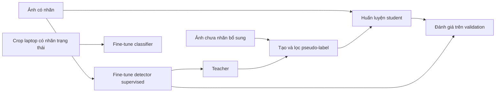
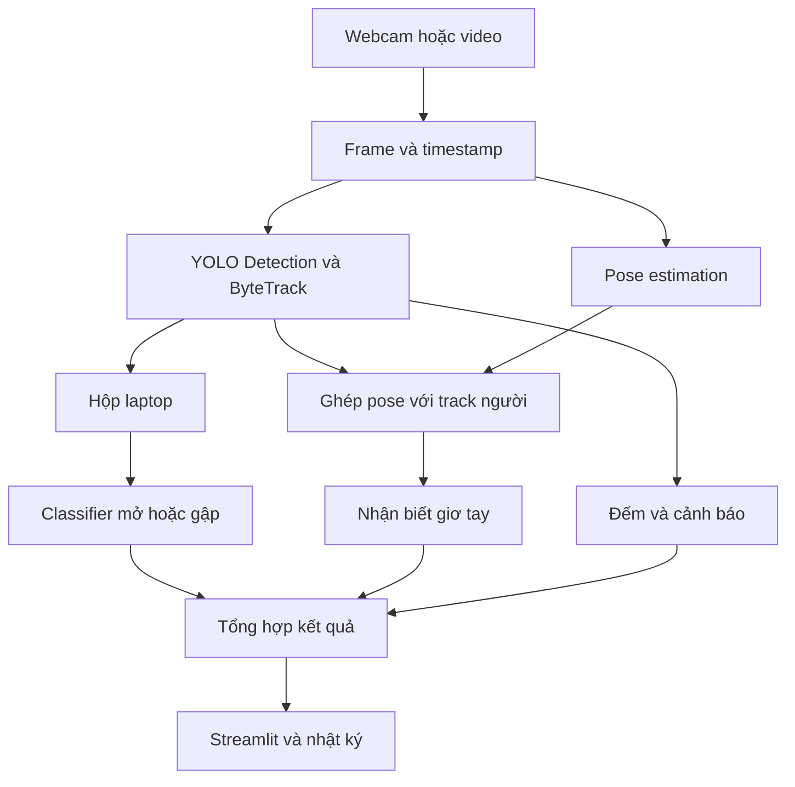

> **Đối soát 05/10/2026:** xem [trạng thái hiện hành](README.md#trạng-thái-theo-tuần). Dataset project8_v0.3 đã duyệt/khóa; R1 và R2 hoàn tất tổng 5 epoch. Những mô tả trước đó trong tài liệu là lịch sử hoặc đề xuất; G1/G2/G3 chưa đủ nghiệm thu toàn bộ.

# Kế hoạch chi tiết tuần 4–5–6: Detection, Recognition và ứng dụng Webcam

**File dự kiến:** `C:\Users\aawm8\Downloads\BTL-AI-Camera-cd8\WEEK4_5_6_PLAN.md`

File đặt ở gốc dự án, ngang hàng với tài liệu tuần 1–2. Nội dung dưới đây là bản kế hoạch mở rộng, có phần nối công việc từ tuần 2–3 và phân công tham khảo cho **5 thành viên, tính cả bạn**.

Các thành viên được ký hiệu **TV1–TV5**. Chưa gán ký hiệu nào cho tên thật hoặc mặc định bạn phải làm một vai trò cụ thể.

## 1. Tiến độ thực tế và những quyết định đã chốt

**Cập nhật 03/10/2026:** dataset chính draft `project8_v0.2` có **1.800 ảnh / 5.862 box**: 1.310 train, 360 validation, 130 test. Nguồn COCO500 (500 ảnh) và Laptop Roboflow v1 do thành viên đóng góp (1.300 ảnh) ngang hàng. Có 1.670 ảnh phát triển; còn thiếu 830 ảnh so với mục tiêu 2.500 nếu giữ mục tiêu đó. Nhãn nguồn Laptop hiện chỉ book/laptop, các lớp khác bổ sung theo phân công. 130 ảnh test vẫn giữ riêng, chưa phải test đủ tám lớp hoặc phòng học độc lập. Review, khóa release, video thật, baseline và fine-tune chưa hoàn tất. G1 còn kiểm webcam thật/review ảnh; G2 có draft nhưng chưa nghiệm thu; G3 chưa train. Có thể chuẩn bị tuần 4 song song, tuần 5–6 chờ model và tập đánh giá hợp lệ.

Kế hoạch này kế thừa [kế hoạch tổng](WEEK1_2_3_PLAN.md) và áp dụng quy mô dữ liệu mới trong [kế hoạch tuần 2](WEEK2_G2.md).

### 1.1. Những gì hiện có

| Thành phần | Trạng thái hiện tại | Ý nghĩa đối với tuần tiếp theo |
|---|---|---|
| Môi trường Python, Ultralytics, OpenCV, Streamlit | Đã chuẩn bị trên máy hiện tại | Có nền để phát triển tiếp |
| YOLO26n pretrained | Đã chạy thử ảnh và video kỹ thuật | Dùng làm baseline và điểm bắt đầu fine-tune |
| Tám lớp đối tượng | Đã thống nhất trong tài liệu và code | Tiếp tục giữ nguyên mapping |
| Giao diện xem ảnh/frame và webcam | Có ảnh/frame, crop, xuất file và Bật/Dừng/Mở lại webcam | Kiểm trên thiết bị thật và mở rộng tracking/sự kiện |
| CLI đọc webcam | Đã có mã đọc camera | Cần kiểm trên webcam thật của thành viên |
| Kiểm thử mã hiện tại | Hồ sơ webcam 03/10 ghi 30/30 pass, thiết bị mô phỏng; webcam thật còn chờ | Là kiểm tra chức năng hiện có, chưa kiểm tracking hoặc recognition |
| Dataset chính của nhóm | Draft project8_v0.2: 1.800 ảnh, có YAML/manifest/checksum | Tuần 2 vẫn cần hoàn thiện thu thập, nhãn và chia tập |
| Fine-tune và evaluator chung | Evaluator đã có; fine-tune chưa chạy | Là đầu việc chính của tuần 3 |
| SSL, tracking, đếm, cảnh báo | Chưa triển khai | Có lịch cụ thể từ tuần 3–4 |
| Nhận trạng thái laptop và giơ tay | Chưa triển khai | Cần chuẩn bị dữ liệu ngay từ tuần 2–3 |

### 1.2. Phạm vi đã chọn

- Giữ tám lớp detection: `person`, `table`, `chair`, `laptop`, `cell phone`, `backpack`, `book`, `cup`.
- Bổ sung **cả hai** tính năng recognition: laptop mở/gập và tư thế giơ tay.
- Thí nghiệm SSL thực hiện ở **tuần 3 hoặc đầu tuần 4**, sau khi dataset có nhãn và baseline supervised sẵn sàng.
- SSL sử dụng **ảnh chưa nhãn thu bổ sung**.
- Mỗi thành viên chạy **web local trên máy mình**, sử dụng webcam tích hợp hoặc webcam USB.
- Tuần 5 tập trung đánh giá; tuần 6 tập trung tái lập, báo cáo, đóng gói và bảo vệ.

Kế hoạch mới sử dụng tối thiểu **2.500 ảnh có nhãn cho train và validation**, chia khoảng **80/20 theo nhóm nguồn hoặc phiên**. Hiện đã giữ riêng 130 ảnh test nguồn Laptop, chưa đủ đánh giá tám lớp; test thực tế độc lập tiếp tục bổ sung cuối dự án. Những con số 1.200 ảnh hoặc tỷ lệ 70/15/15 trong tài liệu cũ không áp dụng cho phiên bản kế hoạch này.

## 2. Mục tiêu sản phẩm cuối tuần 6

Người dùng mở ứng dụng trên laptop, chọn camera và bấm bắt đầu. Ứng dụng hiển thị hình camera kèm loại vật thể, vị trí, ID theo dõi và trạng thái được nhận biết.

Các tình huống demo cần thể hiện:

| Tình huống | Kết quả mong muốn |
|---|---|
| Đưa cốc hoặc điện thoại vào khung hình | Có hộp, nhãn và confidence khi detector phát hiện được |
| Laptop đang mở | Hiện nhãn laptop và trạng thái “Mở” |
| Gập laptop | Trạng thái chuyển sang “Gập” sau khi đủ bằng chứng |
| Laptop quá nhỏ hoặc bị che | Hiện “Không rõ” khi chưa đủ điều kiện nhận trạng thái |
| Một người giơ tay | Hiện trạng thái giơ tay và tạo một sự kiện sau khi xác nhận |
| Người giữ nguyên tay giơ | Không cộng thêm một lượt ở mỗi frame |
| Người hạ tay rồi giơ lại | Tạo lượt mới sau khi trạng thái hạ tay đã được xác nhận |
| Người đi qua vạch | Ghi lượt đúng chiều |
| Người ở trong vùng đủ thời gian | Phát cảnh báo vùng theo quy tắc |
| Bấm dừng rồi bắt đầu lại | Giải phóng, mở lại camera và tạo phiên mới |
| Xuất kết quả | File xuất khớp số liệu đã hiển thị |

Chất lượng thực tế phải được đo. Nếu detector bỏ sót laptop thì classifier phía sau cũng không thể nhận trạng thái của laptop đó; báo cáo cần thể hiện cả lỗi từng thành phần và lỗi toàn luồng.

## 3. Phân biệt các nhiệm vụ trong dự án

| Nhiệm vụ | Câu hỏi trả lời | Ví dụ trong dự án | Cách thực hiện |
|---|---|---|---|
| Detection | Có vật gì, ở đâu? | Laptop ở vùng tọa độ nào? | YOLO26n |
| State recognition | Vật đang ở trạng thái nào? | Laptop mở hay gập? | Classifier trên crop laptop |
| Pose estimation | Các khớp cơ thể nằm ở đâu? | Vai, khuỷu tay, cổ tay | YOLO26n Pose |
| Nhận biết tư thế giơ tay | Các điểm khớp có thỏa tư thế đã định nghĩa không? | Một tay hoặc hai tay giơ cao | Quy tắc hình học và thời gian |
| Tracking | Đối tượng này tương ứng track nào qua các frame? | Người mang ID 7 | ByteTrack |
| Phân tích sự kiện | Có chuyển trạng thái hoặc đạt điều kiện nào? | Vượt vạch, đủ thời gian trong vùng | Logic của nhóm |
| SSL | Ảnh chưa nhãn được sử dụng để học thế nào? | Teacher sinh nhãn giả để train student | Quy trình self-training |

YOLO đã nhận biết loại vật thể khi thực hiện detection. Phần phát triển tiếp trong dự án là **bổ sung thông tin trạng thái và diễn biến theo thời gian**.

Nhận biết tay giơ chỉ mô tả tư thế nhìn thấy. Hệ thống không suy ra mức độ chăm học, ý định phát biểu hoặc danh tính của người đó.

### 3.1. Hai luồng cần hiểu rõ

**Luồng huấn luyện:**



**Luồng khi sử dụng webcam:**



Chạy webcam chỉ thực hiện suy luận. Dữ liệu camera muốn dùng để huấn luyện phải đi qua quy trình thu thập, kiểm tra, chia tập và tạo phiên bản dữ liệu.

## 4. Phân công tham khảo cho nhóm 5 người

### 4.1. Vai trò chính

| Thành viên | Phần chủ trì | Đầu ra kỹ thuật | Người kiểm tra chéo |
|---|---|---|---|
| **TV1** | Dữ liệu và chất lượng nhãn | Manifest, split, kiểm trùng, thống kê dữ liệu, nhãn trạng thái và bộ kiểm thử có đáp án | TV2 |
| **TV2** | Detection và SSL | Detector supervised, teacher/student, evaluator detection, bảng đối chứng | TV3 |
| **TV3** | Recognition | Classifier laptop, xử lý pose và quy tắc nhận biết giơ tay trên từng quan sát, metric recognition | TV4 |
| **TV4** | Tracking và sự kiện | ByteTrack, ghép pose với track, ổn định trạng thái theo thời gian, đếm/vùng/giơ tay, kiểm thử logic | TV5 |
| **TV5** | Webcam, giao diện và tích hợp | Camera runtime, Start/Stop, UI, xuất kết quả, đo hiệu năng và gói chạy chung | TV1 |

Phân công này là phương án tham khảo. Nhóm có thể thay tên vào TV1–TV5 sau khi thống nhất, nhưng mỗi đầu ra vẫn phải có một người chủ trì.

### 4.2. Những việc cả năm người cùng làm

- Thu thập và ghi nguồn dữ liệu.
- Gán nhãn hoặc sửa nhãn theo quy chuẩn chung.
- Review dữ liệu của người khác.
- Chạy ứng dụng trên máy mình.
- Viết phần báo cáo liên quan đến công việc mình làm.
- Hiểu luồng chung và tham gia diễn tập bảo vệ.

Với mục tiêu 2.500 ảnh, có thể chia ban đầu khoảng **500 ảnh/người**. Đây là số ảnh hợp lệ sau lọc trùng và kiểm nhãn; ảnh bị loại phải được thay bằng ảnh phù hợp.

Mỗi người có thể phụ trách một hoặc nhiều lớp. Sau khi tổng hợp công việc, mỗi ảnh cần đủ nhãn các lớp mục tiêu đang xuất hiện; nhãn chưa có được ghi là chưa hoàn thiện, không coi vật đó vắng mặt.

### 4.3. Ma trận công việc theo tuần

| Thành viên | Tuần 3 | Tuần 4 | Tuần 5 | Tuần 6 |
|---|---|---|---|---|
| TV1 | Khóa train/val, quản lý ảnh chưa nhãn, chuẩn bị nhãn recognition | Bổ sung dữ liệu thiếu, hoàn thiện test độc lập | Kiểm nguồn/split, hỗ trợ phân tích lỗi và thống kê | Bàn giao data card, hướng dẫn tái tạo dữ liệu |
| TV2 | Fine-tune supervised, evaluator, bắt đầu SSL | Hoàn tất SSL nếu chuyển lịch, bàn giao detector | Chấm các detector trên test, phân tích hiệu quả SSL | Model card, hướng dẫn train/resume/evaluate |
| TV3 | Chuẩn bị classifier và thử pose | Hoàn thiện laptop/giơ tay, metric từng nhánh | Chấm recognition riêng và toàn pipeline | Phần báo cáo recognition, ca demo đúng/sai |
| TV4 | Tracking cơ bản, test hình học bằng dữ liệu nhân tạo | Ghép track–pose, trạng thái thời gian, vạch/vùng/sự kiện | Chấm sự kiện, lỗi đổi ID và chống lặp | Phần thuật toán, kiểm lại các ca khó |
| TV5 | Khung runtime và UI webcam | Tích hợp đầy đủ, quản lý phiên và export | Benchmark, chạy dài, sửa lỗi tích hợp | Cài máy khác, đóng gói, tổng hợp demo |

### 4.4. Quy tắc bàn giao giữa thành viên

Một phần việc chỉ được coi là bàn giao khi có:

1. Mã nguồn hoặc dữ liệu tương ứng.
2. Hướng dẫn chạy.
3. Cấu hình đã dùng.
4. Input kiểm thử.
5. Đầu ra mong đợi hoặc kết quả thực.
6. Hạn chế còn tồn tại.
7. Xác nhận của người kiểm tra chéo.

Ví dụ, TV3 bàn giao classifier phải kèm checkpoint, thứ tự nhãn, cách xử lý crop, bộ ảnh kiểm và bảng kết quả. Một file `best.pt` riêng lẻ chưa đủ để TV5 tích hợp đúng.

## 5. Chuẩn bị dữ liệu từ tuần 2–3

### 5.1. Các nhóm dữ liệu cần có

| Nhóm dữ liệu | Mục tiêu ban đầu | Cách sử dụng |
|---|---|---|
| Ảnh detection có nhãn | Tối thiểu 2.500 ảnh phát triển | Train và validation |
| Ảnh chưa nhãn | Hướng tới số lượng tương đương phần train có nhãn | Thí nghiệm SSL |
| Crop laptop có nhãn trạng thái | Mục tiêu ban đầu 400–600 crop đa dạng | Train/val classifier |
| Video phát triển | 3–5 clip có trình tự thật | Chỉnh tracking, giơ tay, đếm và vùng |
| Ảnh test độc lập | Dự kiến thêm 300–500 ảnh | Đánh giá cuối tuần 5 |
| Video test độc lập | 5–10 clip | Đánh giá sự kiện và tracking |

Các mức trên là mục tiêu thu thập, chưa phải dữ liệu đang có hoặc điều kiện bảo đảm đạt chất lượng.

### 5.2. Quy tắc chia dữ liệu

- Train và validation của detection chia khoảng 80/20 theo nhóm nguồn, phiên và ảnh gần trùng.
- Ảnh chưa nhãn cho SSL thuộc phần phát triển; không lấy từ phiên đã dành cho validation hoặc test.
- Crop laptop kế thừa split của ảnh gốc.
- Các crop của cùng một ảnh không được rải sang nhiều split.
- Frame trích từ một video phải giữ cùng nhóm phiên.
- Ảnh và video test có thể dùng chung một số phiên test, nhưng những phiên đó không được dùng cho train, validation hoặc video phát triển.
- Chỉ augmentation dữ liệu train.

### 5.3. Dữ liệu laptop mở/gập

Cần thu cả:

- Laptop mở rõ màn hình và thân máy.
- Laptop gập nhìn từ nhiều góc.
- Laptop trên bàn, trên tay hoặc trong nền nhiều vật.
- Các kiểu máy và màu sắc khác nhau.
- Trường hợp dễ nhầm với sách, máy tính bảng hoặc vật hình chữ nhật.
- Trường hợp nhỏ, tối, bị che hoặc chỉ thấy một phần.

Nhãn trạng thái:

| Nhãn | Quy ước |
|---|---|
| `open` | Nhìn thấy rõ nắp/màn hình đã mở khỏi thân |
| `closed` | Nhìn thấy rõ laptop đã gập |
| `unknown` | Không đủ bằng chứng hoặc người gán không thống nhất |

`unknown` được giữ trong hồ sơ review và đánh giá giới hạn. Bản classifier đầu tiên học hai lớp `open` và `closed`; ứng dụng có cơ chế từ chối dự đoán để trả `unknown`.

Cần bổ sung nhãn detection cho laptop gập. Nếu dataset detector chủ yếu có laptop mở, việc chỉ train classifier tốt vẫn chưa giải quyết được lỗi bỏ sót laptop gập.

### 5.4. Dữ liệu giơ tay

Video cần có:

- Không giơ tay.
- Giơ tay trái, tay phải và hai tay.
- Giữ tay giơ trong vài giây.
- Hạ tay rồi giơ lại.
- Giơ tay rất ngắn.
- Người ngồi và đứng.
- Nhiều người giơ cùng lúc.
- Tay bị che hoặc ra ngoài khung hình.
- Đưa tay lên đầu, cầm điện thoại gần tai hoặc vươn vai.
- Hai người giao nhau hoặc che khuất nhau.

Ground truth ghi theo từng người trong clip bằng mã tạm, thời điểm bắt đầu/kết thúc và khoảng không quan sát rõ. Không cần dùng tên thật.

Những video này cũng có thể chứa tình huống vượt vạch và vào vùng để giảm công quay, nhưng phải gán nhãn riêng cho từng loại sự kiện.

## 6. Thí nghiệm SSL ở tuần 3 hoặc đầu tuần 4

### 6.1. Điều kiện bắt đầu

SSL bắt đầu sau khi có:

- Dataset có nhãn đã kiểm và khóa phiên bản.
- Train/validation tách đúng.
- Detector supervised đã huấn luyện xong.
- Evaluator dùng chung đã kiểm mapping.
- Ảnh chưa nhãn có nguồn và không trùng với validation/test.

Nếu dataset có nhãn chưa sẵn sàng thì chưa tạo teacher chính thức. Công việc webcam, tracking, UI và chuẩn bị recognition vẫn có thể tiếp tục bằng pretrained và input mẫu.

### 6.2. Cách hiểu tỷ lệ 50/50

Ví dụ với 2.500 ảnh phát triển:

| Phần | Số lượng minh họa |
|---|---:|
| Train có nhãn | Khoảng 2.000 ảnh |
| Validation | Khoảng 500 ảnh |
| Ảnh chưa nhãn thu thêm | Hướng tới khoảng 2.000 ảnh |
| Test | Thu riêng cuối dự án |

Tỷ lệ 1:1 ở đây áp dụng giữa **ảnh train có nhãn** và **ảnh train chưa nhãn**, không tính validation/test.

Sau lọc pseudo-label, số ảnh dùng được có thể ít hơn. Báo cáo số lượng thực sau lọc; không sao chép ảnh để ép tỷ lệ.

### 6.3. Quy trình teacher–student

| Bước | Công việc | Người chủ trì | Đầu ra |
|---|---|---|---|
| 1 | Fine-tune YOLO26n supervised | TV2 | Checkpoint teacher và log |
| 2 | Chọn teacher theo validation | TV2 | Run được chọn và lý do |
| 3 | Dự đoán ảnh chưa nhãn | TV2 | Hộp, lớp, confidence, metadata |
| 4 | Lọc pseudo-label | TV2 | Tập ứng viên và thống kê loại |
| 5 | Kiểm tra mẫu chất lượng | TV1, cả nhóm hỗ trợ | Báo cáo nhầm lớp, sai hộp, bỏ sót |
| 6 | Tạo dataset student | TV1 + TV2 | Nhãn thật và nhãn giả có nguồn rõ |
| 7 | Fine-tune student từ teacher | TV2 | Checkpoint student, args, log |
| 8 | So sánh trên validation | TV2 | Bảng supervised/SSL |
| 9 | Khóa phương án để chấm test | TV2 + TV5 | Detector cho bản demo và danh sách đối chứng |

Phiên bản đầu dùng **một vòng self-training offline**, teacher cố định trong lúc tạo nhãn. Các phương pháp nghiên cứu như Unbiased Teacher có thiết kế huấn luyện và xử lý sai lệch nhãn giả riêng; không gọi quy trình đơn giản của nhóm là đã triển khai đầy đủ thuật toán đó. [Unbiased Teacher](https://arxiv.org/abs/2102.09480)

### 6.4. Lọc và kiểm pseudo-label

Điểm bắt đầu đề xuất:

- Thử một số ngưỡng confidence trên validation, chẳng hạn 0,60; 0,75; 0,90.
- Thống kê precision/recall từng lớp để chọn ngưỡng phù hợp.
- Kiểm hộp hợp lệ, mapping đúng và ảnh đọc được.
- Ảnh có dự đoán mâu thuẫn hoặc dấu hiệu bỏ sót cần đưa vào danh sách review.
- Ảnh không có dự đoán không tự trở thành ảnh âm tính.
- Kiểm mẫu ít nhất 10% số ảnh dự kiến giữ, tối thiểu 50 ảnh nếu tập đủ lớn; lấy mẫu có phủ các lớp và điều kiện khó.

Confidence cao không phát hiện được mọi lỗi nhãn thiếu. Báo cáo phải ghi cả chất lượng dự đoán giữ lại và các trường hợp teacher bỏ sót.

Nếu một ảnh được con người sửa đầy đủ thành nhãn thật, ghi lại nguồn nhãn là người sửa. Giữ thống kê số ảnh có nhãn thật, nhãn giả và nhãn đã review.

### 6.5. Cấu hình và giới hạn thí nghiệm

- Teacher kế thừa cấu hình detector chính đã lưu trong repo.
- Student bắt đầu từ checkpoint teacher.
- Dùng cùng kiến trúc, kích thước ảnh và mapping.
- Khởi đầu với một run student tối đa 20 epoch, chọn checkpoint bằng validation.
- Lưu rõ learning rate, batch, optimizer, seed và số epoch thực.
- Bản đầu dùng nhãn giả như nhãn YOLO trong dataset kết hợp; không mô tả có giảm trọng số loss nhãn giả nếu chưa thực hiện phần đó.

So sánh supervised với SSL cần ghi cả ngân sách huấn luyện. Nếu student học thêm nhiều bước, kết quả chưa tách riêng được tác dụng của ảnh chưa nhãn khỏi tác dụng học thêm. Khi đủ tài nguyên, bổ sung đối chứng supervised tiếp tục huấn luyện với ngân sách cập nhật tương đương.

Không bắt buộc student phải tốt hơn teacher. Một thí nghiệm cho thấy SSL kém hơn nhưng có dữ liệu, log và phân tích lỗi vẫn là kết quả thực nghiệm hợp lệ.

## 7. Nhận dạng trạng thái laptop

### 7.1. Phương án kỹ thuật

Dùng detector tìm laptop, cắt vùng ảnh rồi đưa qua classifier:

```text
Frame → hộp laptop → crop → chuẩn hóa → classifier → trạng thái
```

Chọn `yolo26n-cls.pt` pretrained làm điểm bắt đầu, rồi fine-tune bằng crop `open` và `closed` của nhóm. Ultralytics cung cấp checkpoint classification này được pretrained trên ImageNet. [Tài liệu classification](https://docs.ultralytics.com/tasks/classify/)

### 7.2. Quy trình tạo crop

1. Lấy hộp laptop đã được kiểm.
2. Mở rộng nhẹ khoảng 5% mỗi phía để giữ phần viền và bản lề nếu còn trong ảnh.
3. Cắt hộp tại biên ảnh.
4. Giữ tỷ lệ ảnh bằng padding trước khi đưa về kích thước đầu vào.
5. Gắn ID ảnh gốc, ID đối tượng, nhãn trạng thái và split.
6. Review các crop không rõ hoặc chứa nhiều vật dễ nhầm.

Quy trình xử lý crop phải thống nhất giữa train, validation và inference. Các phép crop mặc định của classifier có thể cắt mất vùng quan trọng trên ảnh có tỷ lệ dài/rộng lớn, nên cần cấu hình transforms để giữ toàn bộ vùng laptop. [Hướng dẫn transforms](https://docs.ultralytics.com/tasks/classify/#custom-transforms)

### 7.3. Cấu hình khởi đầu

| Tham số | Giá trị đề xuất |
|---|---|
| Model | YOLO26n Classification pretrained |
| Nhãn | `open`, `closed` |
| Kích thước | 224 |
| Epoch tối đa | 30 |
| Early stopping | Patience 7 |
| Seed | 42 |
| Optimizer | AdamW tường minh |
| Learning rate đầu | 0,001 |
| Batch | Khởi đầu 16 trên GPU; giảm theo bộ nhớ |
| Augmentation | Nhẹ, phù hợp góc chụp và ánh sáng |

Đọc `model.names` sau train để lấy mapping, tránh giả định ID 0 luôn là `open`.

### 7.4. Trả về “Không rõ”

Giá trị ban đầu để thử trên validation:

- Confidence trạng thái dưới 0,70 → `unknown`.
- Crop không hợp lệ hoặc cạnh ngắn dưới 32 pixel → `unknown`.
- Không còn quan sát laptop → ngừng hiển thị trạng thái như một kết quả hiện tại.
- Kết quả recognition quá hạn → chờ cập nhật hoặc hiện `unknown`.

Các ngưỡng được lưu trong config và chỉ điều chỉnh trên dữ liệu phát triển.

### 7.5. Ổn định theo thời gian

- Chạy classifier theo lịch, khởi đầu tối đa 2 lần/giây trên từng nhóm crop của frame.
- Ghép kết quả với track laptop tương ứng.
- Xác nhận trạng thái sau hai quan sát hợp lệ liên tiếp cùng nhãn.
- Không dùng kết quả của track trước cho một laptop mới.
- Khi ID đổi hoặc lớp của track thay đổi, xóa lịch sử trạng thái liên quan.
- Kết quả cũ quá 1 giây không được hiển thị như vừa nhận biết.

Với ảnh tĩnh, trả kết quả trực tiếp và không áp điều kiện xác nhận qua nhiều frame.

### 7.6. Đánh giá

Chấm hai mức:

| Mức | Cách chấm | Câu hỏi |
|---|---|---|
| Classifier riêng | Crop từ hộp ground truth | Khi đã có đúng laptop, nhận trạng thái tốt đến đâu? |
| Toàn pipeline | Detector tìm laptop rồi classifier nhận trạng thái | Người dùng thực tế nhận được kết quả đúng bao nhiêu? |

Báo cáo macro-F1, confusion matrix, số mẫu từng lớp và tỷ lệ `unknown`.

Với ground truth rõ ràng, dự đoán `unknown` phải được tính là chưa nhận đúng; không bỏ những trường hợp này để làm đẹp điểm.

## 8. Nhận biết giơ tay bằng pose

### 8.1. Phương án kỹ thuật

Dùng `yolo26n-pose.pt` pretrained để lấy keypoint, sau đó áp quy tắc hình học và thời gian. Bản đầu không yêu cầu fine-tune pose.

YOLO26 Pose có checkpoint pretrained trên COCO keypoints. Các điểm vai, khuỷu tay và cổ tay là đầu vào cho quy tắc của nhóm. [Tài liệu pose](https://docs.ultralytics.com/tasks/pose/)

### 8.2. Định nghĩa tính năng

Tính năng nhận biết **tư thế tay giơ cao có thể quan sát được**.

Kết quả:

- `raised`: có ít nhất một tay thỏa điều kiện.
- `not_raised`: đủ quan sát để xác định hai tay không thỏa.
- `unknown`: không đủ keypoint hoặc không ghép chắc với người đang theo dõi.

Có thể ghi thêm bên tay: trái, phải hoặc cả hai.

### 8.3. Quy tắc ban đầu để kiểm trên video phát triển

Một tay là ứng viên giơ khi:

- Vai, khuỷu tay và cổ tay của bên đó có confidence đủ cao.
- Cổ tay nằm cao hơn vai một khoảng đủ rõ.
- Vị trí khuỷu tay phù hợp với tư thế giơ đã định nghĩa.

Cấu hình khởi đầu:

| Tham số | Giá trị để thử |
|---|---:|
| Confidence keypoint tối thiểu | 0,50 |
| Khoảng cổ tay cao hơn vai | 10% chiều cao hộp người |
| Khuỷu tay không thấp hơn vai quá | 15% chiều cao hộp người |
| Thời gian xác nhận giơ tay | 0,40 giây |
| Thời gian xác nhận hạ tay để tạo lượt tiếp | 0,40 giây |
| Khoảng mất quan sát tối đa trước reset | 0,60 giây |

Đây là quy tắc đề xuất của nhóm. Cần thử với người ngồi, đứng, góc nghiêng và tay bị che; không coi các ngưỡng này là chuẩn chung cho mọi camera.

### 8.4. Ghép pose với người

Pose và detector có thể tạo các hộp người khác nhau. Cần ghép kết quả của cùng frame:

- Quy đổi hộp về tọa độ ảnh gốc.
- Ghép một-một giữa hộp pose và track `person` đang được quan sát.
- Khởi đầu dùng IoU tối thiểu 0,50.
- Trường hợp ghép không rõ hoặc nhiều ứng viên gần nhau → trả `unknown`.
- Dùng ID từ pipeline ByteTrack chính.
- Không tạo hai hệ ID độc lập rồi mặc định chúng tương ứng nhau.

### 8.5. Quy tắc sự kiện

| Tình huống | Cách xử lý |
|---|---|
| Tay vừa giơ một quan sát | Chờ xác nhận |
| Tư thế giơ đủ thời gian | Phát một sự kiện |
| Giữ tay giơ | Giữ trạng thái, không phát lặp |
| Hạ tay đủ thời gian | Cho phép phát lượt mới |
| Keypoint mất ngắn | Tạm dừng tích lũy bằng chứng |
| Mất dấu quá dung sai | Reset trạng thái theo dõi |
| Đổi nguồn hoặc phiên | Reset toàn bộ |
| Track ID mới xuất hiện khi đang giơ | Có thể phát sau xác nhận; ghi giới hạn do đổi ID |

Sự kiện lưu cả thời điểm bắt đầu quan sát tư thế và thời điểm đủ xác nhận. Hai mốc này giúp phân biệt thời điểm hành động với độ chậm phát sự kiện.

### 8.6. Đánh giá

- Chấm trạng thái trên các khoảng video có nhãn rõ.
- Chấm sự kiện theo từng lần giơ tay.
- Ghép một-một giữa sự kiện dự đoán và ground truth.
- Báo precision, recall, F1 và thời gian phát chậm.
- Phân tích riêng: giơ rất ngắn, tay bị che, nhiều người, đổi ID và hành động dễ nhầm.

Nếu không có nhãn keypoint đầy đủ thì không công bố metric chất lượng pose như thể nhóm đã đánh giá toàn bộ mô hình pose.

## 9. Cơ chế webcam để cả nhóm dùng cùng cách

### 9.1. Mô hình sử dụng

Mỗi thành viên:

1. Lấy cùng phiên bản mã nguồn.
2. Cài môi trường riêng trên laptop.
3. Tải cùng bộ weights và cấu hình.
4. Chạy Streamlit local.
5. Chọn camera của máy mình.
6. Sử dụng cùng các nút và tính năng.

Chọn một máy làm máy benchmark chính. Những máy khác dùng để kiểm khả năng cài và chạy; kết quả FPS ghi riêng theo phần cứng.

### 9.2. Điều khiển giao diện

| Điều khiển | Hành vi |
|---|---|
| Chọn nguồn | Webcam hoặc video |
| Chọn camera | Camera index theo máy |
| Chọn detector | Pretrained, supervised hoặc SSL đã có |
| Bật trạng thái laptop | Chạy classifier khi có weights hợp lệ |
| Bật giơ tay | Chạy pose và xử lý sự kiện |
| Bắt đầu | Mở nguồn và tạo phiên |
| Dừng | Dừng worker, giải phóng camera, hoàn tất log |
| Reset phiên | Xóa counter/tracker/trạng thái cho phiên mới |
| Xuất kết quả | Tải metadata, sự kiện và thống kê |

Khi thiếu weights của một chức năng, giao diện cần báo rõ chức năng chưa sẵn sàng. Không tự dùng một checkpoint khác mà vẫn giữ nguyên tên model đang hiển thị.

### 9.3. Kiến trúc runtime

- Một luồng đọc camera sở hữu `VideoCapture`.
- Hàng chờ webcam giữ tối đa một frame mới nhất.
- Một worker xử lý sở hữu model và tracker của phiên.
- Worker chạy detection/tracking rồi các nhánh recognition đến lượt cập nhật.
- Giao diện đọc snapshot kết quả.
- Worker không gọi trực tiếp các hàm giao diện Streamlit. [Hướng dẫn threading của Streamlit](https://docs.streamlit.io/develop/concepts/design/multithreading)

Camera live ưu tiên frame mới. Video dùng để đánh giá offline xử lý toàn bộ frame, không áp chính sách bỏ frame của webcam.

### 9.4. Chạy detection và tracking

Mỗi frame được xử lý chỉ chạy detector một lần cho nhánh detection/tracking.

Đường mặc định dùng `model.track` với trạng thái được giữ giữa các frame, truyền cấu hình ByteTrack tường minh. Không gọi thêm một lần `predict` trên chính frame đó chỉ để lấy lại các hộp tương tự.

Pose là một tác vụ riêng và classifier nhận crop laptop. Thời gian của cả ba nhánh phải được tính khi đo toàn pipeline.

### 9.5. Lịch xử lý recognition

Cấu hình khởi đầu trên CPU:

| Thành phần | Lịch chạy |
|---|---|
| Detection và tracking | Mỗi frame được worker xử lý |
| Pose | Tối đa khoảng 5 lần/giây |
| Classifier laptop | Tối đa khoảng 2 lần/giây, gom crop cùng frame thành batch khi phù hợp |
| Giao diện | Làm mới tối đa khoảng 10 lần/giây |

Nếu máy không đáp ứng được, đo từng khối trên video phát triển rồi chọn cấu hình nhẹ hơn. Mọi thay đổi kích thước ảnh hoặc tần suất recognition phải được ghi lại và kiểm chất lượng.

Khi bật cả hai nhánh recognition, giao diện cần thể hiện trạng thái nào là kết quả mới, trạng thái nào đang chờ cập nhật. Không hiển thị dự đoán cũ vô thời hạn.

### 9.6. Quản lý phiên và lỗi

- Start nhiều lần không tạo thêm worker.
- Stop phải giải phóng camera.
- Chỉ mở phiên mới sau khi phiên cũ đã dừng.
- Đổi camera, video hoặc model tạo phiên mới.
- Hết video phải kết thúc có kiểm soát.
- Camera không đọc được phải báo lỗi và dừng cập nhật trạng thái như đang live.
- Hai tab trên cùng máy không được âm thầm chiếm cùng camera trong cùng ứng dụng.
- Tracker và counter không chia sẻ lẫn giữa các phiên.
- Weights được tải sẵn để demo hoạt động offline.

## 10. Hợp đồng đầu vào/đầu ra giữa các module

Các hợp đồng dưới đây là đặc tả để triển khai tiếp. Những trường mới chưa được coi là API đã có trong repo.

### 10.1. Dữ liệu frame

| Trường | Ý nghĩa |
|---|---|
| `session_id` | Phiên đang chạy |
| `frame_id` | Số thứ tự frame từ nguồn |
| `source_timestamp_ms` | Thời gian trong video hoặc thời gian tương đối của camera |
| `received_monotonic_ns` | Mốc ứng dụng nhận frame để đo độ trễ |
| Kích thước ảnh gốc | Cơ sở quy đổi tọa độ |
| Frame BGR | Dữ liệu ảnh cho OpenCV và pipeline |

### 10.2. Quan sát đối tượng

Mỗi đối tượng cần có:

- `class_id`, `class_name`: mapping dự án 0–7.
- `bbox_xyxy`: pixel ảnh gốc.
- `confidence`: confidence detection.
- `track_id`: có thể rỗng.
- `observed`: có quan sát hiện tại hay chỉ là trạng thái còn lưu.

Thông tin bổ sung khi áp dụng:

- `laptop_state`, `laptop_state_confidence`.
- `hand_state`, `hand_side`.
- Timestamp recognition.
- Lý do `unknown` khi có thể xác định.

Confidence detection, confidence classifier và chất lượng keypoint được ghi riêng.

### 10.3. Sự kiện

Ba loại sự kiện chính:

- `line_cross`.
- `zone_dwell`.
- `hand_raise`.

Mỗi sự kiện có ID duy nhất trong phiên, track liên quan, loại sự kiện, thời điểm bắt đầu/ước lượng và thời điểm phát. Trường hướng, vạch hoặc vùng chỉ điền khi áp dụng.

### 10.4. Đầu ra mỗi lần chạy

- Metadata: phiên bản code, model/config hash, phần cứng và chế độ chạy.
- Nhật ký sự kiện.
- Thống kê hiệu năng.
- Dự đoán phục vụ đánh giá khi chạy benchmark.
- Ảnh/video kết quả nếu người dùng chủ động bật lưu.

Mã mới tiếp tục tổ chức theo trách nhiệm hiện có: inference, training và UI; logic trạng thái, tracking và đánh giá tách khỏi code giao diện để kiểm thử độc lập.

## 11. Công việc nối từ tuần 3 sang tuần 4

### 11.1. Đầu tuần 3

| Công việc | Chủ trì | Đầu ra |
|---|---|---|
| Kiểm và khóa dataset có nhãn | TV1 | Manifest, split, checksum, thống kê lớp |
| Hoàn thiện evaluator detection | TV2 | Kiểm đúng mapping và các ca biết đáp án |
| Chạy baseline pretrained trên validation | TV2 | Bảng baseline |
| Chuẩn bị crop laptop và quy chuẩn giơ tay | TV1 + TV3 | Dataset trạng thái và video phát triển |
| Dựng tracking và runtime cơ bản | TV4 + TV5 | Video chạy xuyên luồng ban đầu |

### 11.2. Giữa tuần 3

- TV2 fine-tune detector supervised.
- TV1 kiểm nguồn và trùng lặp của ảnh chưa nhãn.
- TV3 chạy classifier thử và pose pretrained.
- TV4 kiểm vạch/vùng bằng quỹ đạo nhân tạo.
- TV5 hoàn thiện camera Start/Stop và snapshot kết quả.

### 11.3. Cuối tuần 3

- Chọn teacher theo validation.
- Tạo, lọc và kiểm pseudo-label.
- Chạy student nếu dữ liệu và tài nguyên sẵn sàng.
- Nếu SSL chưa hoàn tất, chuyển phần còn lại sang đầu tuần 4.
- Bàn giao detector đủ dùng để các thành viên tiếp tục tích hợp.

**G3 cần có:** ít nhất baseline pretrained được chấm đúng, run supervised có checkpoint/log, dữ liệu recognition đã chuẩn bị và trạng thái rõ ràng của thí nghiệm SSL.

## 12. Tuần 4 — Tích hợp đầy đủ trên webcam và video

### 12.1. Mục tiêu

Cuối tuần 4 có một luồng ứng dụng chạy được:

**Nguồn hình → detection/tracking → laptop và giơ tay → đếm/cảnh báo → UI và log.**

### 12.2. Lịch công việc

| Chặng | TV1 | TV2 | TV3 | TV4 | TV5 |
|---|---|---|---|---|---|
| Đầu tuần | Bổ sung dữ liệu thiếu và review nhãn | Hoàn tất SSL nếu chuyển lịch | Chốt classifier và quy tắc pose bản đầu | Ghép pose–track, trạng thái thời gian | Camera runtime và UI nhận kết quả chung |
| Giữa tuần | Chuẩn bị ground truth video | Bàn giao detector và metadata | Kiểm lỗi trạng thái trên dev | Vạch/vùng/giơ tay, chống lặp | Ghép đầy đủ các module, export |
| Cuối tuần | Chuẩn bị test từ phiên riêng | Kiểm profile checkpoint | Phân tích lỗi recognition | Chạy bộ kiểm logic | Chạy dài, Start/Stop và demo G4 |

### 12.3. Thứ tự tích hợp

1. Camera/video → detection → hiển thị.
2. Thêm tracking và kiểm reset phiên.
3. Thêm vạch/vùng.
4. Thêm trạng thái laptop.
5. Thêm pose, ghép người và giơ tay.
6. Ghép log và giao diện.
7. Đo tốc độ khi bật từng phần và toàn bộ.

Thứ tự này giúp tìm lỗi theo từng thành phần. Hai nhánh recognition vẫn thuộc phạm vi cần hoàn thiện của tuần 4.

### 12.4. Checklist G4

- [ ] Webcam thật mở, dừng và mở lại được.
- [ ] Video chạy đến cuối và kết thúc đúng.
- [ ] Tám lớp có mapping đúng với pretrained và fine-tuned.
- [ ] Tracker/counter reset đúng khi đổi phiên.
- [ ] Đếm qua vạch và vùng qua các ca kiểm đã định nghĩa.
- [ ] Laptop mở/gập/không rõ hoạt động trong pipeline.
- [ ] Giơ tay có xác nhận, không lặp khi giữ tay.
- [ ] Trạng thái không bị gắn sang track khác.
- [ ] UI và file xuất dùng cùng kết quả.
- [ ] SSL có checkpoint/kết quả hoặc ghi rõ phần chưa hoàn thành.
- [ ] Có báo cáo hiệu năng sơ bộ và danh sách lỗi.
- [ ] Đã xác định bộ test độc lập sẽ dùng ở tuần 5.

## 13. Tuần 5 — Khóa cấu hình, kiểm thử và thực nghiệm

### 13.1. Đầu tuần: hoàn thiện trên dữ liệu phát triển

Chỉ sử dụng train, validation và video phát triển để:

- Chọn detector demo.
- Chọn confidence vận hành.
- Chỉnh ngưỡng laptop và pose.
- Chỉnh thời gian xác nhận giơ tay.
- Chỉnh vạch/vùng/tracker.
- Chọn kích thước ảnh và lịch chạy recognition.
- Sửa lỗi app và log.

Sau đó lưu một bộ cấu hình có phiên bản. Khi chấm test phải biết chính xác model và logic nào đã được dùng.

### 13.2. Các thí nghiệm chính

| Mã | Thí nghiệm | Câu hỏi |
|---|---|---|
| D0 | YOLO26n pretrained | Baseline ban đầu đạt mức nào? |
| D1 | YOLO26n supervised | Dữ liệu có nhãn của nhóm giúp thế nào? |
| D2 | YOLO26n sau SSL | Ảnh chưa nhãn bổ sung có cải thiện không? |
| R1 | Classifier laptop trên crop chuẩn | Chất lượng riêng của classifier |
| R2 | Detector + classifier | Chất lượng nhận trạng thái khi phải tự tìm laptop |
| R3 | Pose + quy tắc giơ tay | Nhận trạng thái và sự kiện tốt đến đâu? |
| A1 | Tracking + vạch/vùng | Đếm và cảnh báo sai ở đâu? |
| P1 | Detection so với pipeline đầy đủ | Recognition làm thay đổi tốc độ thế nào? |

Đối chứng supervised học thêm và YOLO26s được bổ sung khi đủ tài nguyên, sau các phép đo chính.

### 13.3. Detection

- Cùng test, evaluator, mapping và chế độ hậu xử lý.
- Báo mAP50, mAP50–95 và kết quả từng lớp.
- Chấm cả ảnh âm tính.
- Tách confidence vận hành khỏi ngưỡng lấy dự đoán phục vụ AP.
- Kiểm các ca không có dự đoán, sai lớp và hộp trùng.
- Ghi số ảnh, số đối tượng và điều kiện khó.

### 13.4. Recognition và sự kiện

| Thành phần | Chỉ số |
|---|---|
| Laptop trên crop | Macro-F1, confusion matrix, tỷ lệ unknown |
| Laptop toàn pipeline | Đúng cả hộp và trạng thái, bỏ sót, nhận nhầm |
| Giơ tay | Precision/recall/F1 trạng thái và sự kiện |
| Đếm qua vạch | Sai số theo chiều, MAE theo clip, TP/FP/FN sự kiện |
| Cảnh báo vùng | Báo đúng, báo nhầm, bỏ sót, độ chậm |
| Tracking | Phân tích đổi ID trên clip có đối chiếu phù hợp |

Không công bố HOTA/IDF1 chỉ từ nhãn sự kiện nếu chưa có ground truth và evaluator cần thiết.

### 13.5. Hiệu năng

Đo bốn cấu hình:

1. Detection/tracking.
2. Detection/tracking + laptop.
3. Detection/tracking + giơ tay.
4. Pipeline đầy đủ.

Quy trình:

- Warm-up trước khi đo.
- Dùng cùng nguồn, độ phân giải và số đối tượng.
- Chạy ít nhất 300 frame hoặc khoảng 60 giây.
- Lặp ba lần trên máy benchmark chính.
- Ghi FPS xử lý, p95 độ trễ từ nhận frame đến kết quả, số frame bỏ và RAM.
- Chạy phiên liên tục ít nhất 10 phút để kiểm lifecycle và độ ổn định.

Mục tiêu kế thừa là khoảng **10 FPS** và **p95 độ trễ xử lý không quá 200 ms** trên máy demo. Đây là mục tiêu cần kiểm chứng, đặc biệt khi thêm pose.

### 13.6. Phân tích lỗi

Mỗi ca lỗi ghi:

- Input và điều kiện.
- Ground truth.
- Kết quả dự đoán.
- Module liên quan.
- Giả thuyết nguyên nhân.
- Bằng chứng hỗ trợ.
- Hướng cải thiện.

Phủ ít nhất các nhóm: vật nhỏ, laptop gập bị bỏ sót, nhầm trạng thái, keypoint bị che, giơ tay giả, đổi ID, đếm lặp, camera chậm và trạng thái cũ.

### 13.7. Checklist G5

- [ ] Model, ngưỡng và logic được khóa trước chấm test.
- [ ] Test độc lập được review và kiểm trùng.
- [ ] Các detector được chấm bằng cùng protocol.
- [ ] Recognition được chấm riêng và trong pipeline.
- [ ] Sự kiện được ghép một-một với ground truth.
- [ ] Có ba lần đo tốc độ và lần chạy dài.
- [ ] Có 10–20 ca lỗi được phân tích.
- [ ] Mọi bảng số truy được về run/config/dataset.
- [ ] Bản demo cuối tuần dùng đúng cấu hình đã chốt.

Nếu thay đổi thuật toán dựa trên lỗi test thì phải ghi rõ test đã tham gia phát triển. Các lỗi thuần túy của công cụ chấm được sửa có lịch sử và chấm lại mọi đối chứng liên quan.

## 14. Tuần 6 — Tái lập, báo cáo và bảo vệ

### 14.1. Chạy trên máy các thành viên

Mỗi người thực hiện:

- Tạo môi trường riêng.
- Cài đúng dependencies đã chốt.
- Kiểm checksum weights.
- Chạy video mẫu.
- Chạy webcam nếu máy có thiết bị.
- Kiểm Start/Stop và xuất file.
- Ghi phần cứng, lỗi cài đặt và cấu hình thực tế.

Cả nhóm dùng cùng chức năng và dữ liệu mẫu. FPS có thể khác nhau giữa các laptop.

### 14.2. Phân chia báo cáo

| Thành viên | Phần viết chính |
|---|---|
| TV1 | Dữ liệu, nguồn, quy chuẩn nhãn, split và hạn chế |
| TV2 | Detection, transfer learning, supervised và SSL |
| TV3 | Recognition laptop, pose và đánh giá recognition |
| TV4 | Tracking, trạng thái thời gian, đếm/cảnh báo và kiểm thử |
| TV5 | Kiến trúc ứng dụng, webcam, giao diện, triển khai và hiệu năng |

TV5 tổng hợp bản tài liệu, nhưng mỗi người phải bàn giao phần viết cùng số liệu và hình minh họa của mình.

### 14.3. Khung 12 slide

| Slide | Nội dung |
|---|---|
| 1 | Đề tài và nhóm |
| 2 | Bài toán phòng học và mục tiêu |
| 3 | Detection, recognition, tracking trong sản phẩm |
| 4 | Dataset có nhãn, chưa nhãn và test |
| 5 | Sơ đồ huấn luyện supervised và SSL |
| 6 | Kiến trúc webcam |
| 7 | Nhận trạng thái laptop |
| 8 | Giơ tay, tracking và sự kiện |
| 9 | Demo |
| 10 | Kết quả đối chứng và hiệu năng |
| 11 | Ca lỗi và giới hạn |
| 12 | Đóng góp, phân công và hướng phát triển |

### 14.4. Kịch bản demo tham khảo

- Mở webcam và giới thiệu tám lớp.
- Đưa laptop vào cảnh, minh họa mở/gập.
- Giơ tay, giữ tay rồi hạ và giơ lại.
- Đi qua vạch hoặc vào vùng.
- Xuất log và đối chiếu sự kiện.
- Mở một clip lỗi để giải thích giới hạn.
- Chỉ bảng pretrained/supervised/SSL.

Chuẩn bị video dự phòng từ cùng ứng dụng. Khi dùng video quay trước, giới thiệu đúng nguồn đang trình chiếu.

### 14.5. Checklist G6

- [ ] Các thành viên chạy được bản chung trên máy mình hoặc ghi rõ hạn chế thiết bị.
- [ ] Weights và cấu hình được lưu đủ.
- [ ] Báo cáo và slide phản ánh kết quả thật.
- [ ] Có hướng dẫn cài, chạy, train và evaluate.
- [ ] Có video demo dự phòng.
- [ ] Có bảng phân công và đóng góp.
- [ ] Đã diễn tập ít nhất hai lần.
- [ ] Mỗi thành viên giải thích được phần mình và luồng chung.
- [ ] Bộ nộp đã được kiểm trên máy khác.

## 15. Bộ ca kiểm thử cần triển khai

| Mã | Tình huống | Kỳ vọng |
|---|---|---|
| T01 | Pretrained và fine-tuned cùng phát hiện laptop | COCO ID63 và project ID3 cùng map về laptop ID3 |
| T02 | Ảnh không có đối tượng | Kết quả rỗng hợp lệ |
| T03 | Crop laptop chạm biên ảnh | Cắt đúng, không crash |
| T04 | Crop quá nhỏ | Trả unknown theo cấu hình |
| T05 | Laptop đổi mở sang gập | Chuyển trạng thái sau xác nhận |
| T06 | Laptop biến mất | Không giữ kết quả như đang quan sát |
| T07 | Người giữ tay giơ | Một sự kiện cho lượt hiện tại |
| T08 | Hạ tay rồi giơ lại | Tạo lượt thứ hai |
| T09 | Giơ quá ngắn | Xử lý đúng quy tắc thời gian đã chốt |
| T10 | Một tay bị che | Không tự suy ra hai tay đều hạ |
| T11 | Hai người giao nhau | Không ghép tùy tiện trạng thái sang người khác |
| T12 | Mất keypoint | Trả unknown và xử lý thời gian đúng |
| T13 | Người đi A→B rồi B→A | Hai sự kiện đúng chiều |
| T14 | Rung sát vạch | Không tăng liên tục |
| T15 | Đi vòng ngoài đầu vạch | Không tính vượt đoạn vạch |
| T16 | Ở vùng rồi mất dấu ngắn | Không cộng thời gian không quan sát |
| T17 | Start nhiều lần | Một pipeline hoạt động |
| T18 | Stop rồi Start | Camera mở lại, phiên mới sạch |
| T19 | Đổi video hoặc seek | Reset trạng thái phù hợp |
| T20 | Camera bị chiếm/mất kết nối | Báo lỗi, giải phóng tài nguyên |
| T21 | Inference chậm | Hàng chờ live có giới hạn |
| T22 | Chấm video offline | Mọi frame được xử lý |
| T23 | UI cập nhật chậm | Log sự kiện vẫn đầy đủ |
| T24 | Thiếu checkpoint recognition | Báo chức năng chưa sẵn sàng |
| T25 | Ảnh/crop cùng phiên xuyên split | Công cụ kiểm dữ liệu phát hiện |
| T26 | Teacher không có dự đoán | Không tự tạo negative cho SSL |
| T27 | Đổi model giữa phiên | Cấu hình mới không trộn với log cũ |
| T28 | Chạy không internet với weights sẵn | Demo và export hoạt động |

Kiểm logic hình học và trạng thái bằng dữ liệu nhân tạo trước, sau đó mới kiểm tích hợp với model và video thật.

## 16. Rủi ro và cách xử lý khi chậm tiến độ

| Rủi ro | Hướng xử lý |
|---|---|
| Dataset tuần 2 chưa đủ chất lượng | Ưu tiên nguồn, nhãn và chia tập; ghi số thật |
| Thiếu laptop gập | Thu bổ sung và gán cả box lẫn trạng thái |
| Teacher bỏ sót vật nhỏ | Review nhãn giả; loại ảnh không đủ tin cậy; giữ supervised làm đối chứng |
| SSL không cải thiện | Báo đúng, phân tích nhãn giả và miền dữ liệu |
| Pose kém ở góc camera | Thử trên dev, giới hạn miền sử dụng và ghi unknown |
| Ba nhánh model làm webcam chậm | Đo từng khối, chọn lịch recognition và kích thước phù hợp |
| Ghép pose sai người | Kiểm association, dùng unknown khi mơ hồ |
| Một thành viên bị quá tải | Bàn giao một đầu việc cụ thể cho người hỗ trợ, giữ một chủ trì |
| Thiếu GPU | Ưu tiên YOLO26n, giảm số run phụ, lưu checkpoint để tiếp tục |
| Sát hạn nhưng còn nhiều tính năng phụ | Cắt đối chứng mở rộng, giao diện phụ và thử nghiệm thêm trước |

Thứ tự ưu tiên khi thiếu thời gian:

1. Dữ liệu và phép đánh giá đúng.
2. Detector chạy ổn.
3. Webcam và quản lý phiên.
4. Hai chức năng recognition đã chọn.
5. Tracking, đếm và cảnh báo theo phạm vi đã chốt.
6. Hoàn tất và báo cáo thí nghiệm SSL ở mức thực tế.
7. Các đối chứng hoặc tối ưu bổ sung.

Nếu một chức năng chính chưa đạt, ghi rõ trong bàn giao. Không đổi tên tính năng hoặc dùng ảnh demo chọn lọc để coi như đã hoàn thành.

## 17. Cách làm việc chung và nhật ký tuần

### 17.1. Nhịp phối hợp

- Đầu tuần: thống nhất đầu ra và vấn đề đang chặn.
- Giữa tuần: kiểm giao tiếp giữa module bằng input chung.
- Cuối tuần: demo, review bằng chứng và cập nhật checklist.
- Mỗi thay đổi có người thực hiện và người kiểm tra.
- Dùng nhánh theo phần việc; tích hợp từng phần đủ nhỏ để kiểm được.
- Không đưa dữ liệu lớn, môi trường ảo hoặc video cá nhân vào Git ngoài quy trình chia sẻ đã thống nhất.

### 17.2. Nhật ký trong tài liệu

Mỗi tuần có mục ghi:

| Nội dung | Cần điền |
|---|---|
| Thời gian cập nhật | Ngày thực |
| Trạng thái | Chưa bắt đầu / đang làm / đã nghiệm thu |
| Việc hoàn thành | Chức năng và bằng chứng |
| Người thực hiện | TV tương ứng và tên sau khi phân công |
| Kết quả đo | Run, dữ liệu, config và chỉ số |
| Lỗi còn lại | Cách tái hiện và ảnh hưởng |
| Quyết định thay đổi | Lý do, người phụ trách |
| Việc tuần tiếp | Đầu việc và đầu ra |

Nhật ký ở README chính chỉ tóm tắt việc đã có bằng chứng. Tài liệu tuần 4–6 giữ phần chi tiết để nhóm theo dõi.

## 18. Quy cách tạo file và kiểm tra tài liệu

Khi triển khai, tạo một file `WEEK4_5_6_PLAN.md` với nội dung đầy đủ theo các mục trên.

Yêu cầu đối với file:

- Markdown tiếng Việt, UTF-8.
- Có mục lục để truy cập các phần dài.
- Có bảng phân công TV1–TV5, lịch từng tuần và checklist G4–G6.
- Có sơ đồ luồng huấn luyện và webcam.
- Phân biệt trạng thái hiện tại, mục tiêu và kết quả đã đo.
- Các tham số khởi đầu được ghi là cấu hình đề xuất cần kiểm trên validation/dev.
- Các module, trường dữ liệu và giao diện mới được ghi là đặc tả dự kiến.
- Không đánh dấu hoàn thành những việc chưa thực hiện.
- Kiểm liên kết nội bộ và đường dẫn tài liệu có thật.
- Giữ nhất quán: tám lớp, 2.500 ảnh phát triển, test riêng, SSL tuần 3–4, hai nhánh recognition và nhóm 5 người.

Tên thành viên, ngày nộp và phần cứng từng người để nhóm điền bằng thông tin thực tế. Việc triển khai ở bước này là tạo tài liệu kế hoạch; mã, dataset, huấn luyện và ứng dụng được thực hiện theo các mốc đã nêu.
