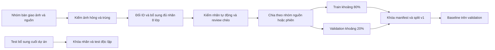

# Tuần 2 — Dataset v1 từ ảnh do nhóm cung cấp

**Cập nhật 03/10/2026:** dataset chính draft `project8_v0.2` có **1.800 ảnh / 5.862 box**: 1.310 train, 360 validation, 130 test. Nguồn COCO500 (500 ảnh) và Laptop Roboflow v1 do thành viên đóng góp (1.300 ảnh) ngang hàng. Có 1.670 ảnh phát triển; còn thiếu 830 ảnh so với mục tiêu 2.500 nếu giữ mục tiêu đó. Nhãn nguồn Laptop hiện chỉ book/laptop, các lớp khác bổ sung theo phân công. 130 ảnh test vẫn giữ riêng, chưa phải test đủ tám lớp hoặc phòng học độc lập. Review, khóa release, video thật, baseline và fine-tune chưa hoàn tất. Đã có công cụ inventory/check/split/lock/verify và evaluator; không gọi draft là G2 đã nghiệm thu. Hướng dẫn hiện hành: [docs/WEEK2_WORKFLOW.md](docs/WEEK2_WORKFLOW.md), [EVALUATION_PROTOCOL.md](EVALUATION_PROTOCOL.md).

**Cập nhật 29/09/2026 theo quyết định của nhóm:** thành viên tự tìm và bàn giao ảnh; tối thiểu **2.500 ảnh gốc hợp lệ sau lọc trùng** cho train + validation. Test được bổ sung gần cuối dự án, ngoài số lượng này. Đã có dataset draft project8_v0.2 thực tế; chưa có release v1 đã review/khóa. Mục tiêu 2.500 là mục tiêu kế hoạch, không phải số đang có.

## 1. Quy mô và cách chia

| Tập | Mục tiêu tại mốc 2.500 ảnh | Mục đích |
|---|---:|---|
| Train | Khoảng 2.000 ảnh (80%) | Cập nhật trọng số khi fine-tune |
| Validation (`val`) | Khoảng 500 ảnh (20%) | Baseline, chọn checkpoint, confidence và cấu hình |
| Test | Chưa có; thu bổ sung cuối dự án | Đánh giá cuối sau khi khóa model và cấu hình |

80/20 là phương án đề xuất để triển khai; giữ nguyên nhóm nguồn/phiên quan trọng hơn đúng từng ảnh theo tỷ lệ. Nếu có 3.000 ảnh thì hướng tới 2.400/600. Không lấy bớt từ 2.500 ảnh đã dùng phát triển để gọi thành test mới.

- 2.500 là số **ảnh khác nhau**, không phải số box, không cộng ảnh augmentation hay bản resize vào chỉ tiêu.
- Dự kiến khoảng 10% ảnh âm tính đã kiểm đủ tám lớp: 250 ảnh trong tổng 2.500, ví dụ 200 train + 50 val. Có thể điều chỉnh và ghi tỷ lệ thật.
- Mục tiêu phủ mỗi lớp: ít nhất khoảng 400 ảnh train và 80 ảnh val có lớp đó. Đây là mục tiêu phân bổ ban đầu, không bảo đảm chất lượng; một ảnh có thể góp vào nhiều lớp nên không cộng các cột thành tổng ảnh.
- Ưu tiên điện thoại/laptop nhỏ, trên bàn, cầm tay, bị che; tránh lấy quá nhiều người để đủ tổng trong khi thiếu ba lớp còn lại.
- Thành viên đánh dấu bối cảnh `classroom`, `indoor_other`, `outdoor`, `unknown`. Ảnh có người và laptop chưa tự chứng minh đó là phòng học. Báo cáo rõ tỷ lệ bối cảnh thực tế.

## 2. Mỗi thành viên bàn giao gì?

Mỗi nguồn giữ riêng dưới `data/raw/<source_id>/`; không chép tất cả file vào cùng một folder rồi đổi tên mất nguồn.

```text
data/raw/<source_id>/
├── images/                 # Ảnh gốc
├── annotations/            # Nhãn gốc: TXT/JSON/XML hoặc để chưa có
├── original_data.yaml      # Nếu nguồn có; giữ tên/thứ tự lớp gốc
└── SOURCE.md               # URL, phiên bản, người giao, quyền sử dụng,
                            # split gốc, cách tạo ảnh, thiếu nhãn đã biết
```

1. Điền nguồn vào bản sao của `data/templates/sources.csv` và giữ thông tin license/ghi công của từng nguồn/ảnh khi có. Nguồn chưa rõ quyền được đánh dấu chờ kiểm.
2. Giao ảnh độ phân giải gốc có sẵn; không ép thành hình vuông hoặc tạo thêm bản xoay để đủ số.
3. Nếu đã có nhãn, giao cả định dạng, tên lớp, mapping ID và split gốc. Chỉ nhãn phân loại tên ảnh không đủ cho detection: phải bổ sung bounding box.
4. Nếu ảnh tách từ video, giao ID video/phiên và thời điểm frame; các đoạn cắt của cùng phiên vẫn là một nhóm.
5. Không có nhãn thì ghi `unlabeled`, không tạo TXT rỗng để giả ảnh âm tính.
6. Giữ tên người chuẩn bị và người review riêng. Chưa có tên thật thì để trống, không điền thay.

## 3. Quy trình chuẩn hóa



### A. Kiểm ảnh và trùng lặp

- Giải mã được, kích thước hợp lệ; ảnh quá hỏng/mờ không nhận ra vật chuyển sang loại/chờ review. Giữ một phần ảnh khó thực tế còn xác định được.
- SHA-256 tìm file trùng tuyệt đối; perceptual hash/contact sheet tìm ảnh gần trùng, crop, resize, đổi độ sáng. Ngưỡng hash chỉ tạo ứng viên để người xem quyết định.
- Kiểm trên toàn bộ nguồn gộp, không chỉ trong folder từng thành viên. Ảnh giống nhau ở hai website vẫn chỉ là một mẫu.
- Mỗi nhóm gần trùng có `duplicate_group_id`; mỗi phiên có `session_id`. Khi chia, dùng nhóm liên thông của các ràng buộc này: không cho các ảnh liên quan đi qua train/val/test.
- Không bịa session cho dataset không cung cấp. Ghi `unknown`, kiểm nhóm cảnh/chuỗi ảnh; nếu vẫn không xác định được, ghi hạn chế độc lập trong data card.

### B. Chuẩn hóa nhãn

| Lớp | ID nhóm | ID YOLO COCO80 | category_id COCO JSON gốc |
|---|---:|---:|---:|
| person | 0 | 0 | 1 |
| table | 1 | 60 (dining table, đối chứng gần đúng) | 67 |
| chair | 2 | 56 | 62 |
| laptop | 3 | 63 | 73 |
| cell phone | 4 | 67 | 77 |
| backpack | 5 | 24 | 27 |
| book | 6 | 73 | 84 |
| cup | 7 | 41 | 47 |

Luôn kiểm `names`/`categories` của nguồn. Không áp các số của COCO cho dataset khác chỉ vì tên file giống nhau. Giữ nhãn gốc; chỉ nhãn đã chuyển đổi đi vào `data/dataset/labels/`.

Giữ **mọi box thuộc cả tám lớp trong mỗi ảnh**. Mỗi thành viên có thể phụ trách một hoặc nhiều lớp; sau khi tổng hợp cần bổ sung các vật thuộc lớp mục tiêu đang xuất hiện. Nguồn chỉ gán điện thoại có thể còn người/cốc/laptop chưa được gán. Đồng nhất cách bao hộp theo [quy chuẩn nhãn](LABELING_GUIDE.md). Crowd/group/ignore hoặc vật mơ hồ phải được review: gán lại từng vật xác định được hoặc loại ảnh nếu pipeline không hỗ trợ; không xóa nhãn rồi giữ vùng đó thành nền.

Kiểm tự động 100%: cặp ảnh/TXT, năm giá trị mỗi dòng, ID nguyên 0–7, số hữu hạn, rộng/cao > 0, hộp nằm trong ảnh, box trùng, số ảnh/box từng lớp, nhóm trùng xuyên split. Máy kiểm định dạng không biết hết nhãn thiếu; việc đó cần người review.

### C. Review người thứ hai

Mục tiêu 20% (500/2.500 ảnh), phân tầng theo nguồn, lớp, bối cảnh và split; tối thiểu 10% chỉ khi nhóm ghi rõ điều chỉnh. Review thêm **100% ca nghi ngờ**, ảnh âm tính cần xác nhận không bỏ sót lớp. Reviewer khác người gán/chuẩn hóa. Mẫu val cần được kiểm trước baseline; phát hiện lỗi hệ thống thì mở rộng kiểm nhóm liên quan. Chỉ đánh dấu `approved` sau khi thực sự xem và sửa.

### D. Chia và khóa

- Với COCO được nhóm cung cấp: giữ `train2017` trong train và `val2017` trong val; không random ảnh từ COCO train sang val rồi gọi đó là validation độc lập của pretrained.
- Với nguồn khác: giữ split chuẩn nếu phù hợp, đồng thời kiểm rò rỉ giữa nguồn. Dataset không có split thì chia theo phiên/nhóm cảnh/gần trùng, seed 42; điều chỉnh nhóm để đủ lớp.
- Nếu split chuẩn của nhiều nguồn xung đột do ảnh trùng, ưu tiên loại bản xung đột khỏi bộ v1 hoặc giữ nguyên nhóm trong một split có ghi lý do; không giữ cả hai.
- Đưa ảnh đã duyệt vào `data/dataset/images/{train,val}` và TXT tương ứng vào `labels/{train,val}`. Tên gồm `source_id` + ID ảnh để tránh ghi đè.
- Tạo `data/manifest.csv`, `data/dataset/v1/splits/train.txt`, `val.txt`, `checksums.json`; ghi checksum cả ảnh, nhãn, manifest và danh sách chia. Hai file TXT là danh sách đường dẫn tương đối với repo phục vụ kiểm tra; YAML chạy train dùng các folder ảnh.
- Mọi sửa nhãn/thay split sau khóa tạo phiên bản mới, ghi lý do và chạy lại baseline/thí nghiệm liên quan. Không cập nhật bộ val lặng lẽ giữa hai model.

## 4. Test bổ sung gần cuối

**Chưa cần có ảnh test ở tuần 2.** Chốt ngay quy tắc nguồn/bối cảnh, lớp và cách đo; giữ riêng nguồn/phiên tương lai dành cho test, không dùng để chọn ảnh train theo kết quả model.

Lịch đề xuất: cuối tuần 4 hoặc đầu tuần 5 nhận và gán nhãn test; sau khi khóa model/ngưỡng/logic và nhãn thì chấm ở tuần 5, để còn thời gian viết báo cáo. Với dự án năm tuần, thực hiện trước giai đoạn chốt báo cáo, không chờ ngày cuối.

- Đề xuất thêm 300–500 ảnh thực tế từ phiên chưa dùng; số này ngoài tối thiểu 2.500 ảnh phát triển. Ghi quy mô thật và số mẫu từng lớp; nếu thiếu lớp thì nêu giới hạn, không tuyên bố đánh giá đủ tám lớp.
- Không trích test từ val đã xem, ảnh train hoặc phiên video_dev. Kiểm trùng với toàn bộ ảnh phát triển kể cả ảnh đã bị loại sau khi nhóm xem kết quả.
- Chỉ thêm `test: images/test` vào YAML khi đã có bộ test hợp lệ. Không trỏ test về val để lệnh chạy được.
- Nếu xem test rồi dùng lỗi để sửa model/ngưỡng thì bộ đó đã tham gia phát triển; cần test mới hoặc ghi rõ phép đo không còn độc lập.

## 5. Video và baseline

Ảnh tổng hợp phục vụ detection. Tracking/đếm vẫn cần **3–5 clip video_dev có trình tự thật** và **5–10 clip video_test độc lập bổ sung cuối dự án**, gán sự kiện cùng timestamp. Slideshow COCO128 chỉ thử đọc file, không thay video sự kiện.

Cuối tuần 2 chấm YOLO26n pretrained trên **val đã khóa**, lưu mAP50, mAP50–95 và AP từng lớp, số ảnh/box, cấu hình, version và checksum checkpoint/dataset. Đã có evaluator chung `python -m src.evaluation`, ánh xạ COCO80→project8 hoặc project8 identity. Chưa có dữ liệu nhóm đã khóa nên chưa có baseline G2. Web chỉ hiển thị dự đoán; confidence không phải mAP. Table COCO là dining table nên ghi giới hạn phạm vi trong bảng so sánh.

Nếu ảnh đến từ tập pretrained đã học, ghi rõ chồng lặp; kết quả trên đó không chứng minh khả năng tổng quát sang phòng học mới. Báo cáo kết quả công khai và test phòng học thật riêng, không gộp thành một kết luận.

## 6. Checklist nghiệm thu G2 — chưa hoàn tất

Đã có bằng chứng kiểm kỹ thuật và hồ sơ draft. Các mục dưới đây là điều kiện nghiệm thu cuối, chưa đánh dấu hoàn thành khi còn review/nhãn/quyền/split cần xác nhận.

- [ ] Có ≥2.500 ảnh phát triển hợp lệ, có nguồn, quyền và thống kê bối cảnh.
- [ ] Đã lọc ảnh hỏng/trùng/gần trùng giữa mọi nguồn, có danh sách loại và nhóm trùng.
- [ ] Có nhãn YOLO đủ tám lớp theo quy chuẩn; mọi ảnh có TXT hợp lệ, ảnh âm tính được xác nhận.
- [ ] Kiểm tự động 100%; review chéo 10–20% và toàn bộ ca nghi ngờ, có người và kết quả thật.
- [ ] Train/val khoảng 80/20 theo nhóm đã khóa; không rò rỉ; đủ ví dụ từng lớp và có checksum.
- [ ] Hoàn thiện `configs/data.yaml`, `data/manifest.csv`, `data/DATA_CARD.md` bằng số liệu thật.
- [ ] Có 3–5 video_dev với sự kiện; ghi protocol, người phụ trách và mốc bổ sung ảnh/video_test cuối dự án.
- [ ] Đã lưu baseline pretrained trên validation bằng phép chấm đúng mapping và cấu hình tái lập.

**Bàn giao G2 mới:** dataset v1 train/val, nhãn, hồ sơ nguồn, review, split khóa, video_dev và baseline validation; test có kế hoạch riêng, hoàn thiện ở G5. Đây là thay đổi kế hoạch nhóm, cần phản ánh trong đề cương/báo cáo nếu giảng viên yêu cầu.

## 7. File/folder nào làm việc gì?

| Nơi | Vai trò | Trạng thái |
|---|---|---|
| `data/raw/` | Nguồn COCO và ZIP Laptop thành viên | Đã lưu raw và metadata gốc |
| `data/templates/` | Mẫu kê nguồn, manifest, review, video | Header mẫu; chưa có bản ghi thật |
| `data/dataset/project8_v0.2/` | Dataset chính draft | 1.310 train / 360 val / 130 test; 1.800 ảnh, 5.862 box |
| `data/dataset/v1/splits/` | Danh sách chia; checksum trong release | Chưa khóa; lock sẽ sinh |
| `data/DATA_CARD.md` | Hồ sơ dataset và hạn chế | Có số liệu draft, nguồn, split và việc còn thiếu |
| `scripts/data/` + `src/dataset.py` | Inventory, kiểm dữ liệu, chia nhóm và khóa release | Đã triển khai, xem workflow |
| `src/training/` + `configs/train_n.yaml` | Train bằng Ultralytics khi dataset đạt | Chưa fine-tune |
| `src/inference/` + `src/ui/` | Chạy model và xem kết quả | Đã có bản thử tuần 1 |
| `tests/` | Kiểm code | Khác hoàn toàn ảnh `images/test/` |

Đã triển khai công cụ và kiểm bằng dữ liệu nhân tạo cùng model pretrained thật. Đã có 1.800 ảnh dữ liệu chính và hồ sơ draft; chưa có video thật, review đã duyệt hoặc baseline validation; G2 chưa hoàn thành.
