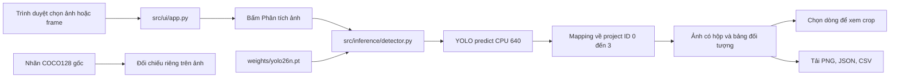
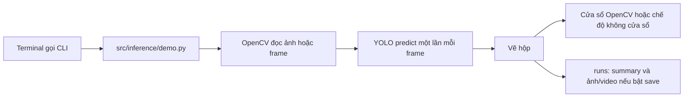
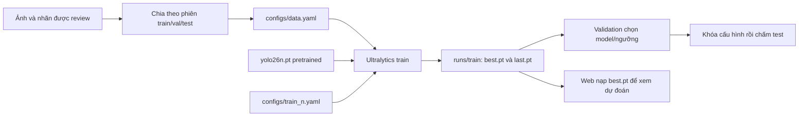

# Cấu trúc và luồng hoạt động

> Cập nhật 02/10/2026: dùng project8 và release YAML data/dataset/v1/data.yaml; pipeline/evaluator tuần 2 đã có. Xem [workflow hiện hành](WEEK2_WORKFLOW.md). Các lệnh/kết quả smoke COCO128 cũ là lịch sử kỹ thuật, không phải baseline dataset nhóm.

## 1. Chạy, train và test khác nhau thế nào?

| Công việc | Đầu vào | Việc máy làm | Đầu ra | Nơi thực hiện |
|---|---|---|---|---|
| **Inference / chạy nhận dạng** | Model `.pt` + ảnh/frame | Dự đoán hộp và lớp; không học thêm | Hộp, confidence, ảnh đã vẽ | `src/inference/` |
| **UI / xem trực quan** | Ảnh do bạn chọn + kết quả inference | Hiển thị, lọc lớp, cho chọn đối tượng, tải kết quả | Trang web trong trình duyệt | `src/ui/` |
| **Training / huấn luyện** | Model pretrained + ảnh và nhãn train/val | Cập nhật trọng số qua nhiều epoch | `best.pt`, `last.pt`, loss và metric | Bộ train Ultralytics; `configs/train_n.yaml`; chỗ dành cho script nhóm: `src/training/` |
| **Chuẩn bị dữ liệu** | Ảnh/nhãn gốc | Kiểm ghép cặp, lập danh sách/config | Manifest, image list, YAML | `scripts/data/` |
| **Software test / kiểm mã** | Ca kiểm nhỏ có đáp án | Kiểm mapping, crop, trạng thái giao diện | Pass/fail | `tests/` |
| **Validation/test chất lượng AI** | Checkpoint + ảnh có nhãn độc lập | Đối chiếu dự đoán với nhãn thật | Precision, recall, mAP… | Lệnh `yolo val`; evaluator chung tại src/evaluation.py |

Ví dụ: bấm “Phân tích ảnh” 100 lần chỉ chạy inference, không làm model học ảnh đó. Muốn model học cần chuẩn bị nhãn và chạy lệnh train riêng. “Test giao diện chạy đúng” cũng không có nghĩa model đạt mAP mục tiêu.

## 2. Cây thư mục theo trách nhiệm

```text
BTL-AI-Camera-cd8/
├── src/                              CODE CỦA NHÓM
│   ├── inference/
│   │   ├── detector.py               Bộ nhận dạng cho web, mapping/crop/nhãn
│   │   └── demo.py                   CLI ảnh/video/webcam, log cơ bản
│   ├── ui/
│   │   └── app.py                    Giao diện Streamlit
│   ├── training/
│   │   └── README.md                 Chưa có trainer tự viết; dùng Ultralytics
│   ├── app.py                        Lối vào web, gọi ui/app.py
│   └── week1_demo.py                 Lối vào CLI cũ, gọi inference/demo.py
├── scripts/data/
│   └── prepare_smoke_dataset.py      Tạo list/YAML COCO128 để train thử
├── tests/                            KIỂM CODE, KHÔNG CHỨA DATASET TEST
│   ├── test_inspection.py            Mapping, nhãn, màu ảnh, crop
│   └── test_app.py                   AppTest chạy giao diện và YOLO thật
├── configs/                          THAM SỐ, KHÔNG PHẢI CODE
│   ├── train_n.yaml                  Tham số train dự kiến, dùng với yolo train
│   ├── data.yaml                     Đường dẫn/8 lớp trên máy này, không commit
│   ├── data.yaml.example             Mẫu cho máy khác
│   ├── app.yaml                      Đặc tả app tương lai, chưa được UI này đọc
│   └── bytetrack.yaml                Tracker cho giai đoạn sau; chưa chạy trong UI
├── .streamlit/config.toml            Địa chỉ local, giới hạn upload, màu giao diện
├── data/                             DỮ LIỆU ĐẦU VÀO
│   ├── reference/coco128/            Ảnh/nhãn tham khảo 80 lớp, không commit
│   ├── dataset/images/{train,val,test}/   Ảnh phòng học về sau
│   ├── dataset/labels/{train,val,test}/   Nhãn 8 lớp tương ứng
│   ├── raw/                         Ảnh/video gốc có quyền sử dụng
│   ├── video_dev/                   Video để phát triển/điều chỉnh
│   ├── video_test/                  Video đánh giá cuối, tách phiên
│   ├── week1_coco128_manifest.csv    50 ảnh chọn sẵn, đường dẫn nguồn
├── weights/                          MODEL ĐẦU VÀO, không phải code
│   └── yolo26n.pt                   Trọng số pretrained tải sẵn
├── runs/                             KẾT QUẢ MÁY SINH, không commit
│   ├── week1/                       Summary/ảnh/video thử; YAML smoke được sinh
│   └── train/<tên_run>/              Sau này: best.pt, last.pt, args.yaml, CSV
├── demo/smoke/                       Slideshow thử video, chưa là clip camera
├── reports/                          Bảng/hình/phân tích dùng trong báo cáo
├── docs/                             CÁCH DÙNG, CÁCH TEST, CÁCH TRAIN
├── .venv/                            Thư viện cài trên máy, không sửa mã trong đây
└── .python/                          Python 3.11 cục bộ, .venv cần nó trên máy này
```

`data/dataset/images/test/` là ảnh test chất lượng AI; `tests/` là bài kiểm mã. Không đặt dataset vào `tests/`. `weights/yolo26n.pt` là model gốc; `runs/train/.../weights/best.pt` là model mới sinh sau fine-tune. Không ghi đè weights gốc.

## 3. Luồng đang chạy thực tế



Model nạp một lần và được tái sử dụng. Bấm nút mới chạy inference. Đổi ảnh/checkpoint/confidence làm kết quả cũ không còn hợp lệ; giao diện yêu cầu chạy lại. Lọc “Lớp hiển thị” chỉ ẩn/hiện kết quả đã có. Việc chọn dòng/crop không chạy model lại. Các phiên cùng model dùng lock để tránh gọi predict đồng thời trên cùng đối tượng model; hiện không có trạng thái tracker.

Đầu vào OpenCV là BGR. Ảnh upload được xử lý hướng EXIF và chuyển RGB→BGR. Hộp và crop dùng pixel của ảnh gốc; việc web thu nhỏ ảnh không thay đổi tọa độ. YOLO pretrained trả ID COCO (`0,60,56,63,67,24,73,41`); `detector.py` chuyển thành ID dự án (`0–7`). Model fine-tuned đúng bốn tên/thứ tự cũng được hỗ trợ; checkpoint khác bị từ chối để tránh nhầm nhãn.



CLI baseline hiện chỉ dùng profile pretrained COCO80 và CPU; web nhận cả checkpoint project8 hợp lệ. CLI chưa có worker latest-frame như kiến trúc đầy đủ trong kế hoạch. Khi webcam chậm, không dùng FPS baseline để khẳng định độ trễ live đã đạt mục tiêu.

## 4. Luồng train trong tương lai



Dataset test không tham gia tối ưu. Bảng so sánh checkpoint 80 lớp và 8 lớp cần evaluator chung có mapping; phần đó đã có tại src/evaluation.py; chưa chấm dữ liệu nhóm. Hướng dẫn chi tiết ở [TRAIN_VA_DANH_GIA.md](TRAIN_VA_DANH_GIA.md).

## 5. Dùng web hay terminal?

Web Streamlit phù hợp xem ảnh, chọn đối tượng, tìm lỗi và trình bày cho nhóm. Terminal khởi động web, chạy hàng loạt video, unit test và train. Cửa sổ OpenCV của CLI phù hợp kiểm webcam cục bộ. Hiện không cần ứng dụng desktop riêng hoặc backend FastAPI.

Server bind `127.0.0.1`, chỉ phục vụ máy đang chạy. Browser gửi ảnh upload tới server Python trên chính máy đó. Weights và dataset đã tải thì suy luận có thể chạy offline. Giao diện chưa livestream webcam trình duyệt, chưa tracking/đếm/cảnh báo; phần “Khung hình video” dùng để xem từng frame.
